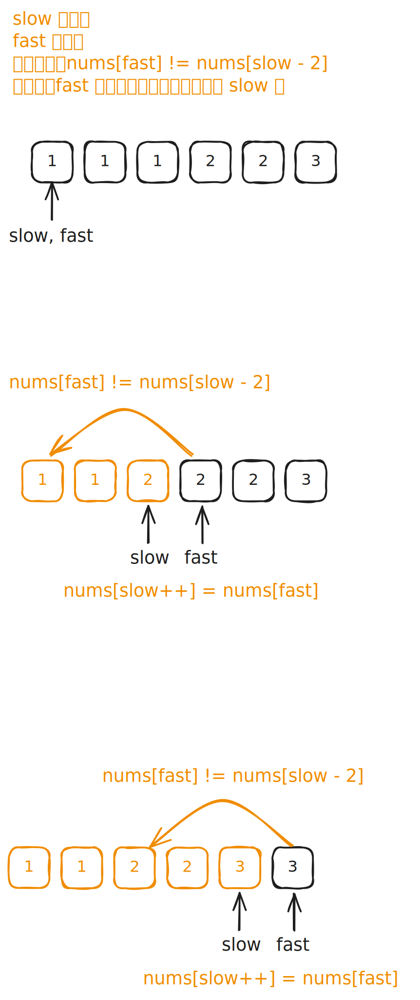

# [0080. 删除有序数组中的重复项 II【中等】](https://github.com/tnotesjs/TNotes.leetcode/tree/main/notes/0080.%20%E5%88%A0%E9%99%A4%E6%9C%89%E5%BA%8F%E6%95%B0%E7%BB%84%E4%B8%AD%E7%9A%84%E9%87%8D%E5%A4%8D%E9%A1%B9%20II%E3%80%90%E4%B8%AD%E7%AD%89%E3%80%91)

<!-- region:toc -->

- [1. 📝 题目描述](#1--题目描述)
- [2. 🎯 s.1 - 快慢指针](#2--s1---快慢指针)
- [3. 引用](#3-引用)

<!-- endregion:toc -->

## 1. 📝 题目描述

- [leetcode](https://leetcode.cn/problems/remove-duplicates-from-sorted-array-ii)

给你一个有序数组 `nums`，请你 [原地][1] 删除重复出现的元素，使得出现次数超过两次的元素只出现两次，返回删除后数组的新长度。

不要使用额外的数组空间，你必须在 [原地][1] 修改输入数组 并在使用 O(1) 额外空间的条件下完成。

说明：

为什么返回数值是整数，但输出的答案是数组呢？

请注意，输入数组是以 「引用」 方式传递的，这意味着在函数里修改输入数组对于调用者是可见的。

你可以想象内部操作如下:

```
// nums 是以“引用”方式传递的。也就是说，不对实参做任何拷贝
int len = removeDuplicates(nums);

// 在函数里修改输入数组对于调用者是可见的。
// 根据你的函数返回的长度, 它会打印出数组中 该长度范围内 的所有元素。
for (int i = 0; i < len; i++) {
    print(nums[i]);
}
```

---

示例 1：

```
输入：nums = [1, 1, 1, 2, 2, 3]
输出：5, nums = [1, 1, 2, 2, 3]
```

解释：

函数应返回新长度 length = 5, 并且原数组的前五个元素被修改为 1, 1, 2, 2, 3。

不需要考虑数组中超出新长度后面的元素。

---

示例 2：

```
输入：nums = [0, 0, 1, 1, 1, 1, 2, 3, 3]
输出：7, nums = [0, 0, 1, 1, 2, 3, 3]
```

解释：

函数应返回新长度 length = 7, 并且原数组的前七个元素被修改为 0, 0, 1, 1, 2, 3, 3。

不需要考虑数组中超出新长度后面的元素。

---

提示：

- `1 <= nums.length <= 3 * 10^4`
- `-10^4 <= nums[i] <= 10^4`
- `nums` 已按升序排列

## 2. 🎯 s.1 - 快慢指针



::: code-group

<<< ./solutions/1/1.c [c]

<<< ./solutions/1/1.js [js]

<<< ./solutions/1/1.py [py]

:::

- 时间复杂度：$O(n)$，只需遍历数组一次
- 空间复杂度：$O(1)$，原地修改，只使用常数额外空间

算法思路：

- 用快慢指针，`slow` 为写指针，`fast` 为读指针
  - `slow` 是“慢指针”，它标记着下一个合法元素应该存放的位置，同时也代表了处理后数组的新长度。
  - `fast` 是“快指针”，它的任务是依次遍历整个原始数组，检查每个元素是否应该被安全写入到 `slow` 中。
- 由于数组已排序，只需判断 `nums[slow - 2]` 是否等于 `nums[fast]`：若不相等，说明 `nums[fast]` 不会构成第三个重复，可以写入 `nums[slow]`；否则跳过
- 循环结束后 `slow` 即为新数组的长度

## 3. 引用

- [原地算法 - 百度百科][1]

[1]: http://baike.baidu.com/item/%E5%8E%9F%E5%9C%B0%E7%AE%97%E6%B3%95
