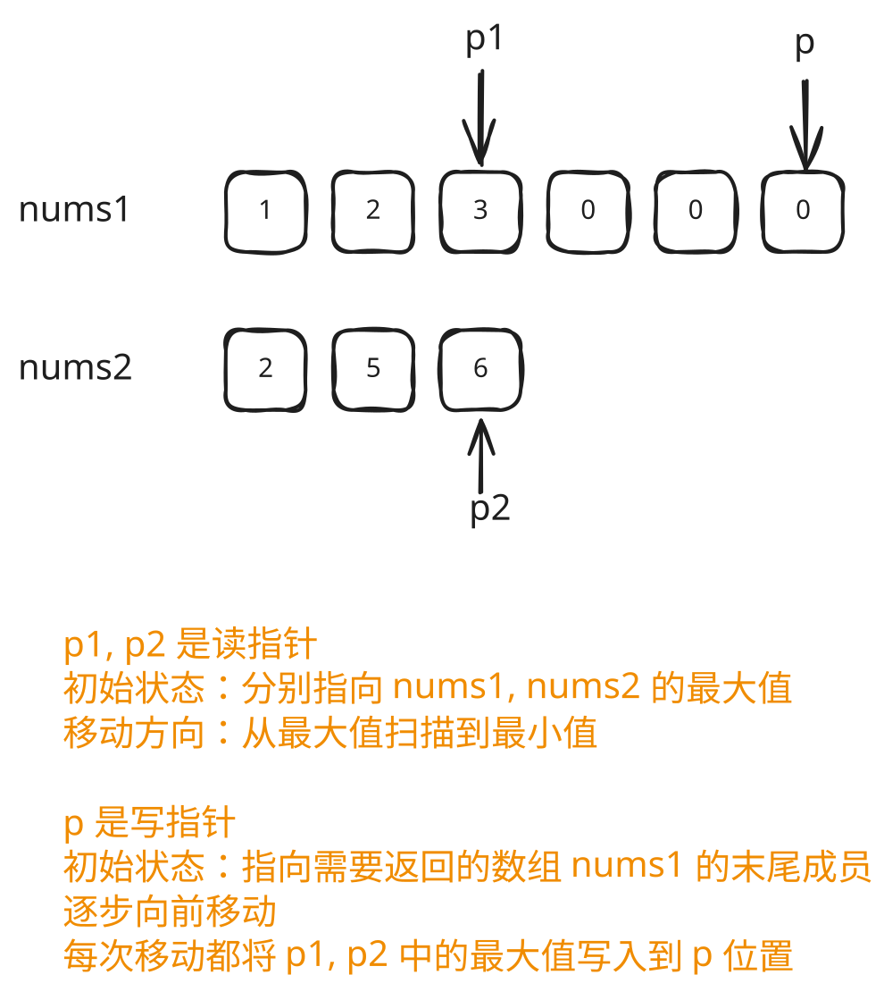

## 1. 题目描述

- [leetcode](https://leetcode.cn/problems/merge-sorted-array)

给你两个按非递减顺序排列的整数数组 `nums1` 和 `nums2`，另有两个整数 `m` 和 `n`，分别表示 `nums1` 和 `nums2` 中的元素数目。

请你合并 `nums2` 到 `nums1` 中，使合并后的数组同样按非递减顺序排列。

注意：最终，合并后数组不应由函数返回，而是存储在数组 `nums1` 中。为了应对这种情况，`nums1` 的初始长度为 `m + n`，其中前 `m` 个元素表示应合并的元素，后 `n` 个元素为 `0`，应忽略。`nums2` 的长度为 `n`。

---

示例 1：

```
输入：
  nums1 = [1, 2, 3, 0, 0, 0],
  m = 3,
  nums2 = [2, 5, 6],
  n = 3
输出：[1, 2, 2, 3, 5, 6]
```

解释：

- 需要合并 [1, 2, 3] 和 [2, 5, 6]。
- 合并结果是 [1, 2, 2, 3, 5, 6]，其中斜体加粗标注的为 nums1 中的元素。

---

示例 2：

```
输入：
  nums1 = [1],
  m = 1,
  nums2 = [],
  n = 0
输出：[1]
```

解释：

- 需要合并 [1] 和 []。
- 合并结果是 [1]。

---

示例 3：

```
输入：
  nums1 = [0],
  m = 0,
  nums2 = [1],
  n = 1
输出：[1]
```

解释：

- 需要合并的数组是 [] 和 [1]。
- 合并结果是 [1]。
- 注意，因为 m = 0，所以 nums1 中没有元素。nums1 中仅存的 0 仅仅是为了确保合并结果可以顺利存放到 nums1 中。

---

提示：

- `nums1.length == m + n`
- `nums2.length == n`
- `0 <= m, n <= 200`
- `1 <= m + n <= 200`
- `-10^9 <= nums1[i], nums2[j] <= 10^9`

进阶：你可以设计实现一个时间复杂度为 `O(m + n)` 的算法解决此问题吗？

## 2. s.1 - 逆向双指针



::: code-group

```c [c]
void merge(int* nums1, int nums1Size, int m, int* nums2, int nums2Size, int n) {
    int p1 = m - 1, p2 = n - 1, p = m + n - 1;

    while (p1 >= 0 && p2 >= 0) {
        if (nums1[p1] > nums2[p2]) {
            nums1[p--] = nums1[p1--];
        } else {
            nums1[p--] = nums2[p2--];
        }
    }

    while (p2 >= 0) {
        nums1[p--] = nums2[p2--];
    }
}
```

```js [js]
/**
 * @param {number[]} nums1
 * @param {number} m
 * @param {number[]} nums2
 * @param {number} n
 * @return {void} Do not return anything, modify nums1 in-place instead.
 */
var merge = function (nums1, m, nums2, n) {
  // 初始化三个指针
  let p1 = m - 1 // 指向 nums1 有效元素的末尾
  let p2 = n - 1 // 指向 nums2 的末尾
  let p = m + n - 1 // 指向 nums1 的末尾

  // 从后向前遍历，直到其中一个数组被完全处理
  while (p1 >= 0 && p2 >= 0) {
    // 将较大的元素放在 nums1 的末尾
    if (nums1[p1] > nums2[p2]) {
      nums1[p] = nums1[p1]
      p1--
    } else {
      nums1[p] = nums2[p2]
      p2--
    }
    p--
  }

  // 如果 nums2 中还有剩余元素，将它们复制到 nums1 的前面
  // 如果 nums1 有剩余，则它们已经在正确的位置，无需操作
  while (p2 >= 0) {
    nums1[p] = nums2[p2]
    p2--
    p--
  }
}
```

```py [py]
class Solution:
    def merge(self, nums1: list[int], m: int, nums2: list[int], n: int) -> None:
        """
        Do not return anything, modify nums1 in-place instead.
        """
        p1, p2, p = m - 1, n - 1, m + n - 1

        while p1 >= 0 and p2 >= 0:
            if nums1[p1] > nums2[p2]:
                nums1[p] = nums1[p1]
                p1 -= 1
            else:
                nums1[p] = nums2[p2]
                p2 -= 1
            p -= 1

        while p2 >= 0:
            nums1[p] = nums2[p2]
            p2 -= 1
            p -= 1
```

:::

复杂度分析：

- 时间复杂度: $O(m + n)$，因为最坏情况下需要遍历两个数组的所有元素。
- 空间复杂度: $O(1)$，只使用了常数级别的额外空间。

算法思路：

- 指针初始化：`p1` 指向 `nums1` 最后一个有效元素 `m-1`，`p2` 指向 `nums2` 最后一个元素 `n-1`，`p` 指向 `nums1` 的最后一个位置 `m+n-1`。
- 从后往前填充：比较 `nums1[p1]` 和 `nums2[p2]`，将较大的元素放入 `nums1[p]`，然后移动相应的指针。
- 处理剩余元素：如果 `nums2` 中还有剩余元素 `p2 >= 0`，将它们按顺序复制到 `nums1` 的前面。`nums1` 中剩余的元素已经在正确的位置上，无需额外处理。
