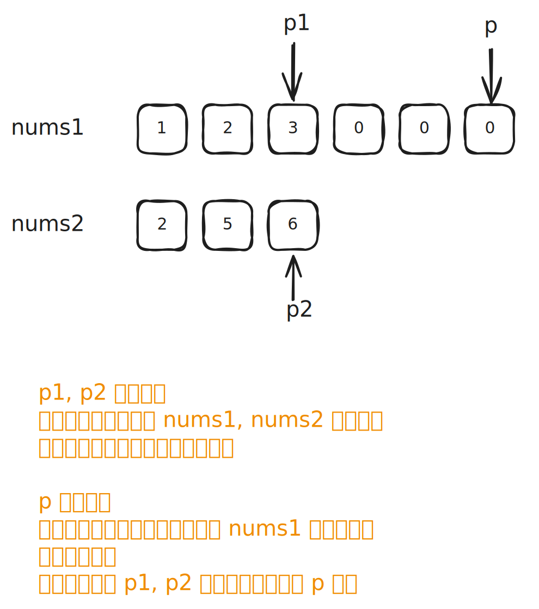

# [0088. 合并两个有序数组【简单】](https://github.com/tnotesjs/TNotes.leetcode/tree/main/notes/0088.%20%E5%90%88%E5%B9%B6%E4%B8%A4%E4%B8%AA%E6%9C%89%E5%BA%8F%E6%95%B0%E7%BB%84%E3%80%90%E7%AE%80%E5%8D%95%E3%80%91)

<!-- region:toc -->

- [1. 📝 题目描述](#1--题目描述)
- [2. 🎯 s.1 - 逆向双指针](#2--s1---逆向双指针)

<!-- endregion:toc -->

## 1. 📝 题目描述

- [leetcode](https://leetcode.cn/problems/merge-sorted-array)

给你两个按非递减顺序排列的整数数组 `nums1` 和 `nums2`，另有两个整数 `m` 和 `n`，分别表示 `nums1` 和 `nums2` 中的元素数目。

请你合并 `nums2` 到 `nums1` 中，使合并后的数组同样按非递减顺序排列。

注意：最终，合并后数组不应由函数返回，而是存储在数组 `nums1` 中。为了应对这种情况，`nums1` 的初始长度为 `m + n`，其中前 `m` 个元素表示应合并的元素，后 `n` 个元素为 `0`，应忽略。`nums2` 的长度为 `n`。

---

示例 1：

```
输入：
  nums1 = [1, 2, 3, 0, 0, 0],
  m = 3,
  nums2 = [2, 5, 6],
  n = 3
输出：[1, 2, 2, 3, 5, 6]
```

解释：

- 需要合并 [1, 2, 3] 和 [2, 5, 6]。
- 合并结果是 [1, 2, 2, 3, 5, 6]，其中斜体加粗标注的为 nums1 中的元素。

---

示例 2：

```
输入：
  nums1 = [1],
  m = 1,
  nums2 = [],
  n = 0
输出：[1]
```

解释：

- 需要合并 [1] 和 []。
- 合并结果是 [1]。

---

示例 3：

```
输入：
  nums1 = [0],
  m = 0,
  nums2 = [1],
  n = 1
输出：[1]
```

解释：

- 需要合并的数组是 [] 和 [1]。
- 合并结果是 [1]。
- 注意，因为 m = 0，所以 nums1 中没有元素。nums1 中仅存的 0 仅仅是为了确保合并结果可以顺利存放到 nums1 中。

---

提示：

- `nums1.length == m + n`
- `nums2.length == n`
- `0 <= m, n <= 200`
- `1 <= m + n <= 200`
- `-10^9 <= nums1[i], nums2[j] <= 10^9`

进阶：你可以设计实现一个时间复杂度为 `O(m + n)` 的算法解决此问题吗？

## 2. 🎯 s.1 - 逆向双指针



::: code-group

<<< ./solutions/1/1.c [c]

<<< ./solutions/1/1.js [js]

<<< ./solutions/1/1.py [py]

:::

复杂度分析：

- 时间复杂度: $O(m + n)$，因为最坏情况下需要遍历两个数组的所有元素。
- 空间复杂度: $O(1)$，只使用了常数级别的额外空间。

算法思路：

- 指针初始化：`p1` 指向 `nums1` 最后一个有效元素 `m-1`，`p2` 指向 `nums2` 最后一个元素 `n-1`，`p` 指向 `nums1` 的最后一个位置 `m+n-1`。
- 从后往前填充：比较 `nums1[p1]` 和 `nums2[p2]`，将较大的元素放入 `nums1[p]`，然后移动相应的指针。
- 处理剩余元素：如果 `nums2` 中还有剩余元素 `p2 >= 0`，将它们按顺序复制到 `nums1` 的前面。`nums1` 中剩余的元素已经在正确的位置上，无需额外处理。
