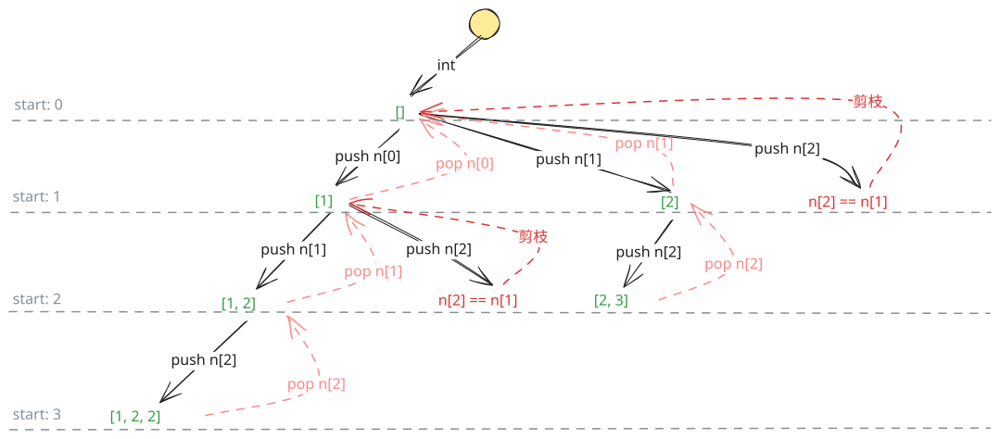

## 1. 题目描述

- [leetcode](https://leetcode.cn/problems/subsets-ii/)

给你一个整数数组 `nums`，其中可能包含重复元素，请你返回该数组所有可能的子集（幂集）。

解集不能包含重复的子集。返回的解集中，子集可以按任意顺序排列。

---

示例 1：

```txt
输入：nums = [1, 2, 2]
输出：[[], [1], [1, 2], [1, 2, 2], [2], [2, 2]]
```

---

示例 2：

```txt
输入：nums = [0]
输出：[[], [0]]
```

---

提示：

- `1 <= nums.length <= 10`
- `-10 <= nums[i] <= 10`

## 2. s.1 - 回溯（排序去重）



::: code-group

```c [c]
/**
 * Return an array of arrays of size *returnSize.
 * The sizes of the arrays are returned as *returnColumnSizes array.
 * Note: Both returned array and *columnSizes array must be malloced, assume caller calls free().
 */
int cmp(const void* a, const void* b) { return *(int*)a - *(int*)b; }

void backtrack(int* nums, int numsSize, int start, int* path, int pathSize,
               int** result, int* returnSize, int** returnColumnSizes) {
    result[*returnSize] = (int*)malloc(sizeof(int) * pathSize);
    memcpy(result[*returnSize], path, sizeof(int) * pathSize);
    (*returnColumnSizes)[*returnSize] = pathSize;
    (*returnSize)++;

    for (int i = start; i < numsSize; i++) {
        if (i > start && nums[i] == nums[i - 1]) continue; // 跳过同层重复
        path[pathSize] = nums[i];
        backtrack(nums, numsSize, i + 1, path, pathSize + 1, result, returnSize, returnColumnSizes);
    }
}

int** subsetsWithDup(int* nums, int numsSize, int* returnSize, int** returnColumnSizes) {
    qsort(nums, numsSize, sizeof(int), cmp);
    int** result = (int**)malloc(sizeof(int*) * (1 << numsSize));
    *returnColumnSizes = (int*)malloc(sizeof(int) * (1 << numsSize));
    *returnSize = 0;
    int* path = (int*)malloc(sizeof(int) * numsSize);
    backtrack(nums, numsSize, 0, path, 0, result, returnSize, returnColumnSizes);
    free(path);
    return result;
}
```

```js [js]
/**
 * @param {number[]} nums
 * @return {number[][]}
 */
var subsetsWithDup = function (nums) {
  nums.sort((a, b) => a - b)
  const result = []

  const backtrack = (start, path) => {
    result.push([...path])
    for (let i = start; i < nums.length; i++) {
      if (i > start && nums[i] === nums[i - 1]) continue // 剪枝，跳过同层重复
      path.push(nums[i])
      backtrack(i + 1, path)
      path.pop()
    }
  }

  backtrack(0, [])
  return result
}
```

```py [py]
class Solution:
    def subsetsWithDup(self, nums: List[int]) -> List[List[int]]:
        nums.sort()
        result = []

        def backtrack(start: int, path: list):
            result.append(path[:])
            for i in range(start, len(nums)):
                if i > start and nums[i] == nums[i - 1]: continue  # 跳过同层重复
                path.append(nums[i])
                backtrack(i + 1, path)
                path.pop()

        backtrack(0, [])
        return result
```

:::

- 时间复杂度：$O(n \times 2^n)$，最多生成 $2^n$ 个子集，每个子集拷贝最多 $O(n)$
- 空间复杂度：$O(n)$，递归栈深度最大为 n

算法思路：

- 先将数组排序，使重复元素相邻
- 回溯过程中，每层递归当 `nums[i] == nums[i-1]` 且 `i > start` 时跳过，避免生成重复子集
- 每次进入回溯函数时，将当前 path 加入结果
