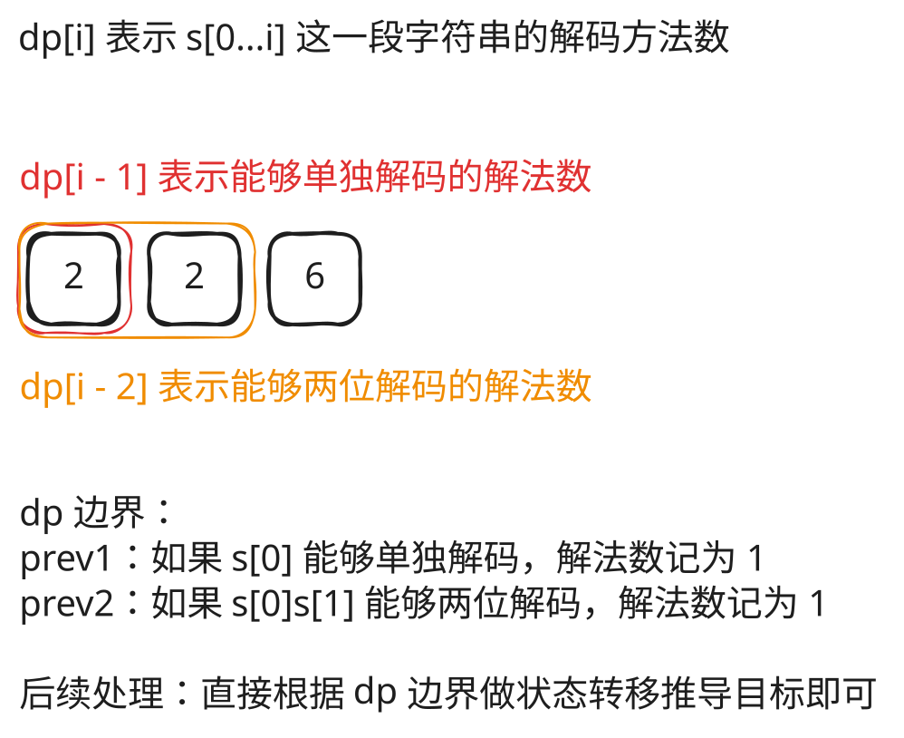

## 1. 题目描述

- [leetcode](https://leetcode.cn/problems/decode-ways/)

一条包含字母 `A-Z` 的消息通过以下映射进行了编码：

- `"1" -> 'A'`
- `"2" -> 'B'`
- `...`
- `"25" -> 'Y'`
- `"26" -> 'Z'`

然而，在解码已编码的消息时，你意识到有许多不同的方式来解码，因为有些编码被包含在其它编码当中（`"2"` 和 `"5"` 与 `"25"`）。

例如，`"11106"` 可以映射为：

- `"AAJF"`，将消息分组为 `(1, 1, 10, 6)`
- `"KJF"`，将消息分组为 `(11, 10, 6)`
- 消息不能分组为 `(1, 11, 06)`，因为 `"06"` 不是一个合法编码（只有 "6" 是合法的）。

注意，可能存在无法解码的字符串。

给你一个只含数字的非空字符串 `s`，请计算并返回解码方法的总数。如果没有合法的方式解码整个字符串，返回 `0`。

题目数据保证答案肯定是一个 32 位的整数。

---

示例 1：

```txt
输入：s = "12"
输出：2
```

解释：它可以解码为 "AB"（1 2）或者 "L"（12）。

---

示例 2：

```txt
输入：s = "226"
输出：3
```

解释：它可以解码为 "BZ" (2 26), "VF" (22 6), 或者 "BBF" (2 2 6)。

---

示例 3：

```txt
输入：s = "06"
输出：0
```

解释："06" 无法映射到 "F"，因为存在前导零（"6" 和 "06" 并不等价）。

---

提示：

- `1 <= s.length <= 100`
- `s` 只包含数字，并且可能包含前导零。

## 2. s.1 - 动态规划



::: code-group

```c [c]
int numDecodings(char* s) {
    int n = strlen(s);
    if (s[0] == '0') return 0;

    int prev2 = 1, prev1 = 1; // prev2 = dp[i-2], prev1 = dp[i-1]
    for (int i = 1; i < n; i++) {
        int cur = 0;
        if (s[i] != '0') cur += prev1;                                         // 单独解码
        if (s[i - 1] == '1' || (s[i - 1] == '2' && s[i] <= '6')) cur += prev2; // 两位解码
        prev2 = prev1;
        prev1 = cur;
    }
    return prev1;
}
```

```js [js]
/**
 * @param {string} s
 * @return {number}
 */
var numDecodings = function (s) {
  if (s[0] === '0') return 0
  let prev2 = 1,
    prev1 = 1 // prev2 = dp[i-2], prev1 = dp[i-1]

  for (let i = 1; i < s.length; i++) {
    let cur = 0
    if (s[i] !== '0') cur += prev1 // 单独解码
    if (s[i - 1] === '1' || (s[i - 1] === '2' && s[i] <= '6')) cur += prev2 // 两位解码
    prev2 = prev1
    prev1 = cur
  }
  return prev1
}
```

```py [py]
class Solution:
    def numDecodings(self, s: str) -> int:
        if s[0] == '0': return 0
        prev2, prev1 = 1, 1  # prev2 = dp[i-2], prev1 = dp[i-1]

        for i in range(1, len(s)):
            cur = 0
            if s[i] != '0': cur += prev1                                          # 单独解码
            if s[i - 1] == '1' or (s[i - 1] == '2' and s[i] <= '6'): cur += prev2  # 两位解码
            prev2, prev1 = prev1, cur
        return prev1
```

:::

- 时间复杂度：$O(n)$，其中 n 是字符串长度
- 空间复杂度：$O(1)$，只使用两个变量滚动

算法思路：

- 状态定义：`dp[i]` 表示字符串前 `i` 个字符的解码方法数
- 状态转移：
  - 若 `s[i] != '0'`，可单独解码，`dp[i] += dp[i-1]`
  - 若 `s[i-1..i]` 组成的两位数在 10–26 之间，可两位解码，`dp[i] += dp[i-2]`
- 初始化：`prev1 = 1` 和 `prev2 = 1`
  - `prev1 = 1` 是因为首个字符已经确认可以单独解码
  - `prev2 = 1` 是为了支持首轮循环时，前两个字符整体解码的情况，比如 `"10"`、`"12"`、`"26"` 这种组合，可以整体解码，记为一种解码方法（因此首轮循环从第二个字符 `s[1]` 开始）
- 用两个变量 `prev2, prev1` 滚动代替数组
