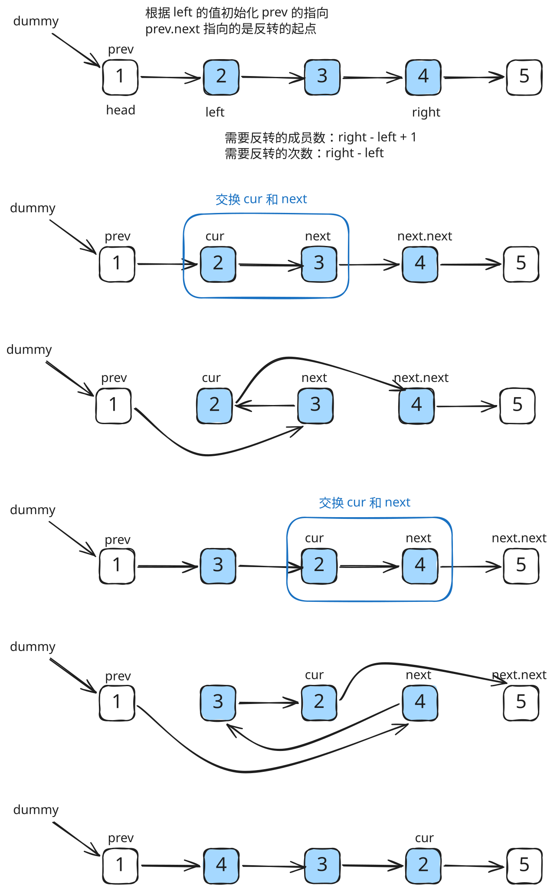

## 1. 题目描述

- [leetcode](https://leetcode.cn/problems/reverse-linked-list-ii/)

给你单链表的头指针 `head` 和两个整数 `left` 和 `right`，其中 `left <= right`。请你反转从位置 `left` 到位置 `right` 的链表节点，返回反转后的链表。

---

示例 1：


```txt
输入：head = [1, 2, 3, 4, 5], left = 2, right = 4
输出：[1, 4, 3, 2, 5]
```

示例 2：

```txt
输入：head = [5], left = 1, right = 1
输出：[5]
```

---

提示：

- 链表中节点数目为 `n`
- `1 <= n <= 500`
- `-500 <= Node.val <= 500`
- `1 <= left <= right <= n`

---

进阶：你可以使用一趟扫描完成反转吗？

## 2. s.1 - 头插法



::: code-group

```c [c]
/**
 * Definition for singly-linked list.
 * struct ListNode {
 *     int val;
 *     struct ListNode *next;
 * };
 */
struct ListNode* reverseBetween(struct ListNode* head, int left, int right) {
    struct ListNode dummy = {0, head};
    struct ListNode* prev = &dummy;
    for (int i = 1; i < left; i++) prev = prev->next; // 定位到 left 前一个节点

    struct ListNode* cur = prev->next;
    for (int i = 0; i < right - left; i++) { // 头插法逐个反转
        struct ListNode* next = cur->next;
        cur->next = next->next;
        next->next = prev->next;
        prev->next = next;
    }
    return dummy.next;
}
```

```js [js]
/**
 * Definition for singly-linked list.
 * function ListNode(val, next) {
 *     this.val = (val===undefined ? 0 : val)
 *     this.next = (next===undefined ? null : next)
 * }
 */
/**
 * @param {ListNode} head
 * @param {number} left
 * @param {number} right
 * @return {ListNode}
 */
var reverseBetween = function (head, left, right) {
  const dummy = new ListNode(0, head)
  let prev = dummy
  for (let i = 1; i < left; i++) prev = prev.next // 定位到 left 前一个节点

  let cur = prev.next
  for (let i = 0; i < right - left; i++) {
    // 头插法逐个反转
    const next = cur.next
    cur.next = next.next
    next.next = prev.next
    prev.next = next
  }
  return dummy.next
}
```

```py [py]
# Definition for singly-linked list.
# class ListNode:
#     def __init__(self, val=0, next=None):
#         self.val = val
#         self.next = next
class Solution:
    def reverseBetween(self, head: Optional[ListNode], left: int, right: int) -> Optional[ListNode]:
        dummy = ListNode(0, head)
        prev = dummy
        for _ in range(left - 1): prev = prev.next  # 定位到 left 前一个节点

        cur = prev.next
        for _ in range(right - left):  # 头插法逐个反转
            nxt = cur.next
            cur.next = nxt.next
            nxt.next = prev.next
            prev.next = nxt
        return dummy.next
```

:::

- 时间复杂度：$O(n)$，其中 n 是链表长度，一趟扫描完成
- 空间复杂度：$O(1)$，只使用常数额外空间

算法思路：

- 创建哨兵节点 `dummy`，定位 `prev` 为 `left` 前一个节点
- 使用头插法：将 `cur.next` 不断抽出插入到 `prev.next`，重复 `right - left` 次
- `cur` 始终指向反转区间的原第一个节点，每轮将 `cur` 后的节点提前
