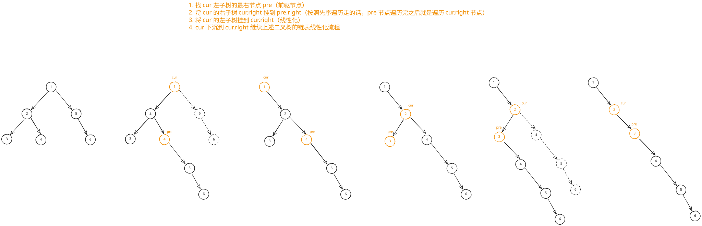

## 1. 题目描述

- [leetcode](https://leetcode.cn/problems/flatten-binary-tree-to-linked-list/)

给你二叉树的根结点 `root`，请你将它展开为一个单链表：

- 展开后的单链表应该同样使用 `TreeNode`，其中 `right` 子指针指向链表中下一个结点，而左子指针始终为 `null`。
- 展开后的单链表应该与二叉树 [先序遍历][1] 顺序相同。

---

示例 1：


```txt
输入：root = [1, 2, 5, 3, 4, null, 6]
输出：[1, null, 2, null, 3, null, 4, null, 5, null, 6]
```

---

示例 2：

```txt
输入：root = []
输出：[]
```

---

示例 3：

```txt
输入：root = [0]
输出：[0]
```

---

提示：

- 树中结点数在范围 `[0, 2000]` 内
- `-100 <= Node.val <= 100`

---

进阶：你可以使用原地算法（`O(1)` 额外空间）展开这棵树吗？

## 2. s.1 - 迭代（寻找前驱节点）



::: code-group

```c [c]
/**
 * Definition for a binary tree node.
 * struct TreeNode {
 *     int val;
 *     struct TreeNode *left;
 *     struct TreeNode *right;
 * };
 */
void flatten(struct TreeNode* root) {
    struct TreeNode* cur = root;
    while (cur) {
        if (cur->left) {
            // 找左子树的最右节点
            struct TreeNode* pre = cur->left;
            while (pre->right) pre = pre->right;
            // 将右子树挂到左子树的最右节点
            pre->right = cur->right;
            // 左子树移到右边，左置空
            cur->right = cur->left;
            cur->left = NULL;
        }
        cur = cur->right;
    }
}
```

```js [js]
/**
 * Definition for a binary tree node.
 * function TreeNode(val, left, right) {
 *     this.val = (val===undefined ? 0 : val)
 *     this.left = (left===undefined ? null : left)
 *     this.right = (right===undefined ? null : right)
 * }
 */
/**
 * @param {TreeNode} root
 * @return {void} Do not return anything, modify root in-place instead.
 */
var flatten = function (root) {
  let cur = root
  while (cur) {
    if (cur.left) {
      // 找左子树的最右节点
      let pre = cur.left
      while (pre.right) pre = pre.right
      // 将右子树挂到左子树的最右节点
      pre.right = cur.right
      // 左子树移到右边，左置空
      cur.right = cur.left
      cur.left = null
    }
    cur = cur.right
  }
}
```

```py [py]
# Definition for a binary tree node.
# class TreeNode:
#     def __init__(self, val=0, left=None, right=None):
#         self.val = val
#         self.left = left
#         self.right = right
class Solution:
    def flatten(self, root: Optional[TreeNode]) -> None:
        """
        Do not return anything, modify root in-place instead.
        """
        cur = root
        while cur:
            if cur.left:
                # 找左子树的最右节点
                pre = cur.left
                while pre.right:
                    pre = pre.right
                # 将右子树挂到左子树的最右节点
                pre.right = cur.right
                # 左子树移到右边，左置空
                cur.right = cur.left
                cur.left = None
            cur = cur.right
```

:::

- 时间复杂度：$O(n)$，其中 $n$ 是节点数，每个节点最多被访问两次
- 空间复杂度：$O(1)$，只使用常数级指针变量

算法思路：

- 从根节点开始遍历，对于当前节点 `cur`，若存在左子树：
  - 找到左子树的最右节点 `pre`（即先序遍历中左子树的最后一个节点）
  - 将 `cur.right` 挂到 `pre.right`
  - 将 `cur.left` 移到 `cur.right`，并将 `cur.left` 置空
- 然后沿 `cur = cur.right` 继续处理下一个节点

## 3. Morris 遍历

这道题 s.1 的实现，和 [TNotes.algorithms - Morris 遍历][2] 中的“找线索”很类似。

## 4. 引用

- [先序遍历 - 百度百科][1]
- [TNotes.algorithms - Morris 遍历][2]

[1]: https://baike.baidu.com/item/%E5%85%88%E5%BA%8F%E9%81%8D%E5%8E%86/6442839?fr=aladdin
[2]: https://tnotesjs.github.io/TNotes.algorithms/notes/0007.%20Morris%20%E9%81%8D%E5%8E%86/README
