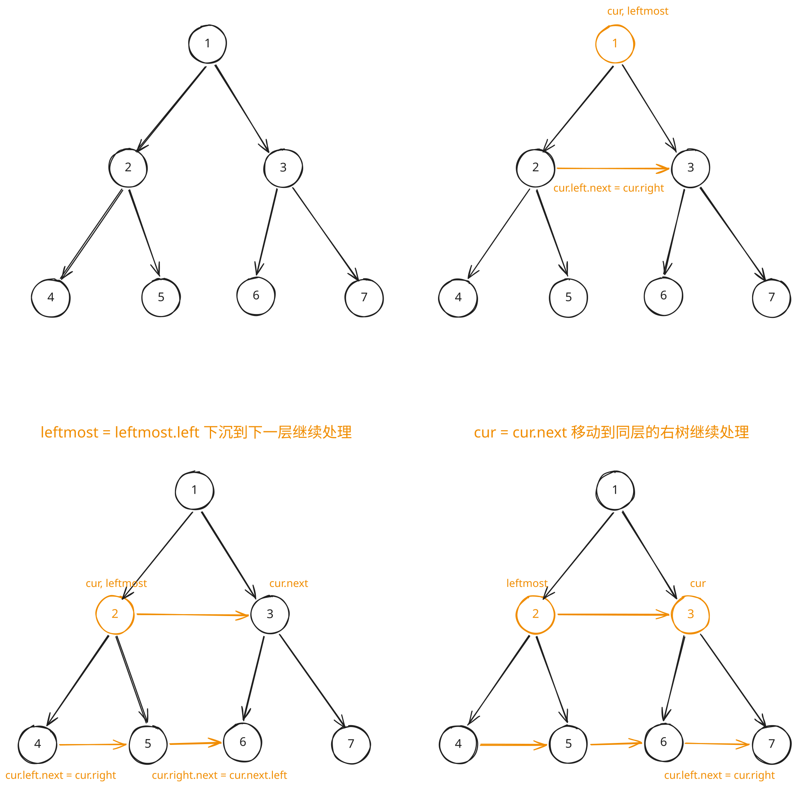

## 1. 题目描述

- [leetcode](https://leetcode.cn/problems/populating-next-right-pointers-in-each-node/)

给定一个完美二叉树，其所有叶子节点都在同一层，每个父节点都有两个子节点。二叉树定义如下：

> 完美二叉树（Perfect Binary Tree）是指：每个非叶子节点都有且只有两个子节点，并且所有叶子节点都在同一层。

```c
struct Node {
  int val;
  Node *left;
  Node *right;
  Node *next;
}
```

填充它的每个 next 指针，让这个指针指向其下一个右侧节点。如果找不到下一个右侧节点，则将 next 指针设置为 `NULL`。

初始状态下，所有 next 指针都被设置为 `NULL`。

---

示例 1：


```txt
输入：root = [1, 2, 3, 4, 5, 6, 7]
输出：[1, #, 2, 3, #, 4, 5, 6, 7, #]
```

解释：

- 给定二叉树如图 A 所示，你的函数应该填充它的每个 next 指针，以指向其下一个右侧节点，如图 B 所示。
- 序列化的输出按层序遍历排列，同一层节点由 next 指针连接，`'#'` 标志着每一层的结束。

---

示例 2：

```txt
输入：root = []
输出：[]
```

---

提示：

- 树中节点的数量在 `[0, 2^12 - 1]` 范围内
- `-1000 <= node.val <= 1000`

---

进阶：

- 你只能使用常量级额外空间。
- 使用递归解题也符合要求，本题中递归程序占用的栈空间不算做额外的空间复杂度。

## 2. s.1 - 基于 next 指针的层序遍历



::: code-group

```c [c]
/**
 * Definition for a Node.
 * struct Node {
 *     int val;
 *     struct Node *left;
 *     struct Node *right;
 *     struct Node *next;
 * };
 */
struct Node* connect(struct Node* root) {
    if (!root) return NULL;
    struct Node* leftmost = root;

    while (leftmost->left) {
        struct Node* cur = leftmost;
        while (cur) {
            cur->left->next = cur->right;
            if (cur->next) cur->right->next = cur->next->left;
            cur = cur->next;
        }
        leftmost = leftmost->left;
    }

    return root;
}
```

```js [js]
/**
 * // Definition for a _Node.
 * function _Node(val, left, right, next) {
 *    this.val = val === undefined ? null : val;
 *    this.left = left === undefined ? null : left;
 *    this.right = right === undefined ? null : right;
 *    this.next = next === undefined ? null : next;
 * };
 */

/**
 * @param {_Node} root
 * @return {_Node}
 */
var connect = function (root) {
  if (!root) return null
  let leftmost = root

  while (leftmost.left) {
    let cur = leftmost
    while (cur) {
      // 左子 -> 右子
      cur.left.next = cur.right
      // 右子 -> 下一个节点的左子
      if (cur.next) cur.right.next = cur.next.left
      cur = cur.next
    }
    leftmost = leftmost.left
  }

  return root
}
```

```py [py]
"""
# Definition for a Node.
class Node:
    def __init__(self, val: int = 0, left: 'Node' = None, right: 'Node' = None, next: 'Node' = None):
        self.val = val
        self.left = left
        self.right = right
        self.next = next
"""

class Solution:
    def connect(self, root: "Optional[Node]") -> "Optional[Node]":
        if not root:
            return None
        leftmost = root

        while leftmost.left:
            cur = leftmost
            while cur:
                cur.left.next = cur.right
                if cur.next:
                    cur.right.next = cur.next.left
                cur = cur.next
            leftmost = leftmost.left

        return root
```

:::

- 时间复杂度：$O(n)$，其中 $n$ 是节点数，每个节点恰好处理一次
- 空间复杂度：$O(1)$，只使用常数级指针变量

算法思路：

- 利用完美二叉树的性质，从最左节点 `leftmost` 逐层往下处理
- 在当前层通过已建立的 `next` 指针横向移动 `cur`，为下一层的子节点建立连接：
  - `cur.left.next = cur.right`（同父节点的左右子连接）
  - `cur.right.next = cur.next.left`（跨父节点的连接）
- 处理完一层后，`leftmost = leftmost.left` 进入下一层
