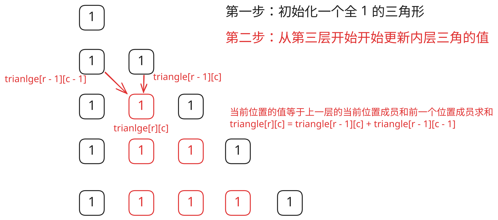

## 1. 题目描述

- [leetcode](https://leetcode.cn/problems/pascals-triangle)

给定一个非负整数 `numRows`，生成「杨辉三角」的前 `numRows` 行。

在「杨辉三角」中，每个数是它左上方和右上方的数的和。


---

示例 1：

```
输入: numRows = 5
输出: [[1], [1, 1], [1, 2, 1], [1, 3, 3, 1], [1, 4, 6, 4, 1]]
```

---

示例 2：

```
输入: numRows = 1
输出: [[1]]
```

提示：

- `1 <= numRows <= 30`

## 2. s.1 - 逐行递推



::: code-group

```c [c]
/**
 * Return an array of arrays of size *returnSize.
 * The sizes of the arrays are returned as *returnColumnSizes array.
 * Note: Both returned array and *columnSizes array must be malloced, assume
 * caller calls free().
 */
int** generate(int numRows, int* returnSize, int** returnColumnSizes) {
    int** triangle = (int**)malloc(sizeof(int*) * numRows);
    *returnColumnSizes = (int*)malloc(sizeof(int) * numRows);
    *returnSize = numRows;

    for (int i = 0; i < numRows; i++) {
        triangle[i] = (int*)malloc(sizeof(int) * (i + 1));
        (*returnColumnSizes)[i] = i + 1;
        triangle[i][0] = 1;
        triangle[i][i] = 1;
    }

    for (int r = 2; r < numRows; r++) {
        for (int c = 1; c < r; c++) {
            triangle[r][c] = triangle[r - 1][c - 1] + triangle[r - 1][c];
        }
    }

    return triangle;
}
```

```js [js]
/**
 * @param {number} numRows
 * @return {number[][]}
 */
var generate = function (numRows) {
  if (numRows === 1) return [[1]]
  if (numRows === 2) return [[1], [1, 1]]

  // 初始化
  const triangle = []
  for (let i = 1; i <= numRows; i++) triangle.push(new Array(i).fill(1))

  // 内层求和
  for (let r = 2; r <= numRows - 1; r++)
    for (let c = 1; c <= r - 1; c++)
      triangle[r][c] = triangle[r - 1][c - 1] + triangle[r - 1][c]

  return triangle
}
```

```py [py]
class Solution:
    def generate(self, numRows: int) -> list[list[int]]:
        triangle = [[1] * (i + 1) for i in range(numRows)]

        for r in range(2, numRows):
            for c in range(1, r):
                triangle[r][c] = triangle[r - 1][c - 1] + triangle[r - 1][c]

        return triangle
```

:::

- 时间复杂度：$O(n^2)$，其中 $n$ 是 `numRows`，需要填充整个杨辉三角的所有元素
- 空间复杂度：$O(1)$，若不计返回结果所占用的空间

算法思路：

- 杨辉三角的第 `i` 行有 `i` 个元素，首尾都是 `1`
- 对于中间元素，满足递推关系：`triangle[r][c] = triangle[r-1][c-1] + triangle[r-1][c]`
- 因此可以先初始化每行全部为 `1`，再逐行填写中间位置的值
