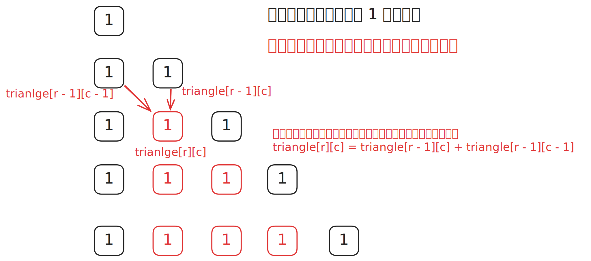

# [0118. 杨辉三角【简单】](https://github.com/tnotesjs/TNotes.leetcode/tree/main/notes/0118.%20%E6%9D%A8%E8%BE%89%E4%B8%89%E8%A7%92%E3%80%90%E7%AE%80%E5%8D%95%E3%80%91)

<!-- region:toc -->

- [1. 📝 题目描述](#1--题目描述)
- [2. 🎯 s.1 - 逐行递推](#2--s1---逐行递推)

<!-- endregion:toc -->

## 1. 📝 题目描述

- [leetcode](https://leetcode.cn/problems/pascals-triangle)

给定一个非负整数 `numRows`，生成「杨辉三角」的前 `numRows` 行。

在「杨辉三角」中，每个数是它左上方和右上方的数的和。


---

示例 1：

```
输入: numRows = 5
输出: [[1], [1, 1], [1, 2, 1], [1, 3, 3, 1], [1, 4, 6, 4, 1]]
```

---

示例 2：

```
输入: numRows = 1
输出: [[1]]
```

提示：

- `1 <= numRows <= 30`

## 2. 🎯 s.1 - 逐行递推



::: code-group

<<< ./solutions/1/1.c [c]

<<< ./solutions/1/1.js [js]

<<< ./solutions/1/1.py [py]

:::

- 时间复杂度：$O(n^2)$，其中 $n$ 是 `numRows`，需要填充整个杨辉三角的所有元素
- 空间复杂度：$O(1)$，若不计返回结果所占用的空间

算法思路：

- 杨辉三角的第 `i` 行有 `i` 个元素，首尾都是 `1`
- 对于中间元素，满足递推关系：`triangle[r][c] = triangle[r-1][c-1] + triangle[r-1][c]`
- 因此可以先初始化每行全部为 `1`，再逐行填写中间位置的值
