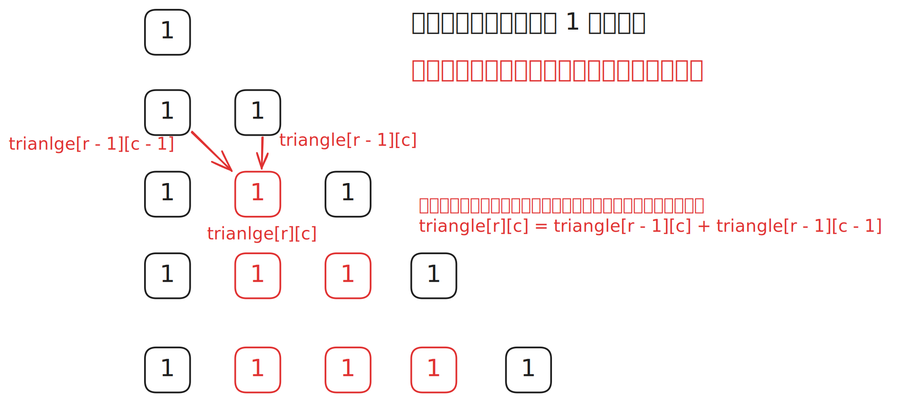

# [0119. 杨辉三角 II【简单】](https://github.com/tnotesjs/TNotes.leetcode/tree/main/notes/0119.%20%E6%9D%A8%E8%BE%89%E4%B8%89%E8%A7%92%20II%E3%80%90%E7%AE%80%E5%8D%95%E3%80%91)

<!-- region:toc -->

- [1. 📝 题目描述](#1--题目描述)
- [2. 🎯 s.1 - 暴力解法](#2--s1---暴力解法)
- [3. 🎯 s.2 - 动态规划](#3--s2---动态规划)

<!-- endregion:toc -->

## 1. 📝 题目描述

- [leetcode](https://leetcode.cn/problems/pascals-triangle-ii)

给定一个非负索引 `rowIndex`，返回「杨辉三角」的第 `rowIndex` 行。

在「杨辉三角」中，每个数是它左上方和右上方的数的和。


示例 1:

```
输入: rowIndex = 3
输出: [1,3,3,1]

```

示例 2:

```
输入: rowIndex = 0
输出: [1]

```

示例 3:

```
输入: rowIndex = 1
输出: [1,1]

```

提示:

- `0 <= rowIndex <= 33`

进阶：

你可以优化你的算法到 `O(rowIndex)` 空间复杂度吗？

## 2. 🎯 s.1 - 暴力解法



::: code-group

<<< ./solutions/1/1.js

:::

- 时间复杂度：$O(rowIndex^2)$，需要填充杨辉三角中的每个元素
- 空间复杂度：$O(rowIndex^2)$，需要存储完整的杨辉三角

解题思路同 118. 杨辉三角，先生成一个完整的杨辉三角，然后返回对应行的数据。

## 3. 🎯 s.2 - 动态规划

::: code-group

<<< ./solutions/2/1.js

:::

- 时间复杂度：$O(rowIndex^2)$，需要遍历 rowIndex 行，每行更新的元素数量逐渐增加
- 空间复杂度：$O(rowIndex)$，使用一个长度为 rowIndex + 1 的数组

解题思路：

- 使用一维数组滚动更新，每次循环在数组末尾添加 1，然后从后往前更新中间元素
- 从后往前更新可以避免覆盖还需要使用的值
- 每个元素等于上一行对应位置和前一位置元素的和
