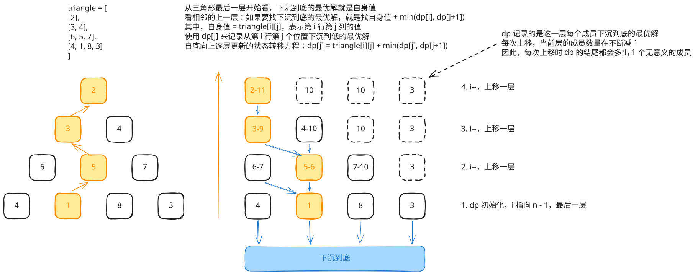

## 1. 题目描述

- [leetcode](https://leetcode.cn/problems/triangle/)

给定一个三角形 `triangle`，找出自顶向下的最小路径和。

每一步只能移动到下一行中相邻的结点上。相邻的结点在这里指的是下标与上一层结点下标相同或者等于上一层结点下标 + 1 的两个结点。也就是说，如果正位于当前行的下标 `i`，那么下一步可以移动到下一行的下标 `i` 或 `i + 1`。

---

示例 1：

```txt
输入：triangle = [[2], [3, 4], [6, 5, 7], [4, 1, 8, 3]]
输出：11
```

解释：

如下面简图所示：

```
   2     <- (0) 最小 2
  3 4    <- (0) 最小 3
 6 5 7   <- (1) 最小 5
4 1 8 3  <- (1) 最小 1
```

自顶向下的最小路径和为 11（即，2 + 3 + 5 + 1 = 11）。

---

示例 2：

```txt
输入：triangle = [[-10]]
输出：-10
```

---

提示：

- `1 <= triangle.length <= 200`
- `triangle[0].length == 1`
- `triangle[i].length == triangle[i - 1].length + 1`
- `-10^4 <= triangle[i][j] <= 10^4`

---

进阶：

- 你可以只使用 `O(n)` 的额外空间（`n` 为三角形的总行数）来解决这个问题吗？

## 2. s.1 - 自底向上 DP



::: code-group

```c [c]
int minimumTotal(int** triangle, int triangleSize, int* triangleColSize) {
    int* dp = (int*)malloc(triangleSize * sizeof(int));
    for (int j = 0; j < triangleSize; j++)
        dp[j] = triangle[triangleSize - 1][j];

    for (int i = triangleSize - 2; i >= 0; i--) {
        for (int j = 0; j <= i; j++) {
            dp[j] = triangle[i][j] + (dp[j] < dp[j + 1] ? dp[j] : dp[j + 1]);
        }
    }

    int res = dp[0];
    free(dp);
    return res;
}
```

```js [js]
/**
 * @param {number[][]} triangle
 * @return {number}
 */
var minimumTotal = function (triangle) {
  const n = triangle.length
  const dp = [...triangle[n - 1]]

  for (let i = n - 2; i >= 0; i--) {
    for (let j = 0; j <= i; j++) {
      dp[j] = triangle[i][j] + Math.min(dp[j], dp[j + 1])
    }
  }

  return dp[0]
}
```

```py [py]
class Solution:
    def minimumTotal(self, triangle: List[List[int]]) -> int:
        dp = triangle[-1][:]
        for i in range(len(triangle) - 2, -1, -1):
            for j in range(i + 1):
                dp[j] = triangle[i][j] + min(dp[j], dp[j + 1])
        return dp[0]
```

:::

- 时间复杂度：$O(n^2)$，其中 $n$ 是三角形的行数
- 空间复杂度：$O(n)$，只使用一维 DP 数组

算法思路：

- 从三角形最后一行开始，自底向上逐层更新 `dp[j] = triangle[i][j] + min(dp[j], dp[j+1])`
- 每层的 `dp[j]` 表示从第 `i` 行第 `j` 个位置到底部的最小路径和
- 最终 `dp[0]` 即为答案
