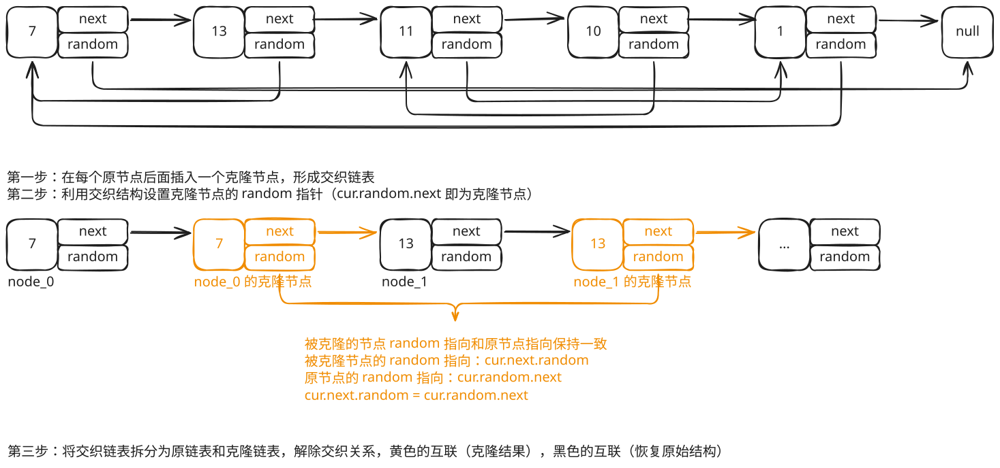

## 1. 题目描述

- [leetcode](https://leetcode.cn/problems/copy-list-with-random-pointer/)

给你一个长度为 `n` 的链表，每个节点包含一个额外增加的随机指针 `random`，该指针可以指向链表中的任何节点或空节点。

构造这个链表的 [深拷贝][1]。深拷贝应该正好由 `n` 个全新节点组成，其中每个新节点的值都设为其对应的原节点的值。新节点的 `next` 指针和 `random` 指针也都应指向复制链表中的新节点，并使原链表和复制链表中的这些指针能够表示相同的链表状态。复制链表中的指针都不应指向原链表中的节点。

例如，如果原链表中有 `X` 和 `Y` 两个节点，其中 `X.random --> Y`。那么在复制链表中对应的两个节点 `x` 和 `y`，同样有 `x.random --> y`。

返回复制链表的头节点。

用一个由 `n` 个节点组成的链表来表示输入/输出中的链表。每个节点用一个 `[val, random_index]` 表示：

- `val`：一个表示 `Node.val` 的整数。
- `random_index`：随机指针指向的节点索引（范围从 `0` 到 `n-1`）；如果不指向任何节点，则为 `null`。

你的代码只接受原链表的头节点 `head` 作为传入参数。

---

示例 1：


```txt
输入：head = [
  [7, null],
  [13, 0],
  [11, 4],
  [10, 2],
  [1, 0]
]
输出：[
  [7, null],
  [13, 0],
  [11, 4],
  [10, 2],
  [1, 0]
]
```

---

示例 2：


```txt
输入：head = [
  [1, 1],
  [2, 1]
]
输出：[
  [1, 1],
  [2, 1]
]
```

---

示例 3：


```txt
输入：head = [
  [3, null],
  [3, 0],
  [3, null]
]
输出：[
  [3, null],
  [3, 0],
  [3, null]
]
```

---

提示：

- `0 <= n <= 1000`
- `-10^4 <= Node.val <= 10^4`
- `Node.random` 为 `null` 或指向链表中的节点。

## 2. s.1 - 节点拆分法



::: code-group

```c [c]
/**
 * Definition for a Node.
 * struct Node {
 *     int val;
 *     struct Node *next;
 *     struct Node *random;
 * };
 */
struct Node* copyRandomList(struct Node* head) {
    if (!head) return NULL;
    // 第一步：在每个节点后插入克隆节点
    struct Node* cur = head;
    while (cur) {
        struct Node* clone = (struct Node*)malloc(sizeof(struct Node));
        clone->val = cur->val;
        clone->next = cur->next;
        clone->random = NULL;
        cur->next = clone;
        cur = clone->next;
    }
    // 第二步：设置克隆节点的 random
    cur = head;
    while (cur) {
        if (cur->random) {
            cur->next->random = cur->random->next;
        }
        cur = cur->next->next;
    }
    // 第三步：拆分链表
    cur = head;
    struct Node* newHead = head->next;
    while (cur) {
        struct Node* clone = cur->next;
        cur->next = clone->next;
        clone->next = clone->next ? clone->next->next : NULL;
        cur = cur->next;
    }
    return newHead;
}
```

```js [js]
/**
 * // Definition for a _Node.
 * function _Node(val, next, random) {
 *    this.val = val;
 *    this.next = next;
 *    this.random = random;
 * };
 */
/**
 * @param {_Node} head
 * @return {_Node}
 */
var copyRandomList = function (head) {
  if (!head) return null
  // 第一步：在每个节点后插入克隆节点
  let cur = head
  while (cur) {
    const clone = new _Node(cur.val, cur.next, null)
    cur.next = clone
    cur = clone.next
  }
  // 第二步：设置克隆节点的 random
  cur = head
  while (cur) {
    if (cur.random) {
      cur.next.random = cur.random.next
    }
    cur = cur.next.next
  }
  // 第三步：拆分链表
  cur = head
  const newHead = head.next
  while (cur) {
    const clone = cur.next
    cur.next = clone.next
    clone.next = clone.next ? clone.next.next : null
    cur = cur.next
  }
  return newHead
}
```

```py [py]
"""
# Definition for a Node.
class Node:
    def __init__(self, x: int, next: 'Node' = None, random: 'Node' = None):
        self.val = int(x)
        self.next = next
        self.random = random
"""
class Solution:
    def copyRandomList(self, head: 'Optional[Node]') -> 'Optional[Node]':
        if not head:
            return None
        # 第一步：在每个节点后插入克隆节点
        cur = head
        while cur:
            clone = Node(cur.val, cur.next)
            cur.next = clone
            cur = clone.next
        # 第二步：设置克隆节点的 random
        cur = head
        while cur:
            if cur.random:
                cur.next.random = cur.random.next
            cur = cur.next.next
        # 第三步：拆分链表
        cur = head
        new_head = head.next
        while cur:
            clone = cur.next
            cur.next = clone.next
            clone.next = clone.next.next if clone.next else None
            cur = cur.next
        return new_head
```

:::

- 时间复杂度：$O(n)$，其中 $n$ 是链表的长度
- 空间复杂度：$O(1)$，不计算输出链表的空间

算法思路：

- 第一步：在每个原节点后面插入一个克隆节点，形成交织链表
- 第二步：利用交织结构设置克隆节点的 `random` 指针（`cur.random.next` 即为克隆节点）
- 第三步：将交织链表拆分为原链表和克隆链表

## 3. 引用

- [深拷贝 - 百度百科][1]

[1]: https://baike.baidu.com/item/深拷贝/22785317?fr=aladdin
