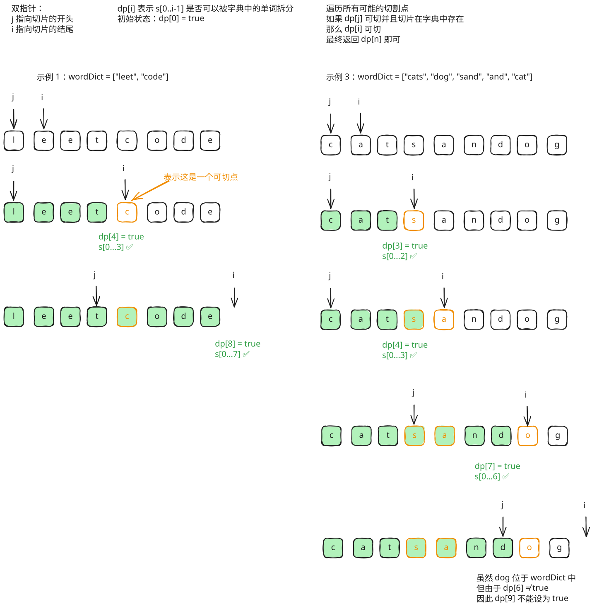

## 1. 题目描述

- [leetcode](https://leetcode.cn/problems/word-break/)

给你一个字符串 `s` 和一个字符串列表 `wordDict` 作为字典。如果可以利用字典中出现的一个或多个单词拼接出 `s` 则返回 `true`。

---

注意：不要求字典中出现的单词全部都使用，并且字典中的单词可以重复使用。

---

示例 1：

```txt
输入: s = "leetcode", wordDict = ["leet", "code"]
输出: true
```

解释: 返回 true 因为 "leetcode" 可以由 "leet" 和 "code" 拼接成。

---

示例 2：

```txt
输入: s = "applepenapple", wordDict = ["apple", "pen"]
输出: true
```

解释:

- 返回 true 因为 `"applepenapple"` 可以由 `"apple"` `"pen"` `"apple"` 拼接成。
- 注意，你可以重复使用字典中的单词。

---

示例 3：

```txt
输入: s = "catsandog", wordDict = ["cats", "dog", "sand", "and", "cat"]
输出: false
```

---

提示：

- `1 <= s.length <= 300`
- `1 <= wordDict.length <= 1000`
- `1 <= wordDict[i].length <= 20`
- `s` 和 `wordDict[i]` 仅由小写英文字母组成
- `wordDict` 中的所有字符串互不相同

## 2. s.1 - 动态规划



::: code-group

```c [c]
bool wordBreak(char* s, char** wordDict, int wordDictSize) {
    int n = strlen(s);
    // dp[i] 表示 s[0..i-1] 是否可以被拆分
    bool* dp = (bool*)calloc(n + 1, sizeof(bool));
    dp[0] = true;
    for (int i = 1; i <= n; i++) {
        for (int k = 0; k < wordDictSize; k++) {
            int len = strlen(wordDict[k]);
            if (i >= len && dp[i - len] && strncmp(s + i - len, wordDict[k], len) == 0) {
                dp[i] = true;
                break;
            }
        }
    }
    bool res = dp[n];
    free(dp);
    return res;
}
```

```js [js]
/**
 * @param {string} s
 * @param {string[]} wordDict
 * @return {boolean}
 */
var wordBreak = function (s, wordDict) {
  const wordSet = new Set(wordDict)
  const n = s.length
  // dp[i] 表示 s[0..i-1] 是否可以被拆分
  const dp = new Array(n + 1).fill(false)
  dp[0] = true
  for (let i = 1; i <= n; i++) {
    for (let j = 0; j < i; j++) {
      if (dp[j] && wordSet.has(s.slice(j, i))) {
        dp[i] = true
        break
      }
    }
  }
  return dp[n]
}
```

```py [py]
class Solution:
    def wordBreak(self, s: str, wordDict: List[str]) -> bool:
        word_set = set(wordDict)
        n = len(s)
        dp = [False] * (n + 1)
        dp[0] = True
        for i in range(1, n + 1):
            for j in range(i):
                if dp[j] and s[j:i] in word_set:
                    dp[i] = True
                    break
        return dp[n]
```

:::

- 时间复杂度：$O(n^2)$，其中 $n$ 是字符串 $s$ 的长度
- 空间复杂度：$O(n + m)$，其中 $m$ 是字典单词数量

算法思路：

- `dp[i]` 表示 `s[0..i-1]` 是否可以被字典中的单词拆分
- 对每个位置 `i`，枚举所有可能的分割点 `j`，若 `dp[j]` 为 `true` 且 `s[j..i-1]` 在字典中，则 `dp[i] = true`
