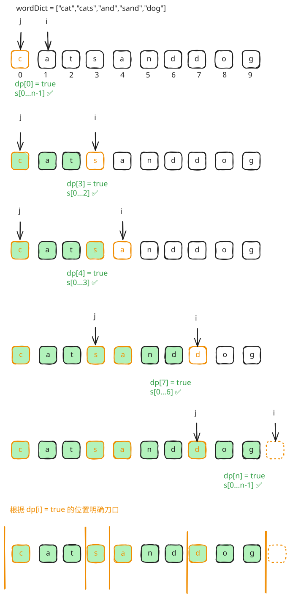

## 1. 题目描述

- [leetcode](https://leetcode.cn/problems/word-break-ii/)

给定一个字符串 `s` 和一个字符串字典 `wordDict`，在字符串 `s` 中增加空格来构建一个句子，使得句子中所有的单词都在词典中。以任意顺序返回所有这些可能的句子。

---

注意：词典中的同一个单词可能在分段中被重复使用多次。

---

示例 1：

```txt
输入:s = "catsanddog", wordDict = ["cat","cats","and","sand","dog"]
输出:["cats and dog","cat sand dog"]
```

---

示例 2：

```txt
输入:s = "pineapplepenapple", wordDict = ["apple","pen","applepen","pine","pineapple"]
输出:["pine apple pen apple","pineapple pen apple","pine applepen apple"]
```

解释: 注意你可以重复使用字典中的单词。

---

示例 3：

```txt
输入:s = "catsandog", wordDict = ["cats","dog","sand","and","cat"]
输出:[]
```

---

提示：

- `1 <= s.length <= 20`
- `1 <= wordDict.length <= 1000`
- `1 <= wordDict[i].length <= 10`
- `s` 和 `wordDict[i]` 仅有小写英文字母组成
- `wordDict` 中所有字符串都不同

## 2. s.1 - DP 预处理 + DFS 回溯



::: code-group

```c [c]
/**
 * Note: The returned array must be malloced, assume caller calls free().
 */
char** result;
int resultSize;
bool dp[21];
int pathStart[21], pathEnd[21]; // 记录路径中每个词的起止位置
int pathSize;
int N;

bool hasWord(const char* s, int start, int end, char** wordDict, int dictSize) {
    int len = end - start;
    for (int i = 0; i < dictSize; i++) {
        if ((int)strlen(wordDict[i]) == len && strncmp(s + start, wordDict[i], len) == 0)
            return true;
    }
    return false;
}

void dfs(const char* s, int start, char** wordDict, int dictSize) {
    if (start == N) {
        // 拼接路径中的每个词，词间加空格
        char* sentence = (char*)malloc(50 * sizeof(char));
        int pos = 0;
        for (int i = 0; i < pathSize; i++) {
            if (i > 0) sentence[pos++] = ' ';
            int len = pathEnd[i] - pathStart[i];
            memcpy(sentence + pos, s + pathStart[i], len);
            pos += len;
        }
        sentence[pos] = '\0';
        result[resultSize++] = sentence;
        return;
    }
    for (int end = start + 1; end <= N; end++) {
        // 剪枝：只走 dp[end] 可达的分支
        if (dp[end] && hasWord(s, start, end, wordDict, dictSize)) {
            pathStart[pathSize] = start;
            pathEnd[pathSize] = end;
            pathSize++;
            dfs(s, end, wordDict, dictSize);
            pathSize--;
        }
    }
}

char** wordBreak(char* s, char** wordDict, int wordDictSize, int* returnSize) {
    N = strlen(s);
    memset(dp, 0, sizeof(dp));
    dp[0] = true;
    for (int i = 1; i <= N; i++) {
        for (int j = 0; j < i; j++) {
            if (dp[j] && hasWord(s, j, i, wordDict, wordDictSize)) {
                dp[i] = true;
                break;
            }
        }
    }
    result = (char**)malloc(10000 * sizeof(char*));
    resultSize = 0;
    pathSize = 0;
    dfs(s, 0, wordDict, wordDictSize);
    *returnSize = resultSize;
    return result;
}
```

```js [js]
/**
 * @param {string} s
 * @param {string[]} wordDict
 * @return {string[]}
 */
var wordBreak = function (s, wordDict) {
  const n = s.length
  const wordSet = new Set(wordDict)

  // dp[i] = true 表示 s[0..i-1] 可被字典中的单词拆分
  const dp = new Array(n + 1).fill(false)
  dp[0] = true
  for (let i = 1; i <= n; i++) {
    for (let j = 0; j < i; j++) {
      if (dp[j] && wordSet.has(s.slice(j, i))) {
        dp[i] = true
        break
      }
    }
  }

  const res = []
  const path = []
  const dfs = (start) => {
    if (start === n) {
      res.push(path.join(' '))
      return
    }
    for (let end = start + 1; end <= n; end++) {
      // 剪枝：只走 dp[end] 可达的分支
      if (dp[end] && wordSet.has(s.slice(start, end))) {
        path.push(s.slice(start, end))
        dfs(end)
        path.pop()
      }
    }
  }
  dfs(0)
  return res
}
```

```py [py]
class Solution:
    def wordBreak(self, s: str, wordDict: List[str]) -> List[str]:
        n = len(s)
        word_set = set(wordDict)

        # dp[i] = True 表示 s[0..i-1] 可被字典中的单词拆分
        dp = [False] * (n + 1)
        dp[0] = True
        for i in range(1, n + 1):
            for j in range(i):
                if dp[j] and s[j:i] in word_set:
                    dp[i] = True
                    break

        res: List[str] = []
        path: List[str] = []

        def dfs(start: int) -> None:
            if start == n:
                res.append(' '.join(path))
                return
            for end in range(start + 1, n + 1):
                # 剪枝：只走 dp[end] 可达的分支
                if dp[end] and s[start:end] in word_set:
                    path.append(s[start:end])
                    dfs(end)
                    path.pop()

        dfs(0)
        return res
```

:::

- 时间复杂度：$O(n^2 + \text{output})$，DP 预处理 $O(n^2)$，DFS 只遍历可达位置，额外开销正比于输出总长度
- 空间复杂度：$O(n)$，DP 数组和递归栈深度均为 $O(n)$（不计输出）

算法思路：

- DP 预处理：`dp[i]` 表示 `s[0..i-1]` 能否被字典中的单词拆分，$dp[0] = \text{true}$
  - DP 预处理这一步和 `0139. 单词拆分【中等】` 实现逻辑一致
- DFS 回溯
  - 从位置 0 出发开始扫描，扫到结尾时记录结果
  - 枚举每个合法结尾 `end` 且 `s[start..end-1]` 在字典中时才递归
  - 合法结尾 `end` 是指 `dp[end] == true` 的位置（借助 DP 结果剪掉所有无法到达终点的死路）
- 到达末尾时将路径中的单词拼接成句子加入结果集

### 2.1. DP 状态转移方程

$$
dp[i] = \bigvee_{j < i} (dp[j] \land s[j..i-1] \in \text{wordSet})
$$

| 符号                 | 含义                                                            |
| -------------------- | --------------------------------------------------------------- |
| $\text{dp}[i]$       | 前缀 $s[0..i-1]$ 能否被成功拆分（布尔值）                       |
| $\bigvee_{j < i}$    | 逻辑或（OR），遍历所有满足 $j < i$ 的切分点，任意一个为真即为真 |
| $\text{dp}[j]$       | 前缀 $s[0..j-1]$ 可以成功拆分                                   |
| $\land$              | 逻辑与（AND）                                                   |
| $s[j..i-1]$          | 字符串 $s$ 中从下标 $j$ 到 $i-1$ 的子串                         |
| $\in \text{wordSet}$ | 该子串是否存在于给定的词典中                                    |
