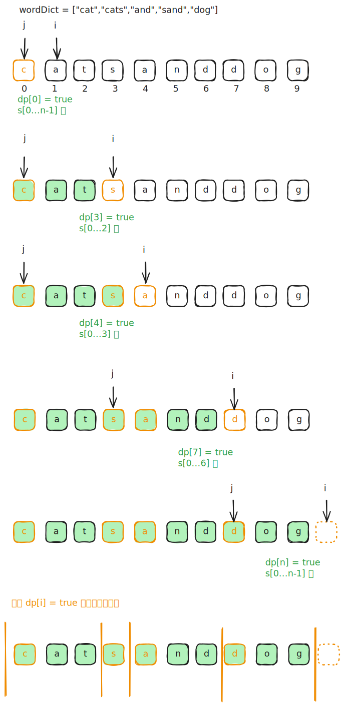

# [0140. 单词拆分 II【困难】](https://github.com/tnotesjs/TNotes.leetcode/tree/main/notes/0140.%20%E5%8D%95%E8%AF%8D%E6%8B%86%E5%88%86%20II%E3%80%90%E5%9B%B0%E9%9A%BE%E3%80%91)

<!-- region:toc -->

- [1. 📝 题目描述](#1--题目描述)
- [2. 🎯 s.1 - DP 预处理 + DFS 回溯](#2--s1---dp-预处理--dfs-回溯)
  - [2.1. DP 状态转移方程](#21-dp-状态转移方程)

<!-- endregion:toc -->

## 1. 📝 题目描述

- [leetcode](https://leetcode.cn/problems/word-break-ii/)

给定一个字符串 `s` 和一个字符串字典 `wordDict`，在字符串 `s` 中增加空格来构建一个句子，使得句子中所有的单词都在词典中。以任意顺序返回所有这些可能的句子。

---

注意：词典中的同一个单词可能在分段中被重复使用多次。

---

示例 1：

```txt
输入:s = "catsanddog", wordDict = ["cat","cats","and","sand","dog"]
输出:["cats and dog","cat sand dog"]
```

---

示例 2：

```txt
输入:s = "pineapplepenapple", wordDict = ["apple","pen","applepen","pine","pineapple"]
输出:["pine apple pen apple","pineapple pen apple","pine applepen apple"]
```

解释: 注意你可以重复使用字典中的单词。

---

示例 3：

```txt
输入:s = "catsandog", wordDict = ["cats","dog","sand","and","cat"]
输出:[]
```

---

提示：

- `1 <= s.length <= 20`
- `1 <= wordDict.length <= 1000`
- `1 <= wordDict[i].length <= 10`
- `s` 和 `wordDict[i]` 仅有小写英文字母组成
- `wordDict` 中所有字符串都不同

## 2. 🎯 s.1 - DP 预处理 + DFS 回溯



::: code-group

<<< ./solutions/1/1.c [c]

<<< ./solutions/1/1.js [js]

<<< ./solutions/1/1.py [py]

:::

- 时间复杂度：$O(n^2 + \text{output})$，DP 预处理 $O(n^2)$，DFS 只遍历可达位置，额外开销正比于输出总长度
- 空间复杂度：$O(n)$，DP 数组和递归栈深度均为 $O(n)$（不计输出）

算法思路：

- DP 预处理：`dp[i]` 表示 `s[0..i-1]` 能否被字典中的单词拆分，$dp[0] = \text{true}$
- DFS 回溯
  - 从位置 0 出发开始扫描，扫到结尾时记录结果
  - 枚举每个合法结尾 `end` 且 `s[start..end-1]` 在字典中时才递归
  - 合法结尾 `end` 是指 `dp[end] == true` 的位置（借助 DP 结果剪掉所有无法到达终点的死路）
- 到达末尾时将路径中的单词拼接成句子加入结果集

### 2.1. DP 状态转移方程

$$
dp[i] = \bigvee_{j < i} (dp[j] \land s[j..i-1] \in \text{wordSet})
$$

| 符号 | 含义 |
| --- | --- |
| $\text{dp}[i]$ | 前缀 $s[0..i-1]$ 能否被成功拆分（布尔值） |
| $\bigvee_{j < i}$ | 逻辑或（OR），遍历所有满足 $j < i$ 的切分点，任意一个为真即为真 |
| $\text{dp}[j]$ | 前缀 $s[0..j-1]$ 可以成功拆分 |
| $\land$ | 逻辑与（AND） |
| $s[j..i-1]$ | 字符串 $s$ 中从下标 $j$ 到 $i-1$ 的子串 |
| $\in \text{wordSet}$ | 该子串是否存在于给定的词典中 |
