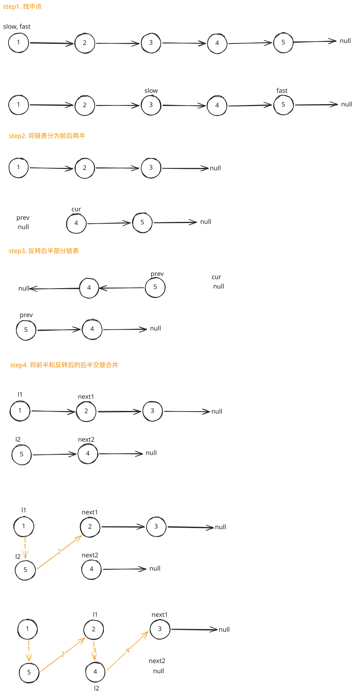

## 1. 题目描述

- [leetcode](https://leetcode.cn/problems/reorder-list/)

给定一个单链表 `L` 的头节点 `head`，单链表 `L` 表示为：

L0 -> L1 -> … -> Ln - 1 -> Ln

请将其重新排列后变为：

L0 -> Ln -> L1 -> Ln - 1 -> L2 -> Ln - 2 -> …

不能只是单纯的改变节点内部的值，而是需要实际的进行节点交换。

---

示例 1：


```txt
输入：head = [1, 2, 3, 4]
输出：[1, 4, 2, 3]
```

---

示例 2：


```txt
输入：head = [1, 2, 3, 4, 5]
输出：[1, 5, 2, 4, 3]
```

---

提示：

- 链表的长度范围为 `[1, 5 * 10^4]`
- `1 <= node.val <= 1000`

## 2. s.1 - 快慢指针 + 反转 + 合并



::: code-group

```c [c]
/**
 * Definition for singly-linked list.
 * struct ListNode {
 *     int val;
 *     struct ListNode *next;
 * };
 */
void reorderList(struct ListNode* head) {
    if (!head || !head->next) return;
    // 找中点
    struct ListNode* slow = head;
    struct ListNode* fast = head;
    while (fast->next && fast->next->next) {
        slow = slow->next;
        fast = fast->next->next;
    }
    // 反转后半部分
    struct ListNode* prev = NULL;
    struct ListNode* cur = slow->next;
    slow->next = NULL;
    while (cur) {
        struct ListNode* next = cur->next;
        cur->next = prev;
        prev = cur;
        cur = next;
    }
    // 合并两个链表
    struct ListNode* l1 = head;
    struct ListNode* l2 = prev;
    while (l2) {
        struct ListNode* next1 = l1->next;
        struct ListNode* next2 = l2->next;
        l1->next = l2;
        l2->next = next1;
        l1 = next1;
        l2 = next2;
    }
}
```

```js [js]
/**
 * Definition for singly-linked list.
 * function ListNode(val, next) {
 *     this.val = (val===undefined ? 0 : val)
 *     this.next = (next===undefined ? null : next)
 * }
 */
/**
 * @param {ListNode} head
 * @return {void} Do not return anything, modify head in-place instead.
 */
var reorderList = function (head) {
  if (!head || !head.next) return
  // 找中点
  let slow = head,
    fast = head
  while (fast.next && fast.next.next) {
    slow = slow.next
    fast = fast.next.next
  }
  // 反转后半部分
  let prev = null,
    cur = slow.next
  slow.next = null // 把链表从中间切断，分成前后两个独立的子链表
  while (cur) {
    const next = cur.next
    cur.next = prev
    prev = cur
    cur = next
  }
  // 合并两个链表
  let l1 = head,
    l2 = prev
  while (l2) {
    const next1 = l1.next,
      next2 = l2.next
    l1.next = l2
    l2.next = next1
    l1 = next1
    l2 = next2
  }
}
```

```py [py]
# Definition for singly-linked list.
# class ListNode:
#     def __init__(self, val=0, next=None):
#         self.val = val
#         self.next = next
class Solution:
    def reorderList(self, head: Optional[ListNode]) -> None:
        if not head or not head.next:
            return
        # 找中点
        slow, fast = head, head
        while fast.next and fast.next.next:
            slow = slow.next
            fast = fast.next.next
        # 反转后半部分
        prev, cur = None, slow.next
        slow.next = None
        while cur:
            nxt = cur.next
            cur.next = prev
            prev = cur
            cur = nxt
        # 合并两个链表
        l1, l2 = head, prev
        while l2:
            next1, next2 = l1.next, l2.next
            l1.next = l2
            l2.next = next1
            l1 = next1
            l2 = next2
```

:::

- 时间复杂度：$O(n)$，其中 $n$ 是链表的长度
- 空间复杂度：$O(1)$，只使用了常数级别的额外空间

算法思路：

- 用快慢指针找到链表中点
- 将链表分为前后两半
- 反转后半部分链表
- 将前半和反转后的后半交替合并
