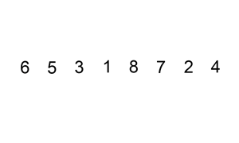

## 1. 题目描述

- [leetcode](https://leetcode.cn/problems/insertion-sort-list/)

给定单个链表的头 `head`，使用插入排序对链表进行排序，并返回排序后链表的头。

插入排序算法的步骤:

1. 插入排序是迭代的，每次只移动一个元素，直到所有元素可以形成一个有序的输出列表。
2. 每次迭代中，插入排序只从输入数据中移除一个待排序的元素，找到它在序列中适当的位置，并将其插入。
3. 重复直到所有输入数据插入完为止。

下面是插入排序算法的一个图形示例。部分排序的列表（黑色）最初只包含列表中的第一个元素。每次迭代时，从输入数据中删除一个元素（红色），并就地插入已排序的列表中。

对链表进行插入排序。



---

示例 1：


```txt
输入: head = [4, 2, 1, 3]
输出: [1, 2, 3, 4]
```

示例 2：


```txt
输入: head = [-1, 5, 3, 4, 0]
输出: [-1, 0, 3, 4, 5]
```

---

提示：

- 列表中的节点数在 `[1, 5000]`范围内
- `-5000 <= Node.val <= 5000`

## 2. s.1 - 插入排序

::: code-group

```c [c]
/**
 * Definition for singly-linked list.
 * struct ListNode {
 *     int val;
 *     struct ListNode *next;
 * };
 */
struct ListNode* insertionSortList(struct ListNode* head) {
    struct ListNode dummy;
    dummy.next = NULL;
    struct ListNode* cur = head;
    while (cur) {
        struct ListNode* next = cur->next;
        struct ListNode* prev = &dummy;
        while (prev->next && prev->next->val < cur->val) {
            prev = prev->next;
        }
        cur->next = prev->next;
        prev->next = cur;
        cur = next;
    }
    return dummy.next;
}
```

```js [js]
/**
 * Definition for singly-linked list.
 * function ListNode(val, next) {
 *     this.val = (val===undefined ? 0 : val)
 *     this.next = (next===undefined ? null : next)
 * }
 */
/**
 * @param {ListNode} head
 * @return {ListNode}
 */
var insertionSortList = function (head) {
  const dummy = new ListNode(0)
  let cur = head
  while (cur) {
    const next = cur.next
    // 找到插入位置
    let prev = dummy
    while (prev.next && prev.next.val < cur.val) {
      prev = prev.next
    }
    cur.next = prev.next
    prev.next = cur
    cur = next
  }
  return dummy.next
}
```

```py [py]
# Definition for singly-linked list.
# class ListNode:
#     def __init__(self, val=0, next=None):
#         self.val = val
#         self.next = next
class Solution:
    def insertionSortList(self, head: Optional[ListNode]) -> Optional[ListNode]:
        dummy = ListNode(0)
        cur = head
        while cur:
            nxt = cur.next
            prev = dummy
            while prev.next and prev.next.val < cur.val:
                prev = prev.next
            cur.next = prev.next
            prev.next = cur
            cur = nxt
        return dummy.next
```

:::

- 时间复杂度：$O(n^2)$，其中 $n$ 是链表的长度
- 空间复杂度：$O(1)$，只使用了常数级别的额外空间

算法思路：

- 创建虚拟头节点 `dummy` 作为已排序链表的起点
- 遍历原链表，对每个节点从 `dummy` 开始找到合适的插入位置并插入
