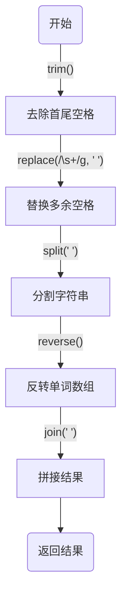

# [0151. 反转字符串中的单词【中等】](https://github.com/tnotesjs/TNotes.leetcode/tree/main/notes/0151.%20%E5%8F%8D%E8%BD%AC%E5%AD%97%E7%AC%A6%E4%B8%B2%E4%B8%AD%E7%9A%84%E5%8D%95%E8%AF%8D%E3%80%90%E4%B8%AD%E7%AD%89%E3%80%91)

<!-- region:toc -->

- [1. 📝 题目描述](#1--题目描述)
- [2. 🎯 s.1 - 字符串分割](#2--s1---字符串分割)
- [3. 🎯 s.2 - 双指针](#3--s2---双指针)

<!-- endregion:toc -->

## 1. 📝 题目描述

- [leetcode](https://leetcode.cn/problems/reverse-words-in-a-string)

给你一个字符串 `s` ，请你反转字符串中 单词 的顺序。

单词 是由非空格字符组成的字符串。`s` 中使用至少一个空格将字符串中的 单词 分隔开。

返回 单词 顺序颠倒且 单词 之间用单个空格连接的结果字符串。

注意： 输入字符串 `s`中可能会存在前导空格、尾随空格或者单词间的多个空格。返回的结果字符串中，单词间应当仅用单个空格分隔，且不包含任何额外的空格。

示例 1：

```
输入：s = "the sky is blue"
输出："blue is sky the"
```

示例 2：

```
输入：s = "  hello world  "
输出："world hello"
解释：反转后的字符串中不能存在前导空格和尾随空格。
```

示例 3：

```
输入：s = "a good   example"
输出："example good a"
解释：如果两个单词间有多余的空格，反转后的字符串需要将单词间的空格减少到仅有一个。
```

提示：

- `1 <= s.length <= 10^4`
- `s` 包含英文大小写字母、数字和空格 `' '`
- `s` 中 至少存在一个 单词

进阶： 如果字符串在你使用的编程语言中是一种可变数据类型，请尝试使用 `O(1)` 额外空间复杂度的 原地 解法。

## 2. 🎯 s.1 - 字符串分割

```js
var reverseWords = function (s) {
  return s.trim().replace(/\s+/g, ' ').split(' ').reverse().join(' ')
}
```

实现流程：

1. 去除首尾空格：使用 `trim()` 方法去除字符串 `s` 的首尾空格。
2. 替换多余空格：使用 `replace(/\s+/g, ' ')` 方法将字符串中多余的空格替换为单个空格。
3. 分割字符串：使用 `split(' ')` 方法将字符串按空格分割成单词数组。
4. 反转单词数组：使用 `reverse()` 方法将单词数组反转。
5. 拼接结果：使用 `join(' ')` 方法将反转后的单词数组拼接成最终的字符串。



## 3. 🎯 s.2 - 双指针

```js
var reverseWords = function (s) {
  const words = []
  const n = s.length
  let i = 0
  while (i < n) {
    while (s[i] === ' ') i++ // 过滤掉空格
    // 找单词
    if (i < n) {
      let j = i
      while (j < n && s[j] !== ' ') j++
      words.push(s.slice(i, j)) // 将单词插入 words 数组
      i = j
    }
  }
  return words.reverse().join(' ') // 反转、拼接
}
```

实现流程：

1. 初始化变量：
   - `words`：一个空数组，用于存储从字符串 `s` 中提取出的单词。
   - `n`：字符串 `s` 的长度。
   - `i`：一个索引变量，初始值为 0，用于遍历字符串 `s`。
2. 遍历字符串：
   - 使用一个 `while` 循环，条件是 `i < n`，即只要 `i` 没有超出字符串 `s` 的长度，就继续循环。
   - 在循环内部，首先使用一个内层 `while` 循环跳过所有的空格，通过检查 `s[i]` 是否等于空格 `' '` 来实现。如果遇到空格，则将 `i` 增加 1。
   - 检查 `i` 是否仍然小于 `n`，如果是，则说明还没有到达字符串的末尾，可以继续处理单词。
3. 找单词：
   - 初始化一个变量 `j`，其值与 `i` 相同，用于记录当前单词的结束位置。
   - 使用另一个内层 `while` 循环，条件是 `j < n` 且 `s[j]` 不等于空格 `' '`，即只要 `j` 没有超出字符串 `s` 的长度并且当前字符不是空格，就继续循环。
   - 循环结束后，`j` 就指向了当前单词的结束位置之后的一个空格或者字符串的末尾。
   - 使用 `s.slice(i, j)` 提取从 `i` 到 `j` 的子字符串（不包括 `j` 位置的字符），并将这个子字符串（即一个单词）推入 `words` 数组。
   - 更新 `i` 的值为 `j`，准备处理下一个单词。
4. 处理完毕：
   - 当外层 `while` 循环结束时，说明已经处理完了字符串 `s` 中的所有单词。
   - 使用 `words.reverse()` 方法将 `words` 数组中的单词顺序反转。
   - 使用 `words.join(' ')` 方法将反转后的单词数组转换为一个由空格分隔的字符串。
5. 返回结果：
   - 返回上一步得到的字符串，即原字符串 `s` 中所有单词按逆序排列后的新字符串。
