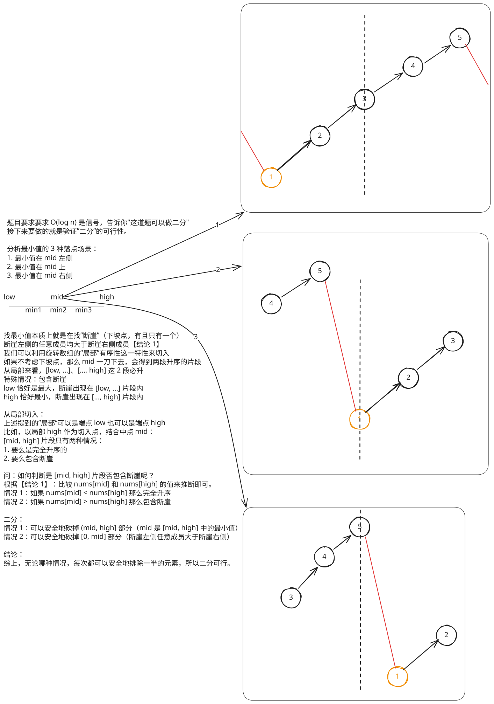

## 1. 题目描述

- [leetcode](https://leetcode.cn/problems/find-minimum-in-rotated-sorted-array)

已知一个长度为 `n` 的数组，预先按照升序排列，经由 `1` 到 `n` 次旋转后，得到输入数组。例如，原数组 `nums = [0, 1, 2, 4, 5, 6, 7]` 在变化后可能得到：

- 若旋转 `4` 次，则可以得到 `[4, 5, 6, 7, 0, 1, 2]`
- 若旋转 `7` 次，则可以得到 `[0, 1, 2, 4, 5, 6, 7]`

注意，数组 `[a[0], a[1], a[2], ..., a[n-1]]` 旋转一次的结果为数组 `[a[n-1], a[0], a[1], a[2], ..., a[n-2]]`。

给你一个元素值互不相同的数组 `nums`，它原来是一个升序排列的数组，并按上述情形进行了多次旋转。请你找出并返回数组中的最小元素。

你必须设计一个时间复杂度为 `O(log n)` 的算法解决此问题。

---

示例 1：

```
输入：nums = [3, 4, 5, 1, 2]
输出：1
```

解释：原数组为 `[1, 2, 3, 4, 5]`，旋转 3 次得到输入数组。

---

示例 2：

```
输入：nums = [4, 5, 6, 7, 0, 1, 2]
输出：0
```

解释：原数组为 `[0, 1, 2, 4, 5, 6, 7]`，旋转 3 次得到输入数组。

---

示例 3：

```
输入：nums = [11, 13, 15, 17]
输出：11
```

解释：原数组为 `[11, 13, 15, 17]`，旋转 4 次得到输入数组。

---

提示：

- `n == nums.length`
- `1 <= n <= 5000`
- `-5000 <= nums[i] <= 5000`
- `nums` 中的所有整数互不相同
- `nums` 原来是一个升序排序的数组，并进行了 `1` 至 `n` 次旋转

## 2. s.1 - 二分查找



::: code-group

```c [c]
int findMin(int* nums, int numsSize) {
    int low = 0, high = numsSize - 1;

    while (low < high) {
        int mid = low + (high - low) / 2;
        if (nums[mid] < nums[high])
            high = mid;
        else
            low = mid + 1;
    }

    return nums[low];
}
```

```js [js]
/**
 * @param {number[]} nums
 * @return {number}
 */
var findMin = function (nums) {
  let low = 0
  let high = nums.length - 1

  while (low < high) {
    const mid = Math.floor((low + high) / 2)
    if (nums[mid] < nums[high]) high = mid
    else low = mid + 1
  }

  return nums[low]
}
```

```py [py]
class Solution:
    def findMin(self, nums: list[int]) -> int:
        low, high = 0, len(nums) - 1

        while low < high:
            mid = (low + high) // 2
            if nums[mid] < nums[high]:
                high = mid
            else:
                low = mid + 1

        return nums[low]
```

:::

- 时间复杂度：$O(\log n)$，每次将搜索区间缩小一半
- 空间复杂度：$O(1)$，只使用常数级别额外空间

算法思路：

- 每次取中点，比较 `nums[mid]` 和 `nums[high]` 判断最小值落在哪一侧：
  - 若 `nums[mid] < nums[high]`，说明 `mid` 到 `high` 这一段是升序的，这一段中的最小值就是 `nums[mid]`，因此最小值不可能在 `(mid, high]` 中，收缩右边界到 `mid`
  - 否则最小值必然在 `[mid + 1, high]` 中，收缩左边界
- 区间收缩至只剩一个元素时，即为最小值
