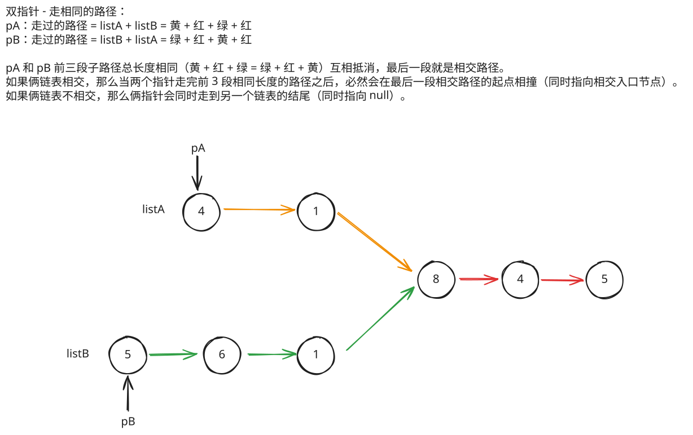

## 1. 题目描述

- [leetcode](https://leetcode.cn/problems/intersection-of-two-linked-lists/)

给你两个单链表的头节点 `headA` 和 `headB`，请你找出并返回两个单链表相交的起始节点。如果两个链表不存在相交节点，返回 `null`。

图示两个链表在节点 `c1` 开始相交：


题目数据保证整个链式结构中不存在环。

注意，函数返回结果后，链表必须保持其原始结构。

自定义评测：

评测系统的输入如下（你设计的程序不适用此输入）：

- `intersectVal` - 相交的起始节点的值。如果不存在相交节点，这一值为 `0`
- `listA` - 第一个链表
- `listB` - 第二个链表
- `skipA` - 在 `listA` 中（从头节点开始）跳到交叉节点的节点数
- `skipB` - 在 `listB` 中（从头节点开始）跳到交叉节点的节点数

评测系统将根据这些输入创建链式数据结构，并将两个头节点 `headA` 和 `headB` 传递给你的程序。如果程序能够正确返回相交节点，那么你的解决方案将被视作正确答案。

---

示例 1：


```txt
输入：
  intersectVal = 8
  listA = [4, 1, 8, 4, 5]
  listB = [5, 6, 1, 8, 4, 5]
  skipA = 2
  skipB = 3

输出：Intersected at '8'
```

解释：

- 相交节点的值为 8 （注意，如果两个链表相交则不能为 0）。
- 从各自的表头开始算起，链表 A 为 `[4, 1, 8, 4, 5]`，链表 B 为 `[5, 6, 1, 8, 4, 5]`。
- 在 A 中，相交节点前有 2 个节点；在 B 中，相交节点前有 3 个节点。
- 请注意相交节点的值不为 1，因为在链表 A 和链表 B 之中值为 1 的节点 (A 中第二个节点和 B 中第三个节点) 是不同的节点。
- 换句话说，它们在内存中指向两个不同的位置，而链表 A 和链表 B 中值为 8 的节点 (A 中第三个节点，B 中第四个节点) 在内存中指向相同的位置。

---

示例 2：


```txt
输入：
  intersectVal = 2
  listA = [1, 9, 1, 2, 4]
  listB = [3,2,4]
  skipA = 3
  skipB = 1

输出：Intersected at '2'
```

解释：

- 相交节点的值为 2 （注意，如果两个链表相交则不能为 0）。
- 从各自的表头开始算起，链表 A 为 `[1, 9, 1, 2, 4]`，链表 B 为 `[3, 2, 4]`。
  在 A 中，相交节点前有 3 个节点；在 B 中，相交节点前有 1 个节点。

---

示例 3：


```txt
输入：
  intersectVal = 0
  listA = [2, 6, 4]
  listB = [1, 5]
  skipA = 3
  skipB = 2

输出：No intersection
```

解释：

- 从各自的表头开始算起，链表 A 为 `[2, 6, 4]`，链表 B 为 `[1, 5]`。
- 由于这两个链表不相交，所以 intersectVal 必须为 0，而 skipA 和 skipB 可以是任意值。
- 这两个链表不相交，因此返回 null。

---

提示：

- `listA` 中节点数目为 `m`
- `listB` 中节点数目为 `n`
- `1 <= m, n <= 3 * 10^4`
- `1 <= Node.val <= 10^5`
- `0 <= skipA <= m`
- `0 <= skipB <= n`
- 如果 `listA` 和 `listB` 没有交点，`intersectVal` 为 `0`
- 如果 `listA` 和 `listB` 有交点，`intersectVal == listA[skipA] == listB[skipB]`

---

进阶：你能否设计一个时间复杂度 `O(m + n)` 、仅用 `O(1)` 内存的解决方案？

## 2. s.1 - 双指针 - 走相同的路径



::: code-group

```c [c]
/**
 * Definition for singly-linked list.
 * struct ListNode {
 *     int val;
 *     struct ListNode *next;
 * };
 */
struct ListNode* getIntersectionNode(struct ListNode* headA, struct ListNode* headB) {
    if (!headA || !headB) return NULL;

    struct ListNode* pA = headA;
    struct ListNode* pB = headB;

    while (pA != pB) {
        pA = pA ? pA->next : headB;
        pB = pB ? pB->next : headA;
    }

    return pA;
}
```

```js [js]
/**
 * Definition for singly-linked list.
 * function ListNode(val) {
 *     this.val = val;
 *     this.next = null;
 * }
 */

/**
 * @param {ListNode} headA
 * @param {ListNode} headB
 * @return {ListNode}
 */
var getIntersectionNode = function (headA, headB) {
  // 如果其中一个链表为空，则不可能相交
  if (!headA || !headB) return null

  let pointerA = headA
  let pointerB = headB

  // 当两个指针不相等时继续循环
  while (pointerA !== pointerB) {
    // 如果pointerA到达末尾，则从headB开始
    pointerA = pointerA ? pointerA.next : headB
    // 如果pointerB到达末尾，则从headA开始
    pointerB = pointerB ? pointerB.next : headA
  }

  // 返回相交节点，如果没有相交则返回null
  return pointerA
}
```

```py [py]
# Definition for singly-linked list.
# class ListNode:
#     def __init__(self, x):
#         self.val = x
#         self.next = None

class Solution:
    def getIntersectionNode(self, headA: ListNode, headB: ListNode) -> Optional[ListNode]:
        if not headA or not headB:
            return None

        pA, pB = headA, headB

        while pA is not pB:
            pA = pA.next if pA else headB
            pB = pB.next if pB else headA

        return pA
```

:::

- 时间复杂度：$O(M + N)$，其中 M 和 N 分别是两个链表的长度
- 空间复杂度：$O(1)$，只使用了常数级别的额外空间

算法思路：

- 这道题要求找到两个链表的相交节点。如果两个链表相交，那么从相交节点开始，两个链表的后续节点都是相同的。
- 我们可以使用双指针技巧来解决这个问题，让两个指针分别遍历两个链表，当一个指针到达链表末尾时，让它从另一个链表的头部重新开始。
  - 如果两个链表相交，两个指针会在相交节点相遇
  - 如果两个链表不相交，两个指针会同时到达末尾（null）
