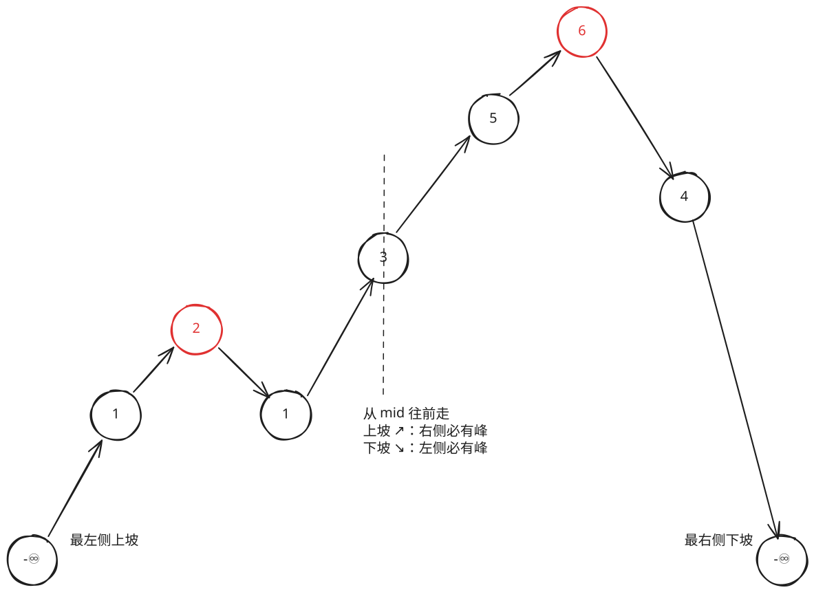

## 1. 题目描述

- [leetcode](https://leetcode.cn/problems/find-peak-element)

峰值元素是指其值严格大于左右相邻值的元素。

给你一个整数数组 `nums`，找到峰值元素并返回其索引。数组可能包含多个峰值，在这种情况下，返回任何一个峰值所在位置即可。

你可以假设 `nums[-1] = nums[n] = -∞`。

你必须实现时间复杂度为 `O(log n)` 的算法来解决此问题。

---

示例 1：

```
输入：nums = [1, 2, 3, 1]
输出：2
```

解释：3 是峰值元素，你的函数应该返回其索引 2。

---

示例 2：

```
输入：nums = [1, 2, 1, 3, 5, 6, 4]
输出：1 或 5
```

解释：

- 你的函数可以返回索引 1，其峰值元素为 2；
- 或者返回索引 5，其峰值元素为 6。

---

提示：

- `1 <= nums.length <= 1000`
- `-2^31 <= nums[i] <= 2^31 - 1`
- 对于所有有效的 `i` 都有 `nums[i] != nums[i + 1]`

## 2. s.1 - 二分查找



::: code-group

```c [c]
int findPeakElement(int* nums, int numsSize) {
    int l = 0, r = numsSize - 1;

    while (l < r) {
        int mid = ((r - l) >> 1) + l;
        if (nums[mid] > nums[mid + 1])
            r = mid;
        else
            l = mid + 1;
    }

    return l;
}
```

```js [js]
/**
 * @param {number[]} nums
 * @return {number}
 */
var findPeakElement = function (nums) {
  let l = 0
  let r = nums.length - 1

  while (l < r) {
    const mid = ((r - l) >> 1) + l
    if (nums[mid] > nums[mid + 1]) r = mid
    else l = mid + 1
  }

  return l
}
```

```py [py]
class Solution:
    def findPeakElement(self, nums: list[int]) -> int:
        l, r = 0, len(nums) - 1

        while l < r:
            mid = ((r - l) >> 1) + l
            if nums[mid] > nums[mid + 1]:
                r = mid
            else:
                l = mid + 1

        return l
```

:::

- 时间复杂度：$O(\log n)$，每次将搜索区间缩小一半
- 空间复杂度：$O(1)$，只使用常数级别额外空间

算法思路：

- 将数组比作山脉，两侧边界外视为 $-\infty$ 的谷底，相邻元素互不相等意味着没有水平路段
- 每次取中点 `mid`，比较 `nums[mid]` 和 `nums[mid + 1]`：
  - 若 `nums[mid] > nums[mid + 1]`，说明处于下坡，左侧 $(L, mid]$ 中必然存在峰值，令 $R = mid$
  - 否则处于上坡，右侧 $[mid + 1, R]$ 中必然存在峰值，令 $L = mid + 1$
- 区间收缩至 $L = R$ 时，即为峰值所在位置
