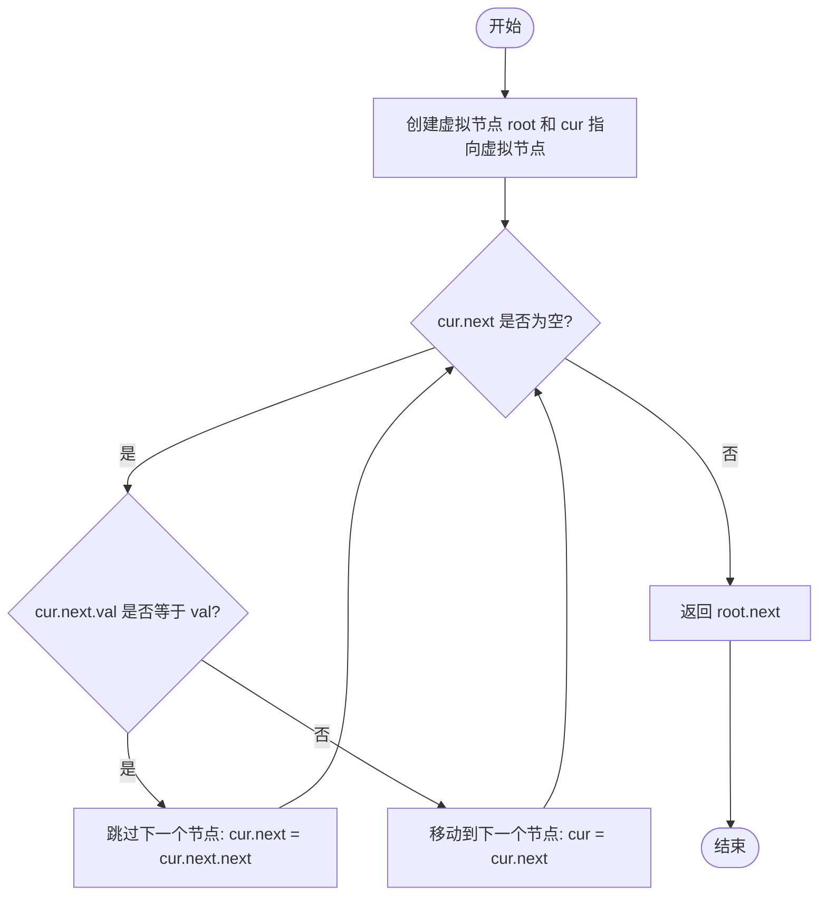
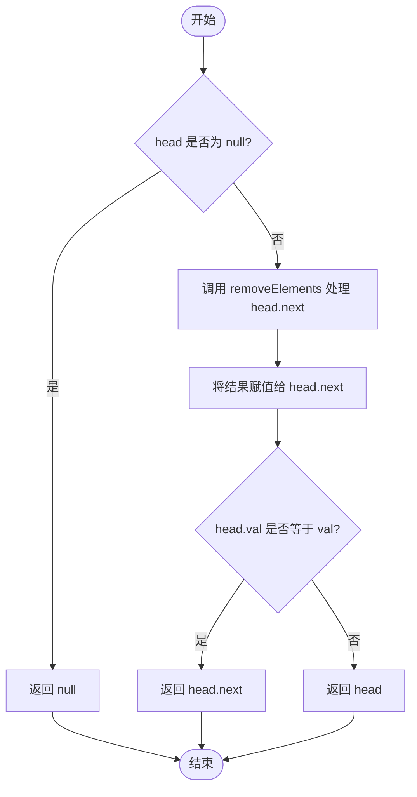

# [0203. 移除链表元素【简单】](https://github.com/Tdahuyou/TNotes.leetcode/tree/main/notes/0203.%20%E7%A7%BB%E9%99%A4%E9%93%BE%E8%A1%A8%E5%85%83%E7%B4%A0%E3%80%90%E7%AE%80%E5%8D%95%E3%80%91)

<!-- region:toc -->

- [1. 📝 Description](#1--description)
- [2. 💻 题解.1 - 遍历](#2--题解1---遍历)
- [3. 💻 题解.2 - 递归](#3--题解2---递归)

<!-- endregion:toc -->
- [leetcode](https://leetcode.cn/problems/remove-linked-list-elements/)


## 1. 📝 Description

::: details [leetcode](https://leetcode.cn)

给你一个链表的头节点 `head` 和一个整数 `val` ，请你删除链表中所有满足 `Node.val == val` 的节点，并返回 **新的头节点** 。

**示例 1：**


```
输入：head = [1,2,6,3,4,5,6], val = 6
输出：[1,2,3,4,5]
```

**示例 2：**

```
输入：head = [], val = 1
输出：[]
```

**示例 3：**

```
输入：head = [7,7,7,7], val = 7
输出：[]
```

**提示：**

- 列表中的节点数目在范围 `[0, 10^4]` 内
- `1 <= Node.val <= 50`
- `0 <= val <= 50`

## 2. 💻 题解.1 - 遍历

```js
var removeElements = function (head, val) {
  let root = cur = new ListNode(0, head);
  while (cur.next) {
    if (cur.next.val === val) {
      cur.next = cur.next.next;
    } else {
      cur = cur.next;
    }
  };
  return root.next;
};
```

- 流程图：



- 实现思路：
  - 遍历链表，若链表当前节点的下一个节点的值与 val 相等，那么将下一个节点重新赋值为当前节点的 下下 个节点（即“删除链表上，当前节点的下一个节点。）否则，直接赋值为下一个节点。
- root 是哨兵节点，cur 是辅助节点。
  - 最后返回的是 root.next 而非 cur.next。cur 用于实现功能，它的指向会变，但是 root 的指向始终不变，所以最终返回的是 root.next。
  - 在链表的表头添加一个根节点 root，令 `root.next === head`，主要作用是提供一个固定的起点，以便在最后返回链表表头的时候使用。
  - 定义一个变量 cur，初始值和 root 相同，表示当前节点，主要作用是从头遍历链表，查找需要删除的元素并将其从链表中移除。
- **🤔 思考：为什么要使用当前节点的下一个节点的 val 值去判断，不直接使用当前节点的 val 去判断？**
  - 单向链表中，每个节点都认为自己是头节点，它压根就不知道前边时候还有其它节点，如果使用当前节点来做判断，若判断结果是需要删除当前节点，则意味着需要将上一个节点的指针指向当前节点的下一个节点，可是此时你只能通过当前节点找到下一个节点，找不到上一个节点，导致无法删除当前节点。
  - 试想一下，如果使用当前节点来做判断的话，若当前节点的 val 不满足要求，也就是与传入的 val 值不相等（cur.val !== val），那么，这种情况下是没问题的，直接令 cur = cur.next; 继续判断下一个节点就好。但是，如果当前节点的值满足要求的话（cur.val === val），会出现无法找到当前节点的上一个节点的问题，进而导致当前节点无法被删除。因为我们需要将上一个节点（cur.pre）的 next 指向当前节点的下一个节点 cur.next，以此来删除当前这个需要被删除的节点。
- 🤔 思考：可以去掉 root 这个哨兵节点吗？最后不是返回 `return root.next` 而是直接 `return head;`
  - 不行。
  - 示例 3 通不过。
  - 会报错的特殊情况：若第一个节点就是需要被删除的话，直接 `return head;` 会将原链表直接返回。

```text
输入：[7, 7, 7, 7] 7
期望输出：[]
实际输出：[7, 7, 7, 7]
```

## 3. 💻 题解.2 - 递归

```js
var removeElements = function (head, val) {
  if (head === null) return head
  head.next = removeElements(head.next, val)
  return head.val === val ? head.next : head
}
```

- 流程图：



- 实现思路：
  - 先找出口：若当前节点是 null，那么意味着 “递” 到了最后一个节点，此时可以开始 “归” 了。
- 递归
  - 递
    - 递的过程，啥也不做，就是将当前指针 “递” 到最后一个节点
  - 归
    - 归的过程，是在 “递” 的过程结束之后，意味着：“归” 也是从最后一个节点开始的；
    - 归的过程，好比从后往前依次遍历各节点，对于遍历到的节点，需要判断是归并当前节点还是当前节点的下一个节点。
      - 若发现当前节点的 val 值与传入的 val 值相同，那么将当前节点的下一个节点归并；（意味着删除当前这个节点）
      - 若发现当前节点的 val 值与传入的 val 值不同，那么直接将当前节点归并；
