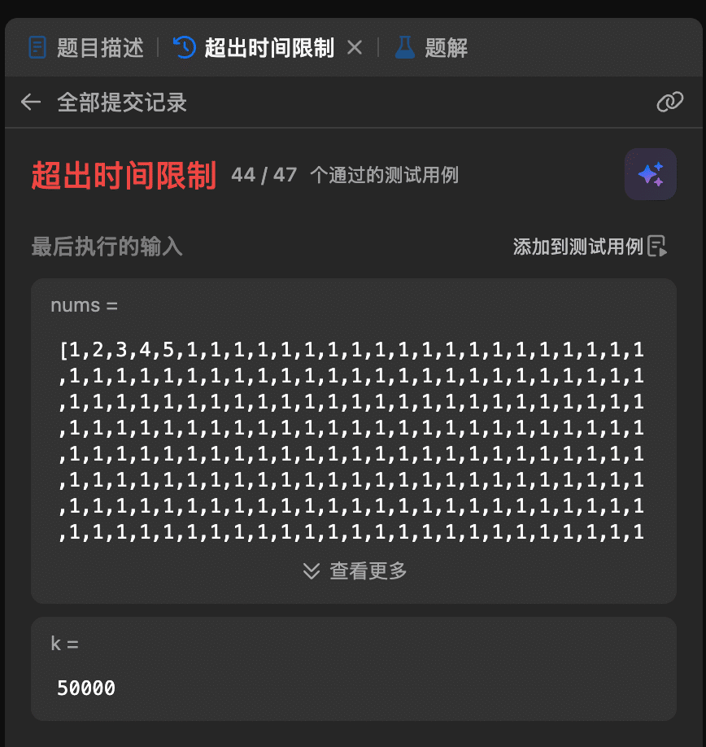

## 1. 题目描述

- [leetcode](https://leetcode.cn/problems/kth-largest-element-in-an-array/)

给定整数数组 `nums` 和整数 `k`，请返回数组中第 `k` 个最大的元素。

请注意，你需要找的是数组排序后的第 `k` 个最大的元素，而不是第 `k` 个不同的元素。

你必须设计并实现时间复杂度为 `O(n)` 的算法解决此问题。

---

示例 1：

```txt
输入: [3,2,1,5,6,4], k = 2
输出: 5
```

---

示例 2：

```txt
输入: [3,2,3,1,2,4,5,5,6], k = 4
输出: 4
```

---

提示：

- `1 <= k <= nums.length <= 10^5`
- `-10^4 <= nums[i] <= 10^4`

## 2. s.1 - 快速选择

::: code-group

```c [c]
void swap(int* a, int* b) { int t = *a; *a = *b; *b = t; }

int quickSelect(int* nums, int lo, int hi, int target) {
    int pivot = nums[lo + rand() % (hi - lo + 1)];
    int lt = lo, i = lo, gt = hi;
    while (i <= gt) {
        if (nums[i] < pivot) swap(&nums[lt++], &nums[i++]);
        else if (nums[i] > pivot) swap(&nums[i], &nums[gt--]);
        else i++;
    }
    if (target < lt) return quickSelect(nums, lo, lt - 1, target);
    if (target > gt) return quickSelect(nums, gt + 1, hi, target);
    return pivot;
}

int findKthLargest(int* nums, int numsSize, int k) {
    return quickSelect(nums, 0, numsSize - 1, numsSize - k);
}
```

```js [js]
/**
 * @param {number[]} nums
 * @param {number} k
 * @return {number}
 */
var findKthLargest = function (nums, k) {
  const target = nums.length - k;
  function quickSelect(lo, hi) {
    const pivot = nums[lo + Math.floor(Math.random() * (hi - lo + 1))];
    let lt = lo,
      i = lo,
      gt = hi;
    while (i <= gt) {
      if (nums[i] < pivot) {
        [nums[lt], nums[i]] = [nums[i], nums[lt]];
        lt++;
        i++;
      } else if (nums[i] > pivot) {
        [nums[i], nums[gt]] = [nums[gt], nums[i]];
        gt--;
      } else {
        i++;
      }
    }
    if (target < lt) return quickSelect(lo, lt - 1);
    if (target > gt) return quickSelect(gt + 1, hi);
    return pivot;
  }
  return quickSelect(0, nums.length - 1);
};
```

```py [py]
import random

class Solution:
    def findKthLargest(self, nums: List[int], k: int) -> int:
        target = len(nums) - k
        def quick_select(lo, hi):
            pivot = nums[random.randint(lo, hi)]
            lt, i, gt = lo, lo, hi
            while i <= gt:
                if nums[i] < pivot:
                    nums[lt], nums[i] = nums[i], nums[lt]
                    lt += 1
                    i += 1
                elif nums[i] > pivot:
                    nums[i], nums[gt] = nums[gt], nums[i]
                    gt -= 1
                else:
                    i += 1
            if target < lt:
                return quick_select(lo, lt - 1)
            if target > gt:
                return quick_select(gt + 1, hi)
            return pivot
        return quick_select(0, len(nums) - 1)
```

:::

- 时间复杂度：平均 $O(n)$，三路划分后大量重复元素也可一次结束
- 空间复杂度：$O(\log n)$，递归栈平均深度

算法思路：

- 第 $k$ 大等价于升序后索引 $n - k$ 的元素
- 随机选 pivot，三路划分成 `< pivot`、`= pivot`、`> pivot`
- 目标落在等于区间则直接返回，否则只递归一侧

## 3. 超时提交示例

```py
class Solution:
    def findKthLargest(self, nums: List[int], k: int) -> int:
        target = len(nums) - k
        def quick_select(lo, hi):
            pivot, i = nums[hi], lo
            for j in range(lo, hi):
                if nums[j] <= pivot:
                    nums[i], nums[j] = nums[j], nums[i]
                    i += 1
            nums[i], nums[hi] = nums[hi], nums[i]
            if i == target:
                return nums[i]
            elif i < target:
                return quick_select(i + 1, hi)
            else:
                return quick_select(lo, i - 1)
        return quick_select(0, len(nums) - 1)
```

 {w=434px}

固定取末尾做 pivot 的单路划分，遇到几乎全是相同值的用例（如全 `1`、`k = 50000`）时，每次只排除 1 个元素，退化成 $O(n^2)$。
