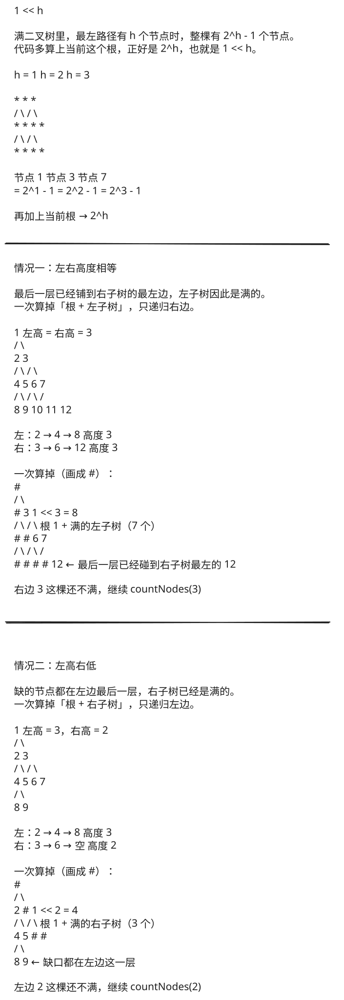

## 1. 题目描述

- [leetcode](https://leetcode.cn/problems/count-complete-tree-nodes/)

给你一棵完全二叉树的根节点 `root`，求出该树的节点个数。

[完全二叉树][1] 的定义如下：在完全二叉树中，除了最底层节点可能没填满外，其余每层节点数都达到最大值，并且最下面一层的节点都集中在该层最左边的若干位置。若最底层为第 `h` 层（从第 0 层开始），则该层包含 `1~ 2^h` 个节点。

---

示例 1：


```txt
输入：root = [1, 2, 3, 4, 5, 6]
输出：6
```

---

示例 2：

```txt
输入：root = []
输出：0
```

---

示例 3：

```txt
输入：root = [1]
输出：1
```

---

提示：

- 树中节点的数目范围是`[0, 5 * 10^4]`
- `0 <= Node.val <= 5 * 10^4`
- 题目数据保证输入的树是 完全二叉树

---

进阶：遍历树来统计节点是一种时间复杂度为 `O(n)` 的简单解决方案。你可以设计一个更快的算法吗？

## 2. s.1 - 递归遍历（会超时）

::: code-group

```c [c]
/**
 * Definition for a binary tree node.
 * struct TreeNode {
 *     int val;
 *     struct TreeNode *left;
 *     struct TreeNode *right;
 * };
 */
int countNodes(struct TreeNode* root) {
    if (!root) return 0;

    return 1 + countNodes(root->left) + countNodes(root->right);
}
```

```js [js]
/**
 * Definition for a binary tree node.
 * function TreeNode(val, left, right) {
 *     this.val = (val===undefined ? 0 : val)
 *     this.left = (left===undefined ? null : left)
 *     this.right = (right===undefined ? null : right)
 * }
 */
/**
 * @param {TreeNode} root
 * @return {number}
 */

var countNodes = function (root) {
  if (!root) return 0;

  return 1 + countNodes(root.left) + countNodes(root.right);
};
```

```py [py]
class Solution:
    def countNodes(self, root: Optional[TreeNode]) -> int:
        if not root:
            return 0

        return 1 + self.countNodes(root.left) + self.countNodes(root.right)
```

:::

- 时间复杂度：$O(n)$，需要访问每个节点
- 空间复杂度：$O(\log n)$，递归调用栈的深度

算法思路：

- 递归遍历整棵树，计算节点总数
- 递归公式：节点总数 = 1（当前节点） + 左子树节点数 + 右子树节点数
- 这是最直接的解法，但没有利用完全二叉树的特性

### 超时说明

 {w=1059px}

s.1 的算法本身是对的，但这题在力扣上交不出去。判题加了次线性时间限制，全树递归是 O(n)，会直接被判「违反限制」。

截图里的报错就是这个：

> The recursive traversal visits every node, resulting in Theta(n) runtime, which violates the sublinear time restriction.

题目进阶要求的就是比 O(n) 更快。要过这题，交 **s.2**（比较左右子树高度，满的一侧用 `1 << h` 直接算）。它是 O(log² n)，满足这个限制。

## 3. s.2 - 比较左右子树高度 + 满二叉树公式



::: code-group

```c [c]
/**
 * Definition for a binary tree node.
 * struct TreeNode {
 *     int val;
 *     struct TreeNode *left;
 *     struct TreeNode *right;
 * };
 */
// 获取树的高度（最左侧路径）
static int getHeight(struct TreeNode* node) {
    int height = 0;
    while (node) {
        height++;
        node = node->left;
    }
    return height;
}

int countNodes(struct TreeNode* root) {
    if (!root) return 0;

    int leftHeight = getHeight(root->left);
    int rightHeight = getHeight(root->right);

    if (leftHeight == rightHeight) {
        // 如果左右高度相等，左子树必是满二叉树，用公式 2^h 直接计算，递归右子树
        return (1 << leftHeight) + countNodes(root->right);
    } else {
        // 如果左右高度不等，右子树必是满二叉树，用公式 2^h 直接计算，递归左子树
        return (1 << rightHeight) + countNodes(root->left);
    }
}
```

```js [js]
/**
 * Definition for a binary tree node.
 * function TreeNode(val, left, right) {
 *     this.val = (val===undefined ? 0 : val)
 *     this.left = (left===undefined ? null : left)
 *     this.right = (right===undefined ? null : right)
 * }
 */
/**
 * @param {TreeNode} root
 * @return {number}
 */
var countNodes = function (root) {
  if (!root) return 0;

  // 获取树的高度（最左侧路径）
  const getHeight = (node) => {
    let height = 0;
    while (node) {
      height++;
      node = node.left;
    }
    return height;
  };

  const leftHeight = getHeight(root.left);
  const rightHeight = getHeight(root.right);

  if (leftHeight === rightHeight) {
    // 如果左右高度相等，左子树必是满二叉树，用公式 2^h 直接计算，递归右子树
    return (1 << leftHeight) + countNodes(root.right);
  } else {
    // 如果左右高度不等，右子树必是满二叉树，用公式 2^h 直接计算，递归左子树
    return (1 << rightHeight) + countNodes(root.left);
  }
};
```

```py [py]
# Definition for a binary tree node.
# class TreeNode:
#     def __init__(self, val=0, left=None, right=None):
#         self.val = val
#         self.left = left
#         self.right = right
class Solution:
    def countNodes(self, root: Optional[TreeNode]) -> int:
        if not root:
            return 0

        # 获取树的高度（最左侧路径）
        def get_height(node: Optional[TreeNode]) -> int:
            height = 0
            while node:
                height += 1
                node = node.left
            return height

        left_height = get_height(root.left)
        right_height = get_height(root.right)

        if left_height == right_height:
            # 如果左右高度相等，左子树必是满二叉树，用公式 2^h 直接计算，递归右子树
            return (1 << left_height) + self.countNodes(root.right)
        else:
            # 如果左右高度不等，右子树必是满二叉树，用公式 2^h 直接计算，递归左子树
            return (1 << right_height) + self.countNodes(root.left)
```

:::

- 时间复杂度：$O(\log^2 n)$，每次递归需要 $O(\log n)$ 时间计算高度，最多递归 $O(\log n)$ 次
- 空间复杂度：$O(\log n)$，递归调用栈的深度

算法思路：

- 利用完全二叉树的性质：除最后一层外，其他层都是满的
- 比较左右子树的高度（沿着最左路径计算）
- 如果左右高度相等，左子树必是满二叉树，用公式 $2^h$ 直接计算，递归右子树
- 如果左右高度不等，右子树必是满二叉树，用公式计算，递归左子树
- 位运算 `1 << h` 等价于 $2^h$，效率更高

## 4. 引用

- [百度百科 - 完全二叉树][1]

[1]: https://baike.baidu.com/item/%E5%AE%8C%E5%85%A8%E4%BA%8C%E5%8F%89%E6%A0%91/7773232?fr=aladdin
