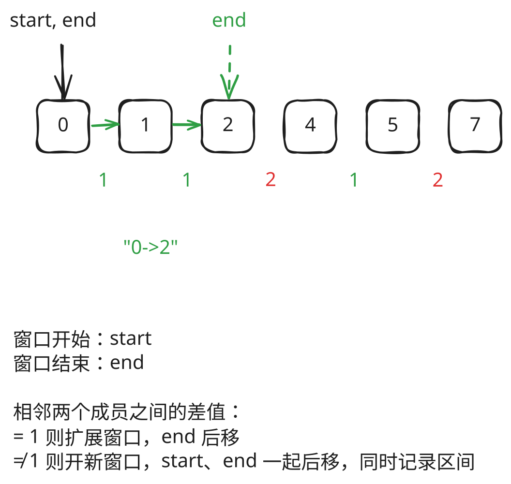

## 1. 题目描述

- [leetcode](https://leetcode.cn/problems/summary-ranges/)

给定一个无重复元素的有序整数数组 `nums`。

区间 `[a, b]` 是从 `a` 到 `b`（包含）的所有整数的集合。

返回恰好覆盖数组中所有数字的最小有序区间范围列表。也就是说，`nums` 的每个元素都恰好被某个区间范围所覆盖，并且不存在属于某个区间但不属于 `nums` 的数字 `x`。

列表中的每个区间范围 `[a, b]` 应该按如下格式输出：

- `"a -> b"`，如果 `a != b`
- `"a"`，如果 `a == b`

---

示例 1：

```
输入：nums = [0, 1, 2, 4, 5, 7]
输出：["0->2", "4->5", "7"]
```

解释：

区间范围是：

- `[0,2] --> "0->2"`
- `[4,5] --> "4->5"`
- `[7,7] --> "7"`

---

示例 2：

```
输入：nums = [0, 2, 3, 4, 6, 8, 9]
输出：["0", "2->4", "6", "8->9"]
```

解释：区间范围是：

- `[0, 0] --> "0"`
- `[2, 4] --> "2->4"`
- `[6, 6] --> "6"`
- `[8, 9] --> "8->9"`

---

提示：

- `0 <= nums.length <= 20`
- `-2^31 <= nums[i] <= 2^31 - 1`
- `nums` 中的所有值都互不相同
- `nums` 按升序排列

## 2. s.1 - 一次遍历




::: code-group

```c [c]
/**
 * Note: The returned array must be malloced, assume caller calls free().
 */
#include <limits.h>
#include <stdio.h>
#include <stdlib.h>

static char* formatRange(int start, int end) {
    char* buf = (char*)malloc(32);
    if (start == end) {
        sprintf(buf, "%d", start);
    } else {
        sprintf(buf, "%d->%d", start, end);
    }
    return buf;
}

/**
 * Note: The returned array must be malloced, assume caller calls free().
 */
char** summaryRanges(int* nums, int numsSize, int* returnSize) {
    *returnSize = 0;
    if (numsSize == 0) return NULL; // 空数组

    char** result = (char**)malloc(sizeof(char*) * numsSize);
    int start = nums[0]; // 当前区间的起始值
    int end = nums[0];   // 当前区间的结束值

    for (int i = 1; i < numsSize; i++) {
        // end 已是 INT_MAX 时不能再 +1
        if (end < INT_MAX && nums[i] == end + 1) {
            end = nums[i];
        } else {
            result[(*returnSize)++] = formatRange(start, end);
            start = nums[i];
            end = nums[i];
        }
    }

    result[(*returnSize)++] = formatRange(start, end);
    return result;
}
```

```js [js]
/**
 * @param {number[]} nums
 * @return {string[]}
 */
var summaryRanges = function (nums) {
  if (nums.length === 0) return [] // 空数组

  const result = []
  let start = nums[0] // 当前区间的起始值
  let end = nums[0] // 当前区间的结束值

  for (let i = 1; i < nums.length; i++) {
    if (nums[i] === end + 1) {
      end = nums[i]
    } else {
      if (start === end) {
        result.push(start.toString())
      } else {
        result.push(`${start}->${end}`)
      }
      start = nums[i]
      end = nums[i]
    }
  }

  if (start === end) {
    result.push(start.toString())
  } else {
    result.push(`${start}->${end}`)
  }

  return result
}
```

```py [py]
class Solution:
    def summaryRanges(self, nums: List[int]) -> List[str]:
        if not nums:
            return []

        result = []
        start = nums[0]  # 当前区间的起始值
        end = nums[0]  # 当前区间的结束值

        for i in range(1, len(nums)):
            if nums[i] == end + 1:
                end = nums[i]
            else:
                if start == end:
                    result.append(str(start))
                else:
                    result.append(f"{start}->{end}")
                start = nums[i]
                end = nums[i]

        if start == end:
            result.append(str(start))
        else:
            result.append(f"{start}->{end}")

        return result
```

:::

- 时间复杂度：$O(n)$，每个元素只访问一次
- 空间复杂度：$O(1)$，除结果外只使用常数额外空间

算法思路：

- 数组已升序且无重复，相邻两数差为 1 就属于同一段
- 用起点和终点记住当前段：连续则终点后移，断开则写入结果并另起一段
- 扫描结束后写入最后一段；空数组直接返回空列表
