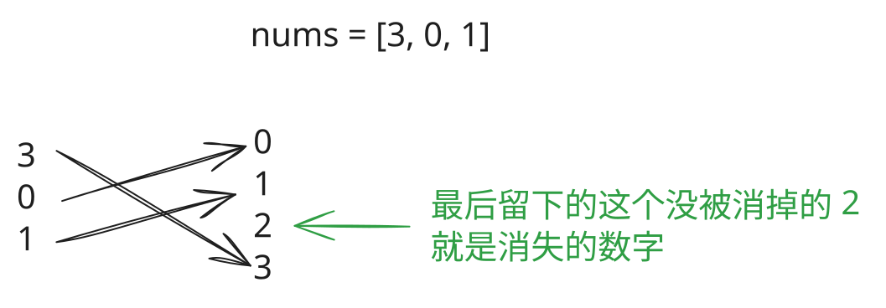

## 1. 题目描述

- [leetcode](https://leetcode.cn/problems/missing-number/)

给定一个包含 `[0, n]` 中 `n` 个数的数组 `nums`，找出 `[0, n]` 这个范围内没有出现在数组中的那个数。

---

示例 1：

```
输入：nums = [3, 0, 1]
输出：2
```

解释：n = 3，因为有 3 个数字，所以所有的数字都在范围 `[0, 3]` 内。2 是丢失的数字，因为它没有出现在 nums 中。

---

示例 2：

```
输入：nums = [0, 1]
输出：2
```

解释：n = 2，因为有 2 个数字，所以所有的数字都在范围 `[0, 2]` 内。2 是丢失的数字，因为它没有出现在 nums 中。

---

示例 3：

```
输入：nums = [9, 6, 4, 2, 3, 5, 7, 0, 1]
输出：8
```

解释：n = 9，因为有 9 个数字，所以所有的数字都在范围 `[0, 9]` 内。8 是丢失的数字，因为它没有出现在 nums 中。

---

提示：

- `n == nums.length`
- `1 <= n <= 10^4`
- `0 <= nums[i] <= n`
- `nums` 中的所有数字都独一无二

---

进阶：你能否实现线性时间复杂度、仅使用额外常数空间的算法解决此问题?

## 2. s.1 - 数学求和法

::: code-group

```c [c]
int missingNumber(int* nums, int numsSize) {
    // 计算 [0, n] 的完整序列和
    int expectedSum = numsSize * (numsSize + 1) / 2;

    // 计算数组中实际元素的和
    int actualSum = 0;
    for (int i = 0; i < numsSize; i++) {
        actualSum += nums[i];
    }

    // 差值就是丢失的数字
    return expectedSum - actualSum;
}
```

```js [js]
var missingNumber = function (nums) {
  const n = nums.length
  // 计算 [0, n] 的完整序列和
  const expectedSum = (n * (n + 1)) / 2

  // 计算数组中实际元素的和
  const actualSum = nums.reduce((sum, num) => sum + num, 0)

  // 差值就是丢失的数字
  return expectedSum - actualSum
}
```

```py [py]
class Solution:
    def missingNumber(self, nums: list[int]) -> int:
        n = len(nums)
        # 计算 [0, n] 的完整序列和
        expected_sum = n * (n + 1) // 2

        # 计算数组中实际元素的和
        actual_sum = sum(nums)

        # 差值就是丢失的数字
        return expected_sum - actual_sum
```

:::

- 时间复杂度：$O(n)$，其中 $n$ 是数组长度，只需遍历一次求和
- 空间复杂度：$O(1)$，只使用常数个变量

算法思路：

- $[0, n]$ 的和等于 $n(n + 1) / 2$
- 用这个和减去数组元素之和，差值就是没有出现的那个数

## 3. s.2 - 异或 - 消消乐

 {w=500px}

::: code-group

```c [c]
int missingNumber(int* nums, int numsSize) {
    int result = numsSize;

    // 对数组索引和数组元素进行异或运算
    for (int i = 0; i < numsSize; i++) {
        result ^= i ^ nums[i];
    }

    return result;
}
```

```js [js]
var missingNumber = function (nums) {
  const n = nums.length
  let result = n

  // 对数组索引和数组元素进行异或运算
  for (let i = 0; i < n; i++) {
    result ^= i ^ nums[i]
  }

  return result
}
```

```py [py]
class Solution:
    def missingNumber(self, nums: list[int]) -> int:
        n = len(nums)
        result = n

        # 对数组索引和数组元素进行异或运算
        for i, num in enumerate(nums):
            result ^= i ^ num

        return result
```

:::

- 时间复杂度：$O(n)$，其中 $n$ 是数组长度，只需遍历一次
- 空间复杂度：$O(1)$，只使用一个变量

算法思路：

- 把下标 $0$ 到 $n - 1$ 再补上 $n$，与数组元素一起做异或
- 相同的数成对抵消为 $0$，丢失的数只出现一次，结果就是它
- 异或满足 $a \oplus a = 0$、$a \oplus 0 = a$，以及交换律和结合律
