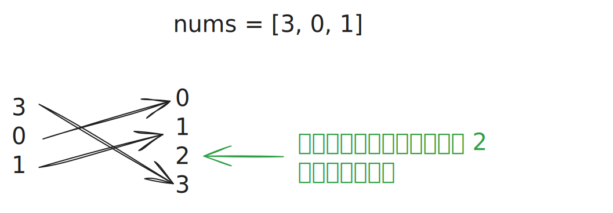
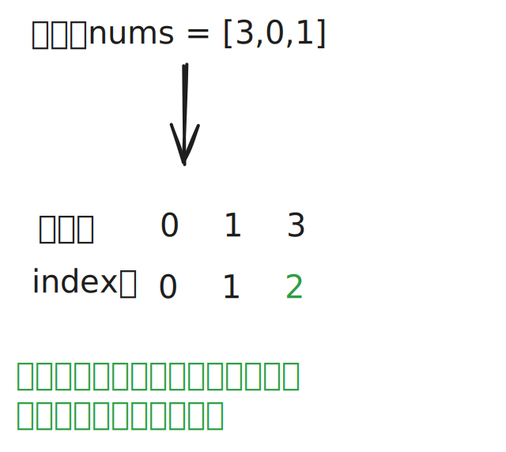

# [0268. 丢失的数字【简单】](https://github.com/tnotesjs/TNotes.leetcode/tree/main/notes/0268.%20%E4%B8%A2%E5%A4%B1%E7%9A%84%E6%95%B0%E5%AD%97%E3%80%90%E7%AE%80%E5%8D%95%E3%80%91)

<!-- region:toc -->

- [1. 📝 题目描述](#1--题目描述)
- [2. 🎯 s.1 - 数学求和法](#2--s1---数学求和法)
- [3. 🎯 s.2 - 异或 - 消消乐](#3--s2---异或---消消乐)
- [4. 🎯 s.3 - 排序法](#4--s3---排序法)

<!-- endregion:toc -->

## 1. 📝 题目描述

- [leetcode](https://leetcode.cn/problems/missing-number/)

给定一个包含 `[0, n]` 中 `n` 个数的数组 `nums` ，找出 `[0, n]` 这个范围内没有出现在数组中的那个数。

---

- **示例 1：**

```
输入：nums = [3,0,1]
输出：2
解释：n = 3，因为有 3 个数字，所以所有的数字都在范围 [0,3] 内。2 是丢失的数字，因为它没有出现在 nums 中。
```

- **示例 2：**

```
输入：nums = [0,1]
输出：2
解释：n = 2，因为有 2 个数字，所以所有的数字都在范围 [0,2] 内。2 是丢失的数字，因为它没有出现在 nums 中。
```

- **示例 3：**

```
输入：nums = [9,6,4,2,3,5,7,0,1]
输出：8
解释：n = 9，因为有 9 个数字，所以所有的数字都在范围 [0,9] 内。8 是丢失的数字，因为它没有出现在 nums 中。
```

---

**提示：**

- `n == nums.length`
- `1 <= n <= 10^4`
- `0 <= nums[i] <= n`
- `nums` 中的所有数字都 **独一无二**

---

**进阶：**

- 你能否实现线性时间复杂度、仅使用额外常数空间的算法解决此问题?

## 2. 🎯 s.1 - 数学求和法

::: code-group

<<< ./solutions/1/1.js [js]

:::

- 等差数列求和公式：
  - 对于首项为 `a₁`，末项为 `aₙ`，项数为 `n` 的等差数列，求和公式为：`S = n * (a₁ + aₙ) / 2`

## 3. 🎯 s.2 - 异或 - 消消乐



::: code-group

<<< ./solutions/2/1.js [js]

:::

- 核心原理 - 类似“消消乐”
- 异或运算有三个重要性质：
  1. 自反性：`a ^ a = 0`（相同数字异或为 0）
  2. 恒等性：`a ^ 0 = a`（任何数与 0 异或等于自身）
  3. 交换律和结合律：可以改变运算顺序
- 循环中的每一步异或操作 `result ^= i ^ nums[i]`
  - `[3, 0, 1]`
    - `i=0: result ^= 0 ^ 3 --> result = 3 ^ 0 ^ 3 = 0`
    - `i=1: result ^= 1 ^ 0 --> result = 0 ^ 1 ^ 0 = 1`
    - `i=2: result ^= 2 ^ 1 --> result = 1 ^ 2 ^ 1 = 2`

## 4. 🎯 s.3 - 排序法



::: code-group

<<< ./solutions/3/1.js [js]

:::
