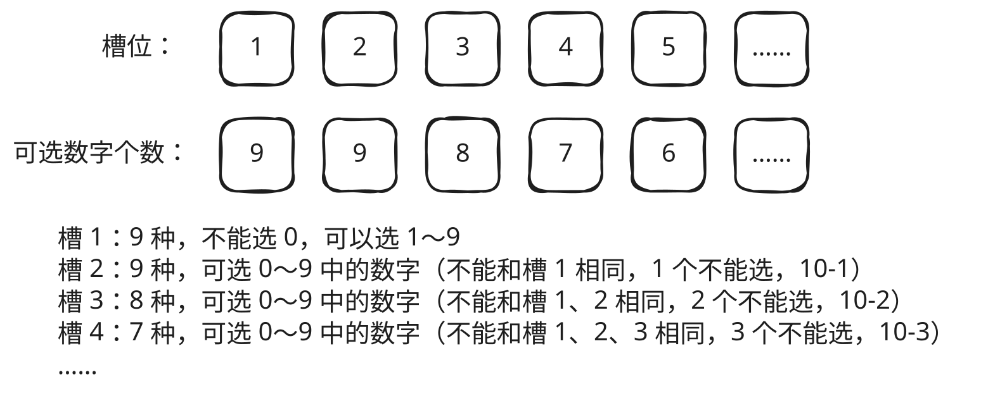

## 1. 题目描述

- [leetcode](https://leetcode.cn/problems/count-numbers-with-unique-digits/)

给你一个整数 `n`，统计并返回各位数字都不同的数字 `x` 的个数，其中 $0 <= x < 10^{n}$。

---

示例 1：

```txt
输入：n = 2
输出：91
解释：答案应为除去 11、22、33、44、55、66、77、88、99 外，在 0 ≤ x < 100 范围内的所有数字。
```

---

示例 2：

```txt
输入：n = 0
输出：1
```

---

提示：

- `0 <= n <= 8`

## 2. s.1 - 排列组合

 {w=849px}


::: code-group

```c [c]
int countNumbersWithUniqueDigits(int n) {
    if (n == 0) return 1;
    int res = 10, product = 9;
    for (int i = 2; i <= n; i++) {
        product *= (10 - i + 1);
        res += product;
    }
    return res;
}
```

```js [js]
/**
 * @param {number} n
 * @return {number}
 */
var countNumbersWithUniqueDigits = function (n) {
  if (n === 0) return 1
  let res = 10,
    product = 9
  for (let i = 2; i <= n; i++) {
    product *= 10 - i + 1
    res += product
  }
  return res
}
```

```py [py]
class Solution:
    def countNumbersWithUniqueDigits(self, n: int) -> int:
        if n == 0:
            return 1
        res, product = 10, 9
        for i in range(2, n + 1):
            product *= (10 - i + 1)
            res += product
        return res
```

:::

- 时间复杂度：$O(n)$
- 空间复杂度：$O(1)$

算法思路：

- $i$ 位数且各位不同的个数 = $9 \times 9 \times 8 \times \cdots \times (10-i+1)$
- 累加 1 位到 $n$ 位的结果，加上 $n=0$ 的情况

## 3. 【AI】s.1 公式推导

这道题的公式推导，核心是运用**排列组合**中的**乘法原理**，按位数分类统计。

我们要求的范围是 $0 \le x < 10^n$，这包括了从 1 位数到 n 位数的所有数字。因此，我们可以分别计算 1 位数、2 位数、…… 直到 n 位数中“各位数字不同”的个数，然后将它们全部加起来。

### 3.1. 边界情况：0 位数与 1 位数

首先处理两种简单情况：

- **当 `n = 0` 时**：范围是 `0 ≤ x < 1`，只有数字 `0` 这一个，所以答案是 **1**。
- **当 `n = 1` 时**：范围是 `0 ≤ x < 10`，即 `0` 到 `9`，共 **10** 个数字，且每个数字都只有一位，天然满足“各位不同”的条件。

### 3.2. 一般情况：2 位数及以上 (n ≥ 2)

对于 n ≥ 2 的情况，我们需要计算**恰好为 `i` 位数**（i 从 2 到 n）且各位数字不同的数字个数。

以 3 位数（i = 3）为例，我们来逐位分析：

1.  **首位（百位）**：不能为 `0`，所以有 **9** 种选择（1 到 9）。
2.  **第二位（十位）**：可以是 `0`，但不能与首位相同。首位已经用掉一个数字，所以还剩下 `10 - 1 = 9` 种选择。
3.  **第三位（个位）**：不能与前两位相同。前两位已经用掉两个数字，所以还剩下 `10 - 2 = 8` 种选择。

根据**乘法原理**，3 位数中各位数字不同的个数为：**$9 \times 9 \times 8 = 648$** 个。

将这个规律推广到任意 `i` 位数（i ≥ 2）：
- 第 1 位：**9** 种选择
- 第 2 位：**9** 种选择（10 - 1）
- 第 3 位：**8** 种选择（10 - 2）
- ...
- 第 `i` 位：**$10 - (i - 1) = 11 - i$** 种选择

所以，**恰好 `i` 位数中各位数字不同的数字个数**为：
$$9 \times 9 \times 8 \times \dots \times (11 - i)$$

这个乘积可以简写为 **$9 \times A_9^{i-1}$**，其中 $A_9^{i-1}$ 表示从 9 个数字中选 `i-1` 个进行排列的方案数。

### 3.3. 代码与公式的对应

现在我们回头看代码中的变量，就能明白它们的含义了：

```c
int res = 10, product = 9;
for (int i = 2; i <= n; i++) {
    product *= (10 - i + 1);
    res += product;
}
```

- **`res = 10`**：初始值对应 **1 位数**的总数（0-9）。
- **`product = 9`**：初始值对应 **2 位数首位**的选择数（1-9）。此时 `product` 表示 **2 位数中各位数字不同的个数**（$9 \times 9$ 中的第一个 9）。
- **循环从 `i = 2` 开始**：表示从计算 **2 位数**的个数开始累加。
- **`product *= (10 - i + 1)`**：这是乘法原理的核心。
    - 当 `i = 2` 时，`product` 乘以 `9`，得到 $9 \times 9$，即 **2 位数**的总数。
    - 当 `i = 3` 时，`product` 再乘以 `8`，得到 $9 \times 9 \times 8$，即 **3 位数**的总数。
    - 以此类推，`product` 在每次循环后，就变成了**恰好 `i` 位数中各位数字不同的个数**。
- **`res += product`**：将当前位数 `i` 的结果累加到总数 `res` 中。

### 3.4. 💎 总结

这个公式的本质就是**分类计数**：将 `0` 到 `10^n - 1` 的所有数字，按位数拆开，分别计算每一类中满足“各位不同”的数字个数，最后求和。

整个算法的数学逻辑非常清晰：一位数有 10 个（0-9），两位数有 81 个（$9 \times 9$），三位数有 648 个（$9 \times 9 \times 8$），以此类推，直到 n 位数。最终答案就是这些数量之和。
