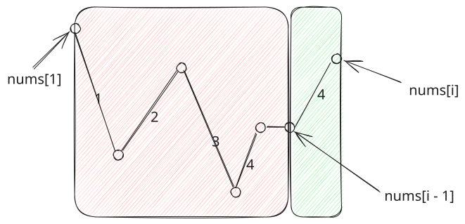

## 1. 题目描述

- [leetcode](https://leetcode.cn/problems/wiggle-subsequence/)

如果连续数字之间的差严格地在正数和负数之间交替，则数字序列称为摆动序列。第一个差（如果存在的话）可能是正数或负数。仅有一个元素或者含两个不等元素的序列也视作摆动序列。

- 例如， `[1, 7, 4, 9, 2, 5]` 是一个摆动序列，因为差值 `(6, -3, 5, -7, 3)` 是正负交替出现的。
- 相反，`[1, 4, 7, 2, 5]` 和 `[1, 7, 4, 5, 5]` 不是摆动序列，第一个序列是因为它的前两个差值都是正数，第二个序列是因为它的最后一个差值为零。

子序列可以通过从原始序列中删除一些（也可以不删除）元素来获得，剩下的元素保持其原始顺序。

给你一个整数数组 `nums`，返回 `nums` 中作为摆动序列的最长子序列的长度。

---

示例 1：

```txt
输入：nums = [1, 7, 4, 9, 2, 5]
输出：6
解释：整个序列均为摆动序列，各元素之间的差值为 (6, -3, 5, -7, 3)。
```

---

示例 2：

```txt
输入：nums = [1, 17, 5, 10, 13, 15, 10, 5, 16, 8]
输出：7
解释：这个序列包含几个长度为 7 摆动序列。
其中一个是 [1, 17, 10, 13, 10, 16, 8]，各元素之间的差值为 (16, -7, 3, -3, 6, -8)。
```

---

示例 3：

```txt
输入：nums = [1, 2, 3, 4, 5, 6, 7, 8, 9]
输出：2
```

---

提示：

- `1 <= nums.length <= 1000`
- `0 <= nums[i] <= 1000`

---

进阶：你能否用 `O(n)` 时间复杂度完成此题?

## 2. s.1 - 贪心 + DP

::: code-group

```c [c]
int wiggleMaxLength(int* nums, int numsSize) {
    if (numsSize < 2) return numsSize;
    int up = 1, down = 1;
    for (int i = 1; i < numsSize; i++) {
        if (nums[i] > nums[i - 1]) up = down + 1;
        else if (nums[i] < nums[i - 1]) down = up + 1;
    }
    return up > down ? up : down;
}
```

```js [js]
/**
 * @param {number[]} nums
 * @return {number}
 */
var wiggleMaxLength = function (nums) {
  if (nums.length < 2) return nums.length
  let up = 1,
    down = 1
  for (let i = 1; i < nums.length; i++) {
    if (nums[i] > nums[i - 1]) up = down + 1 // 波峰，接在下降序列后
    else if (nums[i] < nums[i - 1]) down = up + 1 // 波谷，接在上升序列后
  }
  return Math.max(up, down)
}
```

```py [py]
class Solution:
    def wiggleMaxLength(self, nums: List[int]) -> int:
        if len(nums) < 2:
            return len(nums)
        up, down = 1, 1
        for i in range(1, len(nums)):
            if nums[i] > nums[i - 1]:
                up = down + 1
            elif nums[i] < nums[i - 1]:
                down = up + 1
        return max(up, down)
```

:::

- 时间复杂度：$O(n)$
- 空间复杂度：$O(1)$

算法思路：

- 维护 `up`、`down` 分别表示以上升/下降结尾的最长摆动序列长度
- 若当前上升则 `up = down + 1`，下降则 `down = up + 1`

### 2.1. 贪心思想

只保留趋势发生反转的波峰和波谷，忽略单调上升或下降的中间点。

- `i` 表示以此为结尾
- `up` 表示遍历到 `i` 时（以 `i` 为结尾时），以此为「波峰」的全局最优解
- `down` 表示遍历到 `i` 时（以 `i` 为结尾时），以此为「波谷」的全局最优解

以遇到波峰为例，遇到波峰时，需要更新 `up`。更新波峰的操作：`up = down + 1`，这个式子中的 `down` 表示的是从 `nums[1]` 开始截止到 `nums[i-1]` 这段区间中，所有以“下降结尾”的摆动序列中的全局最长长度。

以下面这个「摆动示例图 1」为例，从 `1` 到 `i - 1` 这个区间内，上升的最优解是 `4`，下降的最优解是 `3`。此时 `nums[i] > nums[i - 1]`，`nums[i]` 处于波峰，更新时使用历史下降最优解 `down`（也就是 `3`）加上这一段波峰区间（也就是 `1`）。



当 `i` 每次变化时：

- 平：跳过不做处理
- 升：记录下这次摆动变化，用历史最优 down 更新 up
- 降：记录下这次摆动变化，用历史最优 up 更新 down

### 2.2. DP 思想

定义以当前元素结尾且趋势分别为上升/下降的最长序列长度为状态，通过子问题的最优解逐步推导出全局最优解。
