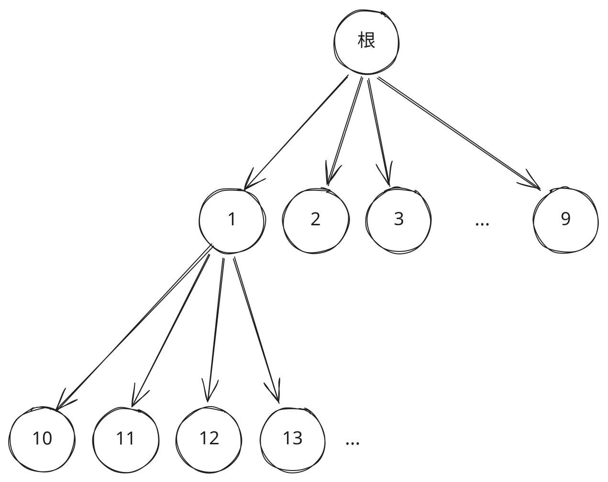

## 1. 题目描述

- [leetcode](https://leetcode.cn/problems/lexicographical-numbers/)

给你一个整数 `n`，按字典序返回范围 `[1, n]` 内所有整数。

你必须设计一个时间复杂度为 `O(n)` 且使用 `O(1)` 额外空间的算法。

---

示例 1：

```txt
输入：n = 13
输出：[1, 10, 11, 12, 13, 2, 3, 4, 5, 6, 7, 8, 9]
```

---

示例 2：

```txt
输入：n = 2
输出：[1, 2]
```

---

提示：

- `1 <= n <= 5 * 10^4`

## 2. s.1 - DFS

::: code-group

```c [c]
/**
 * Note: The returned array must be malloced, assume caller calls free().
 */
void dfs(int cur, int n, int* res, int* idx) {
    if (cur > n) return;
    res[(*idx)++] = cur;
    for (int i = 0; i <= 9; i++) dfs(cur * 10 + i, n, res, idx);
}

int* lexicalOrder(int n, int* returnSize) {
    int* res = (int*)malloc(sizeof(int) * n);
    *returnSize = 0;
    for (int i = 1; i <= 9; i++) dfs(i, n, res, returnSize);
    return res;
}
```

```js [js]
/**
 * @param {number} n
 * @return {number[]}
 */
var lexicalOrder = function (n) {
  const res = []
  const dfs = (cur) => {
    if (cur > n) return
    res.push(cur)
    for (let i = 0; i <= 9; i++) dfs(cur * 10 + i)
  }
  for (let i = 1; i <= 9; i++) dfs(i)
  return res
}
```

```py [py]
class Solution:
    def lexicalOrder(self, n: int) -> List[int]:
        res = []
        def dfs(cur):
            if cur > n:
                return
            res.append(cur)
            for i in range(10):
                dfs(cur * 10 + i)
        for i in range(1, 10):
            dfs(i)
        return res
```

:::

- 时间复杂度：$O(n)$
- 空间复杂度：$O(\log n)$，递归栈深度

算法思路：

- 字典序等价于十叉树的前序遍历
- 从 1-9 开始，每个节点向下扩展 0-9，直到超过 $n$

### 2.1. 十叉树的前序遍历

把 $[1, n]$ 中的数字组织成一棵十叉树：

- 根节点下面挂 1 ~ 9（数字不能以 0 开头）
- 每个节点 $x$ 下面挂 10 个孩子：$x \times 10 + 0$ ~ $x \times 10 + 9$，即在 $x$ 后面再接一位数字
- 大于 $n$ 的节点不存在

字典序的比较规则是：先比第一位，相同再比第二位，依此类推；如果一个是另一个的前缀，短的排在前面（如 `1 < 10`）。

对应到这棵树上：

- 「前缀」就是父节点，所以父节点要排在所有孩子前面
- 「下一位数字」就是第几个孩子，所以孩子要按 0 ~ 9 从小到大访问

「先访问自己，再从小到大依次访问孩子」正是前序遍历，因此十叉树的前序遍历顺序就是字典序。

---

示例：$n = 13$

 {w=470px}

- 节点 1 的孩子本应是 10 ~ 19，但 14 ~ 19 大于 13，不存在
- 节点 2 ~ 9 的孩子（20、30 …）都大于 13，也不存在

前序遍历过程：

1. 访问 1，再依次访问它的孩子 10、11、12、13
2. 回到根，访问 2（没有孩子）
3. 依次访问 3、4、5、6、7、8、9

得到的顺序：

```txt
1, 10, 11, 12, 13, 2, 3, 4, 5, 6, 7, 8, 9
```

与示例 1 的输出一致。
