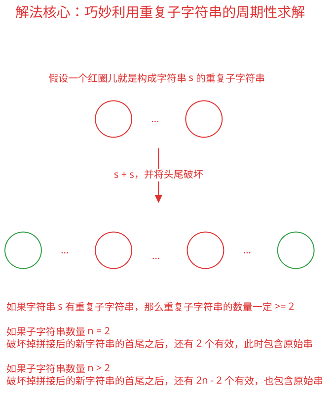

## 1. 📝 题目描述

- [leetcode](https://leetcode.cn/problems/repeated-substring-pattern/)

给定一个非空的字符串 `s`，检查是否可以通过由它的一个子串重复多次构成。

---

示例 1：

```txt
输入: s = "abab"
输出: true
```

解释: 可由子串 "ab" 重复两次构成。

---

示例 2：

```txt
输入: s = "aba"
输出: false
```

---

示例 3：

```txt
输入: s = "abcabcabcabc"
输出: true
```

解释: 可由子串 "abc" 重复四次构成。 (或子串 "abcabc" 重复两次构成。)

---

提示：

- `1 <= s.length <= 10^4`
- `s` 由小写英文字母组成

## 2. 🎯 s.1 - 暴力枚举法

::: code-group

```c [c]
bool repeatedSubstringPattern(char* s) {
    int n = strlen(s);

    for (int len = 1; len <= n / 2; len++) {
        if (n % len != 0)
            continue;

        int repeatCount = n / len;
        char* repeated = (char*)malloc((n + 1) * sizeof(char));
        for (int i = 0; i < repeatCount; i++)
            memcpy(repeated + i * len, s, len);
        repeated[n] = '\0';

        if (strcmp(repeated, s) == 0) {
            free(repeated);
            return true;
        }

        free(repeated);
    }

    return false;
}
```

```js [js]
/**
 * @param {string} s
 * @return {boolean}
 */
var repeatedSubstringPattern = function (s) {
  const n = s.length

  // 枚举可能的子串长度，最长为字符串长度的一半
  for (let i = 1; i <= Math.floor(n / 2); i++) {
    // 只有当字符串长度能被子串长度整除时才可能重复构成
    if (n % i === 0) {
      let pattern = s.substring(0, i)
      let repeated = pattern.repeat(n / i)

      // 检查重复构成的字符串是否与原字符串相同
      if (repeated === s) {
        return true
      }
    }
  }

  return false
}
```

```py [py]
class Solution:
    def repeatedSubstringPattern(self, s: str) -> bool:
        n = len(s)

        for length in range(1, n // 2 + 1):
            if n % length != 0:
                continue

            pattern = s[:length]
            repeated = pattern * (n // length)
            if repeated == s:
                return True

        return False
```

:::

- 时间复杂度：$O(n^2)$，最坏情况下需要枚举 $n/2$ 个子串长度，每次验证需要 $O(n)$ 时间
- 空间复杂度：$O(n)$，需要额外空间存储重复构成的字符串

算法思路：

- 枚举子串长度：
  - 子串长度从 1 到 `Math.floor(n / 2)` 枚举
  - 超过一半长度的子串不可能重复构成原字符串
- 整除判断：
  - 只有当原字符串长度能被子串长度整除时，才可能由该子串重复构成
  - 例如：长度为 6 的字符串可以用长度为 1、2、3 的子串构成，但不能用长度为 4 的子串构成
- 构造验证：
  - 提取长度为 i 的前缀作为可能的子串 pattern
  - 将该子串重复 `n / i` 次构成新字符串
  - 比较新字符串与原字符串是否相同

## 3. 🎯 s.2 - 字符串拼接法



::: code-group

```c [c]
bool repeatedSubstringPattern(char* s) {
    int n = strlen(s);
    if (n < 2)
        return false;

    char* combined = (char*)malloc((2 * n + 1) * sizeof(char));
    memcpy(combined, s, n);
    memcpy(combined + n, s, n);
    combined[2 * n] = '\0';
    combined[2 * n - 1] = '\0';

    bool found = strstr(combined + 1, s) != NULL;
    free(combined);
    return found;
}
```

```js [js]
/**
 * @param {string} s
 * @return {boolean}
 */
var repeatedSubstringPattern = function (s) {
  // 将字符串与自身拼接，去掉首字符和尾字符
  // 如果原字符串在其中出现，则说明可以由重复子串构成
  return (s + s).substring(1, 2 * s.length - 1).includes(s)
}
```

```py [py]
class Solution:
    def repeatedSubstringPattern(self, s: str) -> bool:
        return s in (s + s)[1:-1]
```

:::

- 时间复杂度：$O(n)$，其中 $n$ 是字符串 `s` 的长度，构造拼接串、去掉首尾字符以及在新字符串中查找 `s` 都只需线性处理字符
- 空间复杂度：$O(n)$，需要额外构造长度约为 $2n$ 的拼接字符串

算法思路：

- 如果一个字符串 `s` 可以由重复的子串构成，那么将两个 `s` 拼接后，去掉首尾字符，新的字符串中应该仍然包含原字符串 `s`。
- 这种解法巧妙利用了字符串的周期性特点。
