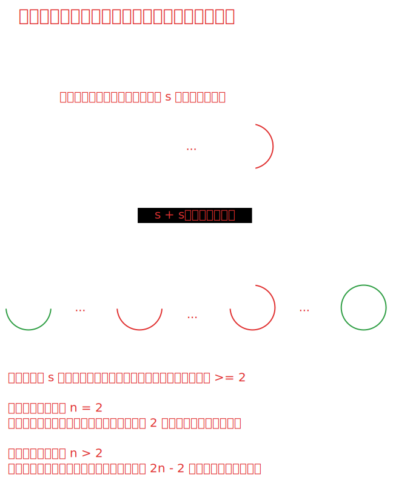

# [0459. 重复的子字符串【简单】](https://github.com/tnotesjs/TNotes.leetcode/tree/main/notes/0459.%20%E9%87%8D%E5%A4%8D%E7%9A%84%E5%AD%90%E5%AD%97%E7%AC%A6%E4%B8%B2%E3%80%90%E7%AE%80%E5%8D%95%E3%80%91)

<!-- region:toc -->

- [1. 📝 题目描述](#1--题目描述)
- [2. 🎯 s.1 - 枚举法](#2--s1---枚举法)
- [3. 🎯 s.2 - 字符串拼接法](#3--s2---字符串拼接法)

<!-- endregion:toc -->

## 1. 📝 题目描述

- [leetcode](https://leetcode.cn/problems/repeated-substring-pattern/)

给定一个非空的字符串 `s` ，检查是否可以通过由它的一个子串重复多次构成。

---

- 示例 1:

```txt
输入: s = "abab"
输出: true
解释: 可由子串 "ab" 重复两次构成。
```

- 示例 2:

```txt
输入: s = "aba"
输出: false
```

- 示例 3:

```txt
输入: s = "abcabcabcabc"
输出: true
解释: 可由子串 "abc" 重复四次构成。 (或子串 "abcabc" 重复两次构成。)
```

---

**提示：**

- `1 <= s.length <= 10^4`
- `s` 由小写英文字母组成

## 2. 🎯 s.1 - 枚举法

::: code-group

<<< ./solutions/1/1.js [js]

:::

- **时间复杂度**：$O(n^2)$，最坏情况下需要枚举 $n/2$ 个子串长度，每次验证需要 $O(n)$ 时间
- **空间复杂度**：$O(n)$，需要额外空间存储重复构成的字符串
- 解题思路：
  1. **枚举子串长度**：
     - 子串长度从 1 到 `Math.floor(n / 2)` 枚举
     - 超过一半长度的子串不可能重复构成原字符串
  2. **整除判断**：
     - 只有当原字符串长度能被子串长度整除时，才可能由该子串重复构成
     - 例如：长度为 6 的字符串可以用长度为 1、2、3 的子串构成，但不能用长度为 4 的子串构成
  3. **构造验证**：
     - 提取长度为 i 的前缀作为可能的子串 pattern
     - 将该子串重复 `n / i` 次构成新字符串
     - 比较新字符串与原字符串是否相同

## 3. 🎯 s.2 - 字符串拼接法



::: code-group

<<< ./solutions/2/1.js [js]

:::

- 时间复杂度：$O(1)$
- 空间复杂度：$O(1)$
- 解题思路：
  - **如果一个字符串 `s` 可以由重复的子串构成，那么将两个 `s` 拼接后，去掉首尾字符，新的字符串中应该仍然包含原字符串 `s`。**
  - 这种解法巧妙利用了字符串的周期性特点。
