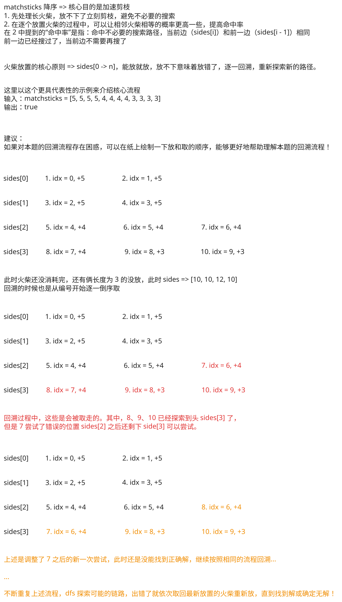

## 1. 📝 题目描述

- [leetcode](https://leetcode.cn/problems/matchsticks-to-square/)

你将得到一个整数数组 `matchsticks`，其中 `matchsticks[i]` 是第 `i` 个火柴棒的长度。你要用所有的火柴棍拼成一个正方形。你不能折断任何一根火柴棒，但你可以把它们连在一起，而且每根火柴棒必须使用一次。

如果你能使这个正方形，则返回 `true`，否则返回 `false`。

---

示例 1：


```txt
输入：matchsticks = [1, 1, 2, 2, 2]
输出：true
```

解释：能拼成一个边长为2的正方形，每边两根火柴。

---

示例 2：

```txt
输入：matchsticks = [3, 3, 3, 3, 4]
输出：false
```

解释：不能用所有火柴拼成一个正方形。

---

提示：

- `1 <= matchsticks.length <= 15`
- `1 <= matchsticks[i] <= 10^8`

## 2. 🎯 s.1 - 回溯 + 剪枝



::: code-group

```c [c]
int cmpDesc(const void* a, const void* b) { return *(int*)b - *(int*)a; }

bool dfs(int* matchsticks, int n, int* sides, int side, int idx) {
    if (idx == n) return sides[0] == side && sides[1] == side && sides[2] == side;
    for (int i = 0; i < 4; i++) {
        if (sides[i] + matchsticks[idx] > side) continue;
        if (i > 0 && sides[i] == sides[i - 1]) continue;
        sides[i] += matchsticks[idx];
        if (dfs(matchsticks, n, sides, side, idx + 1)) return true;
        sides[i] -= matchsticks[idx];
    }
    return false;
}

bool makesquare(int* matchsticks, int matchsticksSize) {
    int sum = 0;
    for (int i = 0; i < matchsticksSize; i++) sum += matchsticks[i];
    if (sum % 4 != 0) return false;
    qsort(matchsticks, matchsticksSize, sizeof(int), cmpDesc);
    int sides[4] = {0};
    return dfs(matchsticks, matchsticksSize, sides, sum / 4, 0);
}
```

```js [js]
/**
 * @param {number[]} matchsticks
 * @return {boolean}
 */
var makesquare = function (matchsticks) {
  const sum = matchsticks.reduce((a, b) => a + b, 0)
  if (sum % 4 !== 0) return false
  const side = sum / 4
  matchsticks.sort((a, b) => b - a) // 降序加速剪枝
  const sides = [0, 0, 0, 0]
  const dfs = (idx) => {
    if (idx === matchsticks.length) return sides.every((s) => s === side)
    for (let i = 0; i < 4; i++) {
      if (sides[i] + matchsticks[idx] > side) continue
      if (i > 0 && sides[i] === sides[i - 1]) continue // 去重剪枝
      sides[i] += matchsticks[idx]
      if (dfs(idx + 1)) return true
      sides[i] -= matchsticks[idx]
    }
    return false
  }
  return dfs(0)
}
```

```py [py]
class Solution:
    def makesquare(self, matchsticks: List[int]) -> bool:
        total = sum(matchsticks)
        if total % 4 != 0:
            return False
        side = total // 4
        matchsticks.sort(reverse=True)
        sides = [0] * 4
        def dfs(idx):
            if idx == len(matchsticks):
                return all(s == side for s in sides)
            for i in range(4):
                if sides[i] + matchsticks[idx] > side:
                    continue
                if i > 0 and sides[i] == sides[i - 1]:
                    continue
                sides[i] += matchsticks[idx]
                if dfs(idx + 1):
                    return True
                sides[i] -= matchsticks[idx]
            return False
        return dfs(0)
```

:::

- 时间复杂度：$O(n \log n + 4^n)$，其中 $n$ 是火柴数量；排序需要 $O(n \log n)$，回溯时每根火柴最多尝试放入 4 条边，最坏情况下需要枚举 $4^n$ 种分配方式，但降序放置和去重剪枝会显著减少实际搜索量
- 空间复杂度：$O(n)$，递归栈深度最多为 $n$，记录 4 条边当前长度的数组只占用 $O(1)$ 额外空间

算法思路：

- 先计算所有火柴长度之和 `sum`，若 `sum % 4 != 0`，说明不可能拼成 4 条等长边，直接返回 `false`
- 设目标边长为 `side = sum / 4`，再将火柴按长度从大到小排序，优先处理长火柴可以更早触发失败分支，从而加快剪枝
- 用长度为 `4` 的数组 `sides` 记录当前 4 条边已经拼出的长度，回溯时依次决定第 `idx` 根火柴放到哪一条边上
- 若某条边放入当前火柴后超过 `side`，则这一放法非法，直接跳过
- 若 `sides[i] == sides[i - 1]`，说明把当前火柴放到第 `i` 条边后得到的状态，与放到第 `i - 1` 条边后得到的状态等价；而第 `i - 1` 条边对应的分支已经搜索过，因此这里可以直接跳过，避免重复搜索
- 当所有火柴都放完时，只要 4 条边都达到 `side`，就说明可以拼成正方形；由于总长度固定，实际实现里判断前三条边满足条件也足够推出第四条边满足条件
