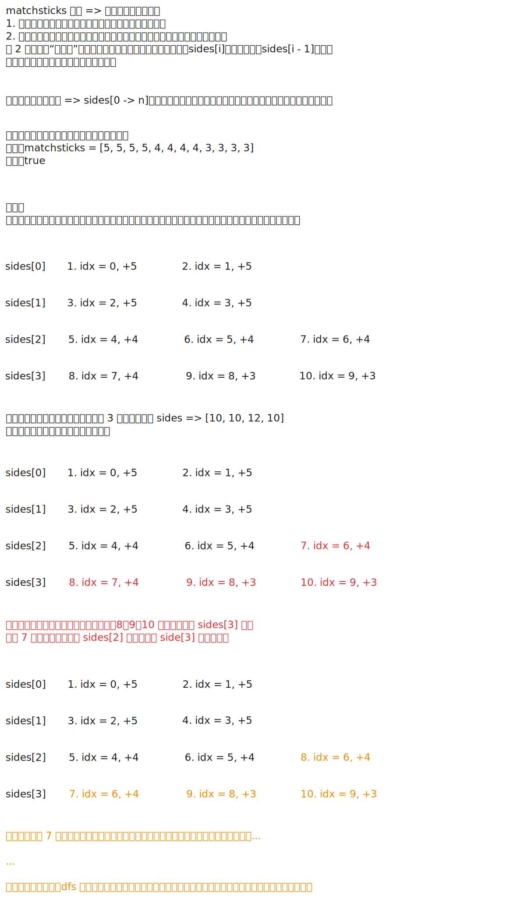

# [0473. 火柴拼正方形【中等】](https://github.com/tnotesjs/TNotes.leetcode/tree/main/notes/0473.%20%E7%81%AB%E6%9F%B4%E6%8B%BC%E6%AD%A3%E6%96%B9%E5%BD%A2%E3%80%90%E4%B8%AD%E7%AD%89%E3%80%91)

<!-- region:toc -->

- [1. 📝 题目描述](#1--题目描述)
- [2. 🎯 s.1 - 回溯 + 剪枝](#2--s1---回溯--剪枝)

<!-- endregion:toc -->

## 1. 📝 题目描述

- [leetcode](https://leetcode.cn/problems/matchsticks-to-square/)

你将得到一个整数数组 `matchsticks`，其中 `matchsticks[i]` 是第 `i` 个火柴棒的长度。你要用所有的火柴棍拼成一个正方形。你不能折断任何一根火柴棒，但你可以把它们连在一起，而且每根火柴棒必须使用一次。

如果你能使这个正方形，则返回 `true`，否则返回 `false`。

---

示例 1：


```txt
输入：matchsticks = [1, 1, 2, 2, 2]
输出：true
```

解释：能拼成一个边长为2的正方形，每边两根火柴。

---

示例 2：

```txt
输入：matchsticks = [3, 3, 3, 3, 4]
输出：false
```

解释：不能用所有火柴拼成一个正方形。

---

提示：

- `1 <= matchsticks.length <= 15`
- `1 <= matchsticks[i] <= 10^8`

## 2. 🎯 s.1 - 回溯 + 剪枝



::: code-group

<<< ./solutions/1/1.c [c]

<<< ./solutions/1/1.js [js]

<<< ./solutions/1/1.py [py]

:::

- 时间复杂度：$O(n \log n + 4^n)$，其中 $n$ 是火柴数量；排序需要 $O(n \log n)$，回溯时每根火柴最多尝试放入 4 条边，最坏情况下需要枚举 $4^n$ 种分配方式，但降序放置和去重剪枝会显著减少实际搜索量
- 空间复杂度：$O(n)$，递归栈深度最多为 $n$，记录 4 条边当前长度的数组只占用 $O(1)$ 额外空间

算法思路：

- 先计算所有火柴长度之和 `sum`，若 `sum % 4 != 0`，说明不可能拼成 4 条等长边，直接返回 `false`
- 设目标边长为 `side = sum / 4`，再将火柴按长度从大到小排序，优先处理长火柴可以更早触发失败分支，从而加快剪枝
- 用长度为 `4` 的数组 `sides` 记录当前 4 条边已经拼出的长度，回溯时依次决定第 `idx` 根火柴放到哪一条边上
- 若某条边放入当前火柴后超过 `side`，则这一放法非法，直接跳过
- 若 `sides[i] == sides[i - 1]`，说明把当前火柴放到第 `i` 条边后得到的状态，与放到第 `i - 1` 条边后得到的状态等价；而第 `i - 1` 条边对应的分支已经搜索过，因此这里可以直接跳过，避免重复搜索
- 当所有火柴都放完时，只要 4 条边都达到 `side`，就说明可以拼成正方形；由于总长度固定，实际实现里判断前三条边满足条件也足够推出第四条边满足条件
