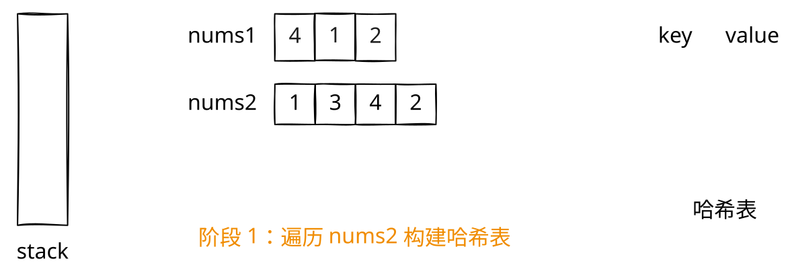
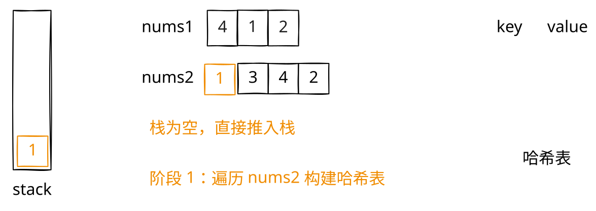
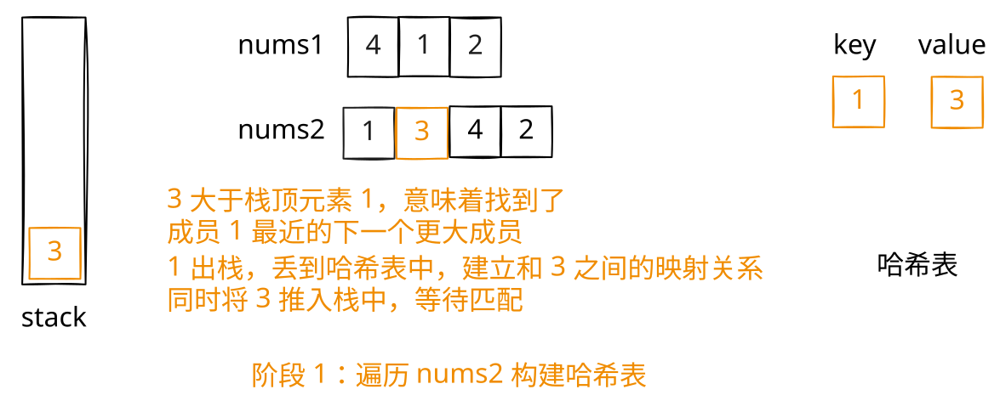
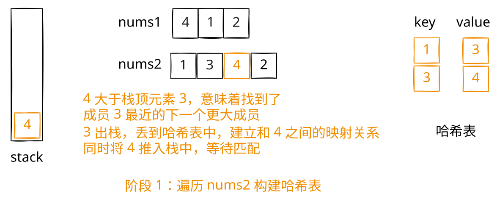
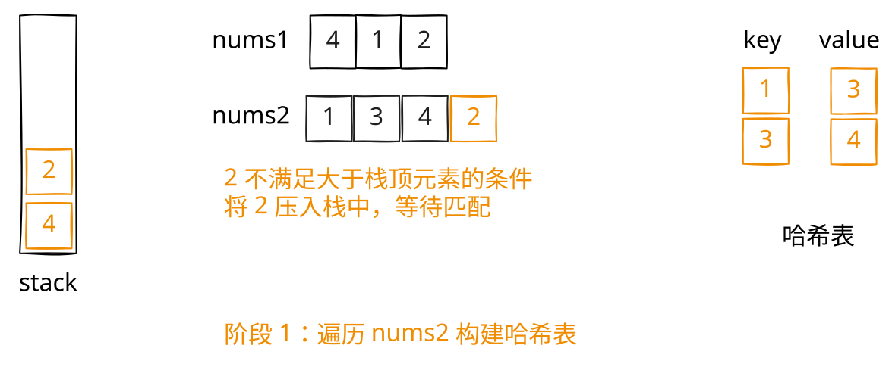
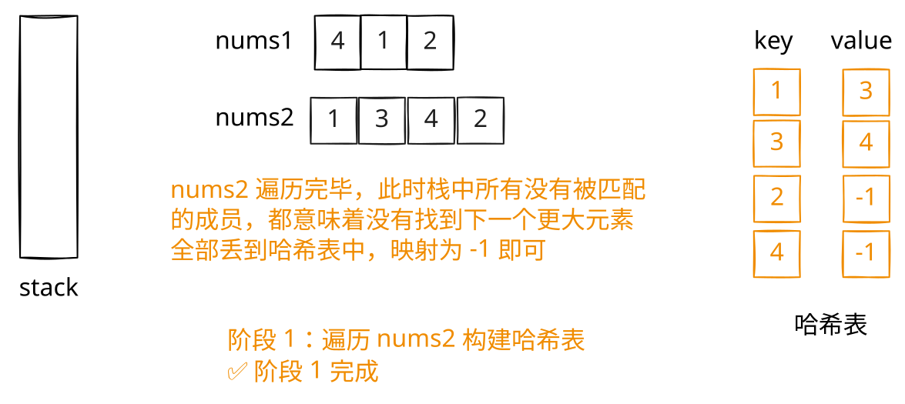
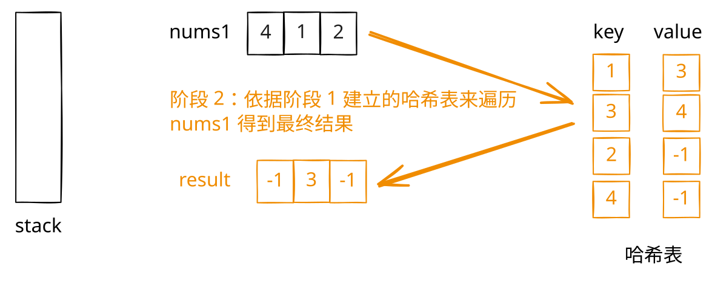

## 1. 📝 题目描述

- [leetcode](https://leetcode.cn/problems/next-greater-element-i/)

`nums1` 中数字 `x` 的下一个更大元素是指 `x` 在 `nums2` 中对应位置右侧的第一个比 `x` 大的元素。

给你两个没有重复元素的数组 `nums1` 和 `nums2`，下标从 0 开始计数，其中`nums1` 是 `nums2` 的子集。

对于每个 `0 <= i < nums1.length`，找出满足 `nums1[i] == nums2[j]` 的下标 `j`，并且在 `nums2` 确定 `nums2[j]` 的下一个更大元素。如果不存在下一个更大元素，那么本次查询的答案是 `-1`。

返回一个长度为 `nums1.length` 的数组 `ans` 作为答案，满足 `ans[i]` 是如上所述的下一个更大元素。

---

示例 1：

```txt
输入：nums1 = [4,1,2], nums2 = [1,3,4,2].
输出：[-1,3,-1]
```

解释：nums1 中每个值的下一个更大元素如下所述：

- `4`，用高亮标识，nums2 = [1, 3, `4`, 2]。不存在下一个更大元素，所以答案是 -1。
- `1`，用高亮标识，nums2 = [`1`, 3, 4, 2]。下一个更大元素是 3。
- `2`，用高亮标识，nums2 = [1, 3, 4, `2`]。不存在下一个更大元素，所以答案是 -1。

---

示例 2：

```txt
输入：nums1 = [2,4], nums2 = [1,2,3,4].
输出：[3,-1]
```

解释：nums1 中每个值的下一个更大元素如下所述：

- `2`，用高亮标识，nums2 = [1, `2`, 3, 4]。下一个更大元素是 3。
- `4`，用高亮标识，nums2 = [1, 2, 3, `4`]。不存在下一个更大元素，所以答案是 -1。

---

提示：

- `1 <= nums1.length <= nums2.length <= 1000`
- `0 <= nums1[i], nums2[i] <= 10^4`
- `nums1` 和 `nums2` 中所有整数互不相同
- `nums1` 中的所有整数同样出现在 `nums2` 中

---

进阶：你可以设计一个时间复杂度为 `O(nums1.length + nums2.length)` 的解决方案吗？

## 2. 🎯 s.1 - 单调栈 + 哈希表

::: swiper















:::

::: code-group

```js [1.js]
/**
 * @param {number[]} nums1
 * @param {number[]} nums2
 * @return {number[]}
 */
var nextGreaterElement = function (nums1, nums2) {
  const map = new Map() // 存储每个元素的下一个更大元素
  const stack = [] // 单调递减栈

  // 遍历 nums2，用单调栈找出每个元素的下一个更大元素
  for (let num of nums2) {
    // 当前元素比栈顶大，说明找到了栈顶元素的下一个更大元素
    while (stack.length > 0 && num > stack[stack.length - 1]) {
      map.set(stack.pop(), num)
    }
    stack.push(num)
  }

  // 栈中剩余元素没有下一个更大元素，设为 -1
  while (stack.length > 0) {
    map.set(stack.pop(), -1)
  }

  // 根据 nums1 查表得到结果
  return nums1.map((num) => map.get(num))
}
```

:::

- 时间复杂度：$O(m + n)$，其中 m 和 n 分别是 nums1 和 nums2 的长度
- 空间复杂度：$O(n)$，哈希表和栈的空间

算法思路：

- 用哈希表存储映射关系：`元素 -> 下一个更大元素`
  - 使用单调递减栈遍历 nums2，找出每个元素的下一个更大元素
  - 当前元素大于栈顶时，栈顶元素的下一个更大元素就是当前元素
  - 栈中剩余元素没有下一个更大元素，记为 -1
- 最后遍历 nums1，查表得到结果

核心：完成哈希表的构建

```txt
nums2 = [1,3,4,2]
对应的哈希表为：
{
  1: 3,
  3: 4,
  4: -1,
  2: -1
}
```
