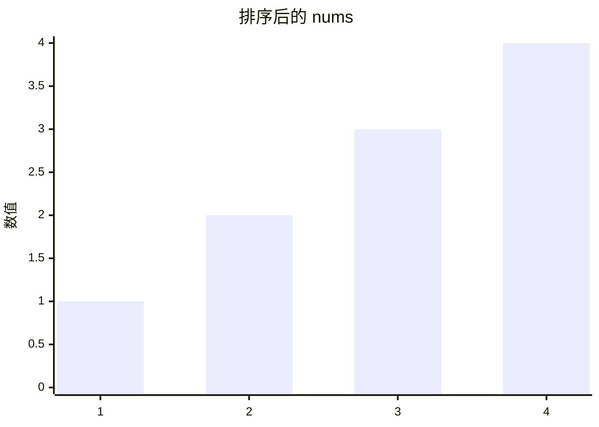

## 1. 📝 题目描述

- [leetcode](https://leetcode.cn/problems/array-partition/)

给定长度为 `2n` 的整数数组 `nums`，你的任务是将这些数分成 `n` 对, 例如 `(a1, b1), (a2, b2), ..., (an, bn)`，使得从 `1` 到 `n` 的 `min(ai, bi)` 总和最大。

返回该 最大总和。

---

示例 1：

```txt
输入：nums = [1,4,3,2]
输出：4
解释：所有可能的分法（忽略元素顺序）为：
1. (1, 4), (2, 3) -> min(1, 4) + min(2, 3) = 1 + 2 = 3
2. (1, 3), (2, 4) -> min(1, 3) + min(2, 4) = 1 + 2 = 3
3. (1, 2), (3, 4) -> min(1, 2) + min(3, 4) = 1 + 3 = 4
所以最大总和为 4

```

示例 2：

```txt
输入：nums = [6,2,6,5,1,2]
输出：9
解释：最优的分法为 (2, 1), (2, 5), (6, 6). min(2, 1) + min(2, 5) + min(6, 6) = 1 + 2 + 6 = 9
```

---

提示：

- `1 <= n <= 10^4`
- `nums.length == 2 * n`
- `-10^4 <= nums[i] <= 10^4`

## 2. 🎯 s.1 - 暴力解法

::: code-group

```js [js]
/**
 * @param {number[]} nums
 * @return {number}
 */
var arrayPairSum = function (nums) {
  // 对数组进行排序
  nums.sort((a, b) => a - b)

  let sum = 0

  // 每两个数分为一组，取每组的第一个数（较小的数）相加
  for (let i = 0; i < nums.length; i += 2) {
    sum += nums[i]
  }

  return sum
}
```

:::

- 贪心算法核心思想：
  - 要使每对中较小值的总和最大，我们需要尽量让较大的数与较大的数配对，较小的数与较小的数配对。这样可以避免大数被小数"拖累"。
  - 为了最大化 `min(ai, bi)` 的总和，我们应该 尽量避免浪费较大的数。
- 实现步骤：
  1. 先对数组进行排序
  2. 每两个相邻的数分为一组
  3. 取每组中较小的那个数（即每组的第一个数）求和



- 假如输入的 nums 是 `[1, 4, 3, 2]`，上图是排序后的 nums。显而易见，其中最小值是 1，这个最小值是一定要找一个伴来配对的，在剩下的 2、3、4 中，跟 2 配对是最优解，因为其它的数（3、4）都比 2 大，跟 2 配对是“浪费”最小的。
- 以此类推，当 nums 成员数量较大时，配对规则也是一样的，先找到最小的，然后从剩余成员中找最小的，这样可以让“浪费”最小。
