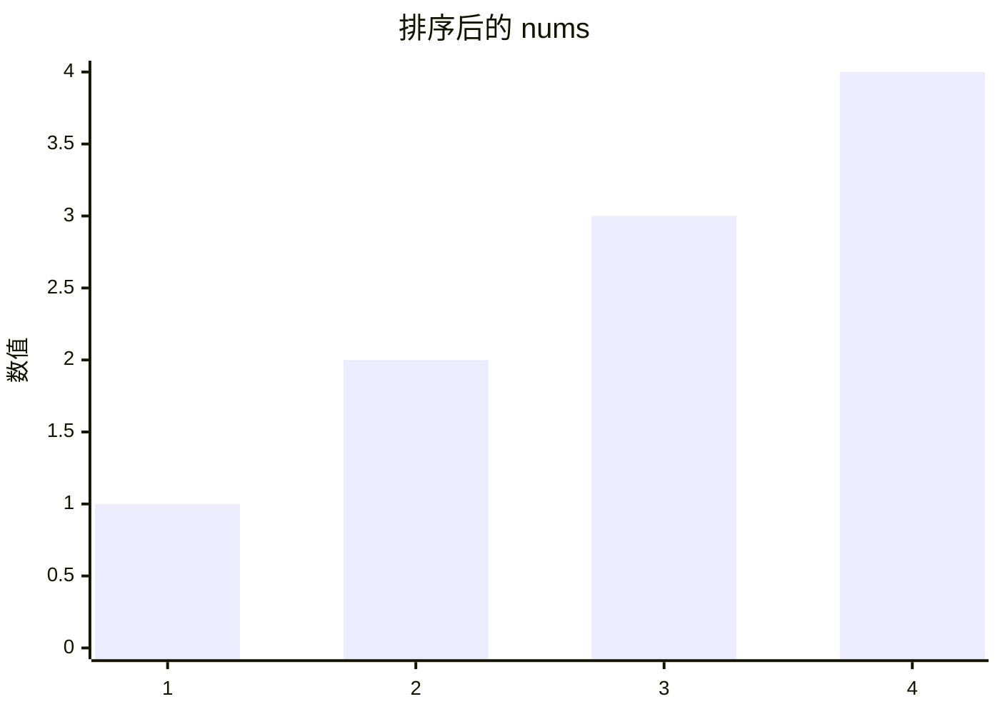

# [0561. 数组拆分【简单】](https://github.com/tnotesjs/TNotes.leetcode/tree/main/notes/0561.%20%E6%95%B0%E7%BB%84%E6%8B%86%E5%88%86%E3%80%90%E7%AE%80%E5%8D%95%E3%80%91)

<!-- region:toc -->

- [1. 📝 Description](#1--description)
- [2. 🎯 s.1 - 暴力解法](#2--s1---暴力解法)

<!-- endregion:toc -->

## 1. 📝 Description

::: details [leetcode](https://leetcode.cn/problems/array-partition/)

给定长度为  `2n`  的整数数组 `nums` ，你的任务是将这些数分成  `n` 对, 例如 `(a1, b1), (a2, b2), ..., (an, bn)` ，使得从 `1` 到  `n` 的 `min(ai, bi)` 总和最大。

返回该 **最大总和** 。

---

- **示例 1：**

```
输入：nums = [1,4,3,2]
输出：4
解释：所有可能的分法（忽略元素顺序）为：
1. (1, 4), (2, 3) -> min(1, 4) + min(2, 3) = 1 + 2 = 3
2. (1, 3), (2, 4) -> min(1, 3) + min(2, 4) = 1 + 2 = 3
3. (1, 2), (3, 4) -> min(1, 2) + min(3, 4) = 1 + 3 = 4
所以最大总和为 4

```

- **示例 2：**

```
输入：nums = [6,2,6,5,1,2]
输出：9
解释：最优的分法为 (2, 1), (2, 5), (6, 6). min(2, 1) + min(2, 5) + min(6, 6) = 1 + 2 + 6 = 9
```

---

**提示：**

- `1 <= n <= 10^4`
- `nums.length == 2 * n`
- `-10^4 <= nums[i] <= 10^4`

:::

## 2. 🎯 s.1 - 暴力解法

::: code-group

<<< ./solutions/1/1.js [js]

:::

- 贪心算法核心思想：
  - 要使每对中较小值的总和最大，我们需要尽量让较大的数与较大的数配对，较小的数与较小的数配对。这样可以避免大数被小数"拖累"。
  - 为了最大化 `min(ai, bi)` 的总和，我们应该 **尽量避免浪费较大的数**。
- 实现步骤：
  1. 先对数组进行排序
  2. 每两个相邻的数分为一组
  3. 取每组中较小的那个数（即每组的第一个数）求和



- 假如输入的 nums 是 `[1, 4, 3, 2]`，上图是排序后的 nums。显而易见，其中最小值是 1，这个最小值是一定要找一个伴来配对的，在剩下的 2、3、4 中，跟 2 配对是最优解，因为其它的数（3、4）都比 2 大，跟 2 配对是“浪费”最小的。
- 以此类推，当 nums 成员数量较大时，配对规则也是一样的，先找到最小的，然后从剩余成员中找最小的，这样可以让“浪费”最小。
