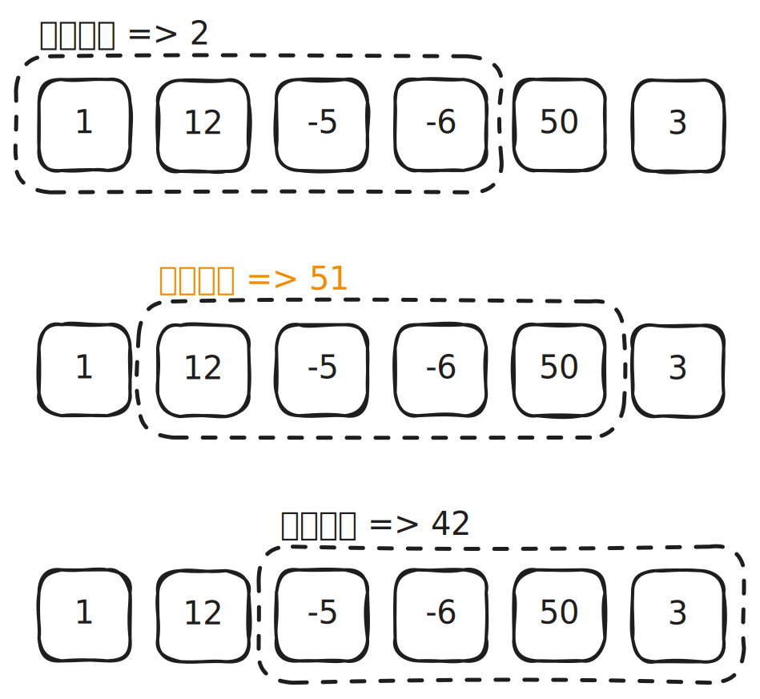

# [0643. 子数组最大平均数 I【简单】](https://github.com/tnotesjs/TNotes.leetcode/tree/main/notes/0643.%20%E5%AD%90%E6%95%B0%E7%BB%84%E6%9C%80%E5%A4%A7%E5%B9%B3%E5%9D%87%E6%95%B0%20I%E3%80%90%E7%AE%80%E5%8D%95%E3%80%91)

<!-- region:toc -->

- [1. 📝 题目描述](#1--题目描述)
- [2. 🎯 s.1 - 滑动窗口](#2--s1---滑动窗口)

<!-- endregion:toc -->

## 1. 📝 题目描述

- [leetcode](https://leetcode.cn/problems/maximum-average-subarray-i/)

给你一个由 `n` 个元素组成的整数数组 `nums` 和一个整数 `k`。

请你找出平均数最大且长度为 `k` 的连续子数组，并输出该最大平均数。

任何误差小于 `10^-5` 的答案都将被视为正确答案。

---

示例 1：

```txt
输入：nums = [1,12,-5,-6,50,3], k = 4
输出：12.75
解释：最大平均数 (12-5-6+50)/4 = 51/4 = 12.75
```

---

示例 2：

```txt
输入：nums = [5], k = 1
输出：5.00000
```

---

提示：

- `n == nums.length`
- `1 <= k <= n <= 10^5`
- `-10^4 <= nums[i] <= 10^4`

## 2. 🎯 s.1 - 滑动窗口



::: code-group

<<< ./solutions/1/1.js

:::

- 时间复杂度：$O(n)$，遍历数组一次
- 空间复杂度：$O(1)$，只使用常数空间

解题思路：

- 使用滑动窗口维护长度为 k 的子数组和
- 先计算前 k 个元素的和作为初始窗口
- 窗口向右滑动，减去左边移出的元素，加上右边新进入的元素
- 记录滑动过程中的最大和
- 返回最大和除以 k 得到最大平均数
