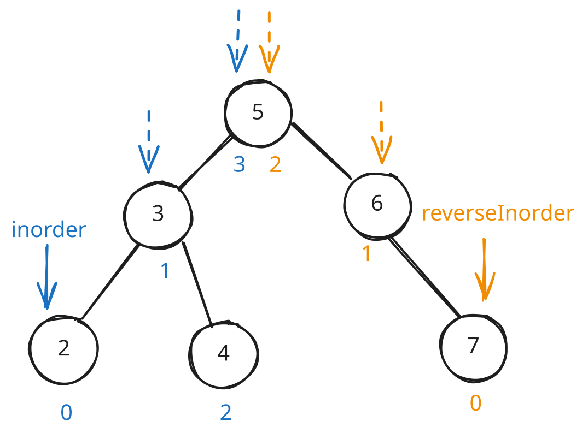

## 1. 📝 题目描述

- [leetcode](https://leetcode.cn/problems/two-sum-iv-input-is-a-bst/)

给定一个二叉搜索树 `root` 和一个目标结果 `k`，如果二叉搜索树中存在两个元素且它们的和等于给定的目标结果，则返回 `true`。

---

示例 1：


```txt
输入: root = [5,3,6,2,4,null,7], k = 9
输出: true
```

---

示例 2：


```txt
输入: root = [5,3,6,2,4,null,7], k = 28
输出: false
```

---

提示：

- 二叉树的节点个数的范围是 `[1, 10^4]`.
- `-10^4 <= Node.val <= 10^4`
- 题目数据保证，输入的 `root` 是一棵 有效 的二叉搜索树
- `-10^5 <= k <= 10^5`

## 2. 🫧 评价

- 推荐使用解法一或解法二，它们更容易理解和实现。解法一利用了 BST 的有序性，解法二思路最直观。解法三空间效率最高但实现较复杂。

## 3. 🎯 s.1 - 中序遍历 + 双指针

::: code-group

```js [js]
/**
 * Definition for a binary tree node.
 * function TreeNode(val, left, right) {
 *     this.val = (val===undefined ? 0 : val)
 *     this.left = (left===undefined ? null : left)
 *     this.right = (right===undefined ? null : right)
 * }
 */
/**
 * @param {TreeNode} root
 * @param {number} k
 * @return {boolean}
 */
var findTarget = function (root, k) {
  // 中序遍历得到有序数组
  const inorder = []
  const dfs = (node) => {
    if (!node) return
    dfs(node.left)
    inorder.push(node.val)
    dfs(node.right)
  }

  dfs(root)

  // 双指针查找两数之和
  let left = 0
  let right = inorder.length - 1

  while (left < right) {
    const sum = inorder[left] + inorder[right]
    if (sum === k) {
      return true
    } else if (sum < k) {
      left++
    } else {
      right--
    }
  }

  return false
}
```

:::

- 时间复杂度：$O(n)$，需要遍历所有节点一次，双指针查找时间为 $O(n)$
- 空间复杂度：$O(n)$，需要额外数组存储中序遍历结果和递归调用栈
- 算法思路：
  - 利用 BST 中序遍历得到有序数组的特性，然后使用双指针查找两数之和。

## 4. 🎯 s.2 - 动态哈希表

::: code-group

```js [js]
/**
 * @param {TreeNode} root
 * @param {number} k
 * @return {boolean}
 */
var findTarget = function (root, k) {
  const set = new Set()

  const dfs = (node) => {
    if (!node) return false

    // 检查是否存在补数
    if (set.has(k - node.val)) {
      return true
    }

    // 将当前节点值加入集合
    set.add(node.val)

    // 递归检查左右子树
    return dfs(node.left) || dfs(node.right)
  }

  return dfs(root)
}
```

:::

- 时间复杂度：$O(n)$，最坏情况下需要遍历所有节点一次
- 空间复杂度：$O(n)$，哈希表最多存储 n 个元素，递归调用栈深度最多为树的高度
- 算法思路：
  - 遍历树的同时使用哈希表存储已访问的节点值，查找是否存在目标补数。

## 5. 🎯 s.3 - BST 迭代器（最优解）



::: code-group

```js [js]
/**
 * @param {TreeNode} root
 * @param {number} k
 * @return {boolean}
 */
var findTarget = function (root, k) {
  // 升序迭代器
  const inorder = []
  // 降序迭代器
  const reverseInorder = []

  let leftNode = root
  let rightNode = root

  // 初始化两个指针
  while (leftNode) {
    inorder.push(leftNode)
    leftNode = leftNode.left
  }

  while (rightNode) {
    reverseInorder.push(rightNode)
    rightNode = rightNode.right
  }

  // 双指针查找
  while (
    inorder.length > 0 &&
    reverseInorder.length > 0 &&
    inorder[inorder.length - 1] !== reverseInorder[reverseInorder.length - 1]
  ) {
    const leftVal = inorder[inorder.length - 1].val
    const rightVal = reverseInorder[reverseInorder.length - 1].val
    const sum = leftVal + rightVal

    if (sum === k) {
      return true
    } else if (sum < k) {
      // 移动左指针
      let node = inorder.pop()
      node = node.right
      while (node) {
        inorder.push(node)
        node = node.left
      }
    } else {
      // 移动右指针
      let node = reverseInorder.pop()
      node = node.left
      while (node) {
        reverseInorder.push(node)
        node = node.right
      }
    }
  }

  return false
}
```

:::

- 时间复杂度：$O(n)$，每个节点最多被访问一次
- 空间复杂度：$O(h)$，其中 h 是树的高度，两个栈最多存储树的高度个节点
- 算法思路：
  - 使用两个 BST 迭代器，一个按升序遍历，一个按降序遍历，类似双指针方法。
  - 核心变量：
    - 本次检查的最小值：`inorder[inorder.length - 1].val`
    - 本次检查的最大值：`reverseInorder[reverseInorder.length - 1].val`
  - 检查目标值：
    - 和等于目标值：返回 true
    - 和小于目标值：扩大最小值
    - 和大于目标值：缩小最大值
  - 维护指向：
    - 注意：在扩大最小值和缩小最大值的时候，需要更新迭代器，确保指向正确。
    - 最小值改变指向 -> 指向大于当前最小值的下一个最小值
    - 最大值改变指向 -> 指向小于当前最大值的下一个最大值
    - 可以利用二叉搜索树的特性来实现 -> 只需要确保 `leftVal` 指向最左边儿的节点，`rightVal` 指向最右边儿的节点即可。
