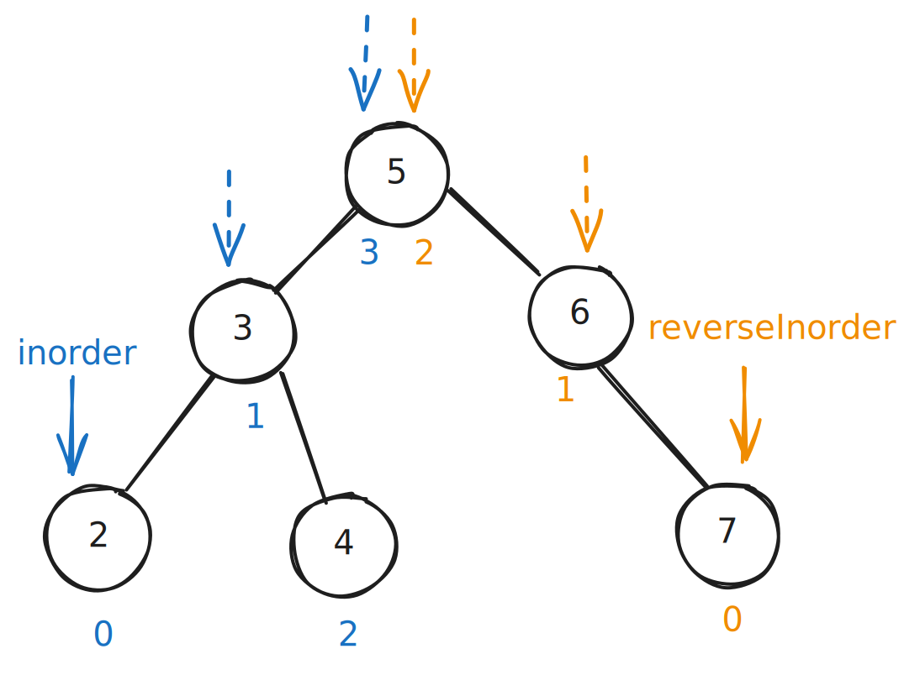

# [0653. 两数之和 IV - 输入二叉搜索树【简单】](https://github.com/tnotesjs/TNotes.leetcode/tree/main/notes/0653.%20%E4%B8%A4%E6%95%B0%E4%B9%8B%E5%92%8C%20IV%20-%20%E8%BE%93%E5%85%A5%E4%BA%8C%E5%8F%89%E6%90%9C%E7%B4%A2%E6%A0%91%E3%80%90%E7%AE%80%E5%8D%95%E3%80%91)

<!-- region:toc -->

- [1. 📝 题目描述](#1--题目描述)
- [2. 🫧 评价](#2--评价)
- [3. 🎯 s.1 - 中序遍历 + 双指针](#3--s1---中序遍历--双指针)
- [4. 🎯 s.2 - 动态哈希表](#4--s2---动态哈希表)
- [5. 🎯 s.3 - BST 迭代器（最优解）](#5--s3---bst-迭代器最优解)

<!-- endregion:toc -->

## 1. 📝 题目描述

- [leetcode](https://leetcode.cn/problems/two-sum-iv-input-is-a-bst/)

给定一个二叉搜索树 `root` 和一个目标结果 `k`，如果二叉搜索树中存在两个元素且它们的和等于给定的目标结果，则返回 `true`。

---

- **示例 1：**


```txt
输入: root = [5,3,6,2,4,null,7], k = 9
输出: true
```

---

- **示例 2：**


```txt
输入: root = [5,3,6,2,4,null,7], k = 28
输出: false
```

---

提示:

- 二叉树的节点个数的范围是 `[1, 10^4]`.
- `-10^4 <= Node.val <= 10^4`
- 题目数据保证，输入的 `root` 是一棵 **有效** 的二叉搜索树
- `-10^5 <= k <= 10^5`

## 2. 🫧 评价

- 推荐使用解法一或解法二，它们更容易理解和实现。解法一利用了 BST 的有序性，解法二思路最直观。解法三空间效率最高但实现较复杂。

## 3. 🎯 s.1 - 中序遍历 + 双指针

::: code-group

<<< ./solutions/1/1.js [js]

:::

- 时间复杂度：$O(n)$，需要遍历所有节点一次，双指针查找时间为 $O(n)$
- 空间复杂度：$O(n)$，需要额外数组存储中序遍历结果和递归调用栈
- 解题思路：
  - 利用 BST 中序遍历得到有序数组的特性，然后使用双指针查找两数之和。

## 4. 🎯 s.2 - 动态哈希表

::: code-group

<<< ./solutions/2/1.js [js]

:::

- 时间复杂度：$O(n)$，最坏情况下需要遍历所有节点一次
- 空间复杂度：$O(n)$，哈希表最多存储 n 个元素，递归调用栈深度最多为树的高度
- 解题思路：
  - 遍历树的同时使用哈希表存储已访问的节点值，查找是否存在目标补数。

## 5. 🎯 s.3 - BST 迭代器（最优解）



::: code-group

<<< ./solutions/3/1.js [js]

:::

- 时间复杂度：$O(n)$，每个节点最多被访问一次
- 空间复杂度：$O(h)$，其中 h 是树的高度，两个栈最多存储树的高度个节点
- 解题思路：
  - 使用两个 BST 迭代器，一个按升序遍历，一个按降序遍历，类似双指针方法。
  - 核心变量：
    - 本次检查的最小值：`inorder[inorder.length - 1].val`
    - 本次检查的最大值：`reverseInorder[reverseInorder.length - 1].val`
  - 检查目标值：
    - 和等于目标值：返回 true
    - 和小于目标值：扩大最小值
    - 和大于目标值：缩小最大值
  - 维护指向：
    - 注意：在扩大最小值和缩小最大值的时候，需要更新迭代器，确保指向正确。
    - 最小值改变指向 -> 指向大于当前最小值的下一个最小值
    - 最大值改变指向 -> 指向小于当前最大值的下一个最大值
    - 可以利用二叉搜索树的特性来实现 -> 只需要确保 `leftVal` 指向最左边儿的节点，`rightVal` 指向最右边儿的节点即可。
