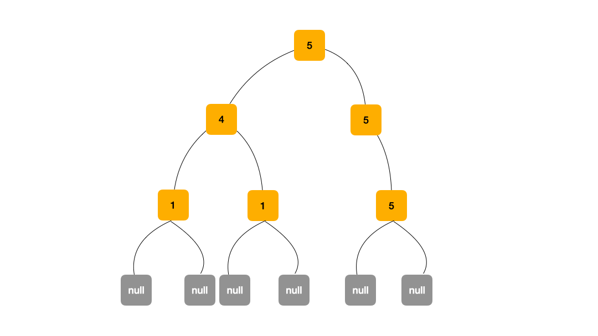

## 1. 📝 题目描述

- [leetcode](https://leetcode.cn/problems/longest-univalue-path/)

给定一个二叉树的 `root`，返回最长的路径的长度，这个路径中的每个节点具有相同值。这条路径可以经过也可以不经过根节点。

两个节点之间的路径长度由它们之间的边数表示。

---

示例 1：


```
输入：root = [5,4,5,1,1,5]
输出：2
```

---

示例 2：


```
输入：root = [1,4,5,4,4,5]
输出：2
```

---

提示：

- 树的节点数的范围是 `[0, 10^4]`
- `-1000 <= Node.val <= 1000`
- 树的深度将不超过 `1000`

## 2. 🎯 s.1 - DFS

```js
var longestUnivaluePath = function (root) {
  let ans = 0

  const dfs = (root) => {
    if (root === null) return 0
    const left = dfs(root.left),
      right = dfs(root.right)
    let l = 0,
      r = 0
    if (root.left && root.left.val === root.val) l = left + 1
    if (root.right && root.right.val === root.val) r = right + 1
    ans = Math.max(ans, l + r)
    return Math.max(l, r)
  }

  dfs(root)
  return ans
}
```

思路：


