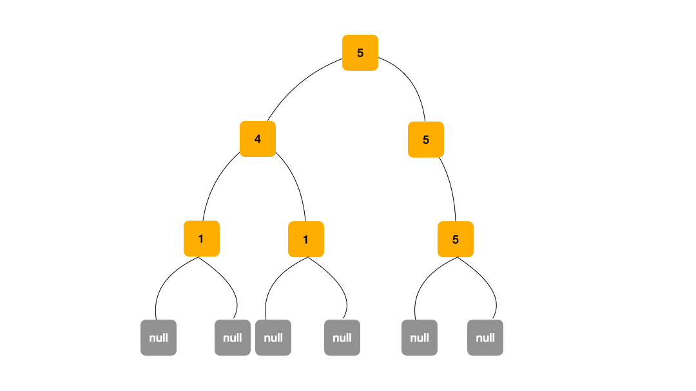

# [0687. 最长同值路径【中等】](https://github.com/tnotesjs/TNotes.leetcode/tree/main/notes/0687.%20%E6%9C%80%E9%95%BF%E5%90%8C%E5%80%BC%E8%B7%AF%E5%BE%84%E3%80%90%E4%B8%AD%E7%AD%89%E3%80%91)

<!-- region:toc -->

- [1. 📝 Description](#1--description)
- [2. 🎯 s.1 - DFS](#2--s1---dfs)

<!-- endregion:toc -->

## 1. 📝 Description

::: details [leetcode](https://leetcode.cn/problems/longest-univalue-path/)

给定一个二叉树的  `root` ，返回  *最长的路径的长度* ，这个路径中的  *每个节点具有相同值* 。 这条路径可以经过也可以不经过根节点。

**两个节点之间的路径长度**  由它们之间的边数表示。

**示例 1:**


```
输入：root = [5,4,5,1,1,5]
输出：2
```

**示例 2:**


```
输入：root = [1,4,5,4,4,5]
输出：2
```

**提示:**

- 树的节点数的范围是  `[0, 10^4]`
- `-1000 <= Node.val <= 1000`
- 树的深度将不超过 `1000`

:::

## 2. 🎯 s.1 - DFS

```js
var longestUnivaluePath = function (root) {
  let ans = 0

  const dfs = (root) => {
    if (root === null) return 0
    const left = dfs(root.left),
      right = dfs(root.right)
    let l = 0,
      r = 0
    if (root.left && root.left.val === root.val) l = left + 1
    if (root.right && root.right.val === root.val) r = right + 1
    ans = Math.max(ans, l + r)
    return Math.max(l, r)
  }

  dfs(root)
  return ans
}
```

- 思路：
  - 
