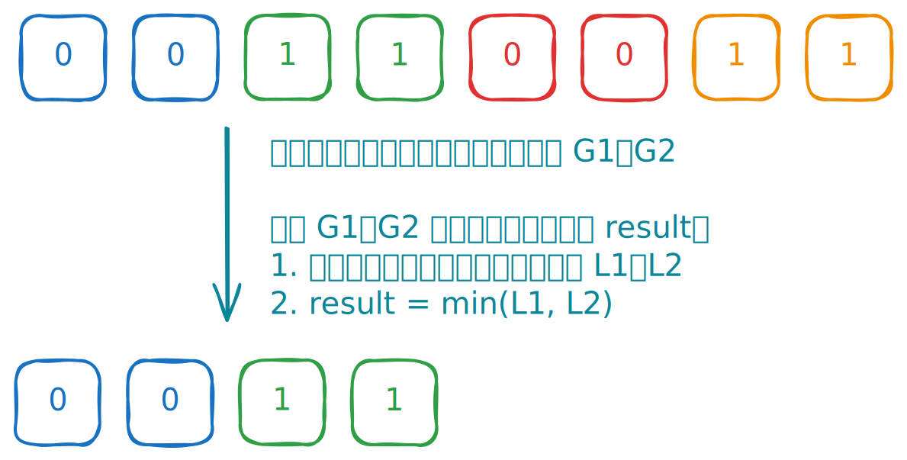

# [0696. 计数二进制子串【简单】](https://github.com/tnotesjs/TNotes.leetcode/tree/main/notes/0696.%20%E8%AE%A1%E6%95%B0%E4%BA%8C%E8%BF%9B%E5%88%B6%E5%AD%90%E4%B8%B2%E3%80%90%E7%AE%80%E5%8D%95%E3%80%91)

<!-- region:toc -->

- [1. 📝 题目描述](#1--题目描述)
- [2. 🫧 评价](#2--评价)
- [3. 🎯 s.1 - 分组统计](#3--s1---分组统计)
- [4. 🎯 s.2 - 动态分组统计（优化空间）](#4--s2---动态分组统计优化空间)

<!-- endregion:toc -->

## 1. 📝 题目描述

- [leetcode](https://leetcode.cn/problems/count-binary-substrings/)

给定一个字符串 `s`，统计并返回具有相同数量 `0` 和 `1` 的非空（连续）子字符串的数量，并且这些子字符串中的所有 `0` 和所有 `1` 都是成组连续的。

重复出现（不同位置）的子串也要统计它们出现的次数。

---

示例 1：

- 输入：s = "00110011"
- 输出：6
- 解释：
  - 6 个子串满足具有相同数量的连续 1 和 0 ："0011"、"01"、"1100"、"10"、"0011" 和 "01"。
  - 注意，一些重复出现的子串（不同位置）要统计它们出现的次数。
  - 另外，"00110011" 不是有效的子串，因为所有的 0（还有 1 ）没有组合在一起。

---

示例 2：

- 输入：s = "10101"
- 输出：4
- 解释：
  - 有 4 个子串："10"、"01"、"10"、"01" ，具有相同数量的连续 1 和 0。

---

提示：

- `1 <= s.length <= 10^5`
- `s[i]` 为 `'0'` 或 `'1'`

## 2. 🫧 评价

- `s.1` 和 `s.2` 的核心思想都是分组统计相同字符个数进行计算，区别在于：
  - `s.1` 是先统计再计算
  - `s.2` 是边统计边计算
- 提交结果：

::: swiper

:::

## 3. 🎯 s.1 - 分组统计

::: code-group

<<< ./solutions/1/1.js [js]

:::

- 时间复杂度：$O(n)$，其中 n 是字符串的长度，需要遍历字符串两次
- 空间复杂度：$O(n)$，需要额外数组存储每组连续字符的长度
- 算法思路：
  - 先统计连续相同字符的长度，然后对于相邻的两组，取较小值即为这两组间能形成的符合条件的子串个数。

## 4. 🎯 s.2 - 动态分组统计（优化空间）

::: code-group

<<< ./solutions/2/1.js [js]

:::

- 时间复杂度：$O(n)$，其中 n 是字符串的长度，只需要遍历字符串一次
- 空间复杂度：$O(1)$，只使用了常数个额外变量
- 算法思路：
  - 思路跟 `s.1` 一样，却别是在分组的过程中动态计算结果，省去了 `counts` 数组的记录开销。
