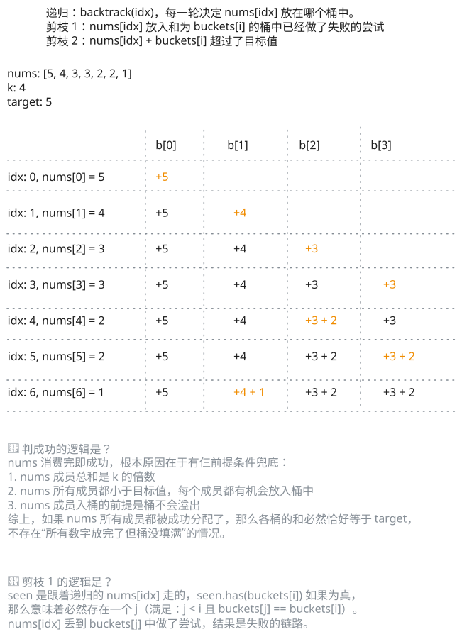

## 1. 📝 题目描述

- [leetcode](https://leetcode.cn/problems/partition-to-k-equal-sum-subsets/)

给定一个整数数组 `nums` 和一个正整数 `k`，找出是否有可能把这个数组分成 `k` 个非空子集，其总和都相等。

---

示例 1：

```txt
输入：nums = [4, 3, 2, 3, 5, 2, 1], k = 4
输出：True
```

说明：有可能将其分成 4 个子集（5），（1,4），（2,3），（2,3）等于总和。

---

示例 2：

```txt
输入: nums = [1,2,3,4], k = 3
输出: false
```

---

提示：

- `1 <= k <= len(nums) <= 16`
- `0 < nums[i] < 10000`
- 每个元素的频率在 `[1,4]` 范围内

## 2. 🎯 s.1 - 回溯 + 剪枝



::: code-group

```c [c]
int target;

bool backtrack(int* nums, int numsSize, int* buckets, int k, int idx) {
    if (idx == numsSize) return true;
    for (int i = 0; i < k; i++) {
        if (buckets[i] + nums[idx] > target) continue;
        // 剪枝：跳过相同值的桶
        int skip = 0;
        for (int j = 0; j < i; j++) {
            if (buckets[j] == buckets[i]) { skip = 1; break; }
        }
        if (skip) continue;
        buckets[i] += nums[idx];
        if (backtrack(nums, numsSize, buckets, k, idx + 1)) return true;
        buckets[i] -= nums[idx];
    }
    return false;
}

int cmpDesc(const void* a, const void* b) { return *(int*)b - *(int*)a; }

bool canPartitionKSubsets(int* nums, int numsSize, int k) {
    int sum = 0;
    for (int i = 0; i < numsSize; i++) sum += nums[i];
    if (sum % k != 0) return false;
    target = sum / k;
    qsort(nums, numsSize, sizeof(int), cmpDesc);
    if (nums[0] > target) return false;
    int* buckets = (int*)calloc(k, sizeof(int));
    bool res = backtrack(nums, numsSize, buckets, k, 0);
    free(buckets);
    return res;
}
```

```js [js]
/**
 * @param {number[]} nums
 * @param {number} k
 * @return {boolean}
 */
var canPartitionKSubsets = function (nums, k) {
  const sum = nums.reduce((a, b) => a + b, 0)
  if (sum % k !== 0) return false
  const target = sum / k
  nums.sort((a, b) => b - a)
  if (nums[0] > target) return false
  const buckets = new Array(k).fill(0)
  const backtrack = (idx) => {
    if (idx === nums.length) return true
    const seen = new Set()
    for (let i = 0; i < k; i++) {
      if (seen.has(buckets[i])) continue
      if (buckets[i] + nums[idx] > target) continue
      seen.add(buckets[i])
      buckets[i] += nums[idx]
      if (backtrack(idx + 1)) return true
      buckets[i] -= nums[idx]
    }
    return false
  }
  return backtrack(0)
}

canPartitionKSubsets([4, 3, 2, 3, 5, 2, 1], 4) // true
// canPartitionKSubsets([10, 1, 10, 9, 6, 1, 9, 5, 9, 10, 7, 8, 5, 2, 10, 8], 11)
```

```py [py]
class Solution:
    def canPartitionKSubsets(self, nums: List[int], k: int) -> bool:
        total = sum(nums)
        if total % k != 0:
            return False
        target = total // k
        nums.sort(reverse=True)
        if nums[0] > target:
            return False
        buckets = [0] * k
        def backtrack(idx):
            if idx == len(nums):
                return True
            seen = set()
            for i in range(k):
                if buckets[i] in seen:
                    continue
                if buckets[i] + nums[idx] > target:
                    continue
                seen.add(buckets[i])
                buckets[i] += nums[idx]
                if backtrack(idx + 1):
                    return True
                buckets[i] -= nums[idx]
            return False
        return backtrack(0)
```

:::

- 时间复杂度：$O(n \log n + k^n)$，其中 $n$ 是数组长度，$k$ 是子集数量；排序需要 $O(n \log n)$，回溯时每个数最多尝试放入 $k$ 个桶，最坏情况下需要枚举 $k^n$ 种分配方式，但降序放置和去重剪枝会显著减少实际搜索量
- 空间复杂度：$O(n + k)$，递归栈深度最多为 $n$，记录 $k$ 个桶当前和的数组占用 $O(k)$ 额外空间

算法思路：

- 先计算数组总和 `sum`，若 `sum % k != 0`，直接返回 `false`
- 设目标子集和为 `target = sum / k`，将数组降序排序；若最大元素已经超过 `target`，直接返回 `false`
- 用长度为 `k` 的数组 `buckets` 记录每个桶的当前和，回溯时依次决定第 `idx` 个数放到哪个桶中
- 若某个桶放入当前数后超过 `target`，则跳过
- 若 `buckets[i]` 的值与之前某个桶 `buckets[j]`（$j < i$）相同，说明把当前数放到第 `i` 个桶后得到的状态，与放到第 `j` 个桶后得到的状态等价；而第 `j` 个桶对应的分支已经搜索过，因此可以直接跳过，避免重复搜索
- 当所有数都成功放完时，说明可以划分为 $k$ 个和相等的子集，返回 `true`
