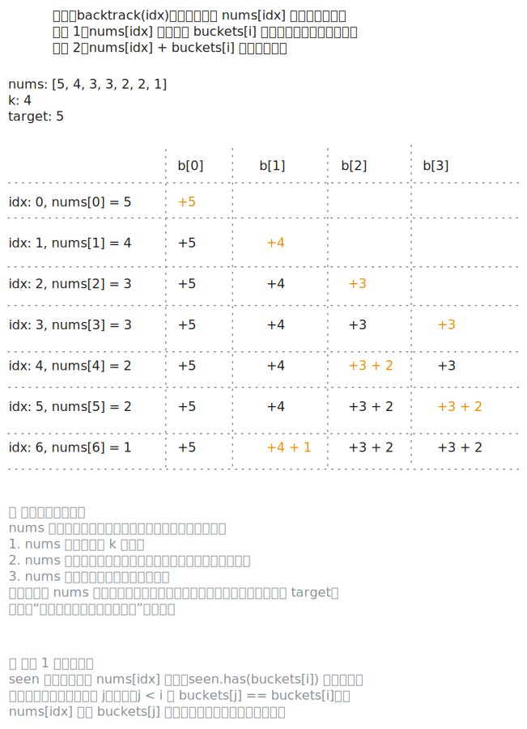

# [0698. 划分为k个相等的子集【中等】](https://github.com/tnotesjs/TNotes.leetcode/tree/main/notes/0698.%20%E5%88%92%E5%88%86%E4%B8%BAk%E4%B8%AA%E7%9B%B8%E7%AD%89%E7%9A%84%E5%AD%90%E9%9B%86%E3%80%90%E4%B8%AD%E7%AD%89%E3%80%91)

<!-- region:toc -->

- [1. 📝 题目描述](#1--题目描述)
- [2. 🎯 s.1 - 回溯 + 剪枝](#2--s1---回溯--剪枝)

<!-- endregion:toc -->

## 1. 📝 题目描述

- [leetcode](https://leetcode.cn/problems/partition-to-k-equal-sum-subsets/)

给定一个整数数组 `nums` 和一个正整数 `k`，找出是否有可能把这个数组分成 `k` 个非空子集，其总和都相等。

---

示例 1：

```txt
输入：nums = [4, 3, 2, 3, 5, 2, 1], k = 4
输出：True
```

说明：有可能将其分成 4 个子集（5），（1,4），（2,3），（2,3）等于总和。

---

示例 2：

```txt
输入: nums = [1,2,3,4], k = 3
输出: false
```

---

提示：

- `1 <= k <= len(nums) <= 16`
- `0 < nums[i] < 10000`
- 每个元素的频率在 `[1,4]` 范围内

## 2. 🎯 s.1 - 回溯 + 剪枝



::: code-group

<<< ./solutions/1/1.c [c]

<<< ./solutions/1/1.js [js]

<<< ./solutions/1/1.py [py]

:::

- 时间复杂度：$O(n \log n + k^n)$，其中 $n$ 是数组长度，$k$ 是子集数量；排序需要 $O(n \log n)$，回溯时每个数最多尝试放入 $k$ 个桶，最坏情况下需要枚举 $k^n$ 种分配方式，但降序放置和去重剪枝会显著减少实际搜索量
- 空间复杂度：$O(n + k)$，递归栈深度最多为 $n$，记录 $k$ 个桶当前和的数组占用 $O(k)$ 额外空间

算法思路：

- 先计算数组总和 `sum`，若 `sum % k != 0`，直接返回 `false`
- 设目标子集和为 `target = sum / k`，将数组降序排序；若最大元素已经超过 `target`，直接返回 `false`
- 用长度为 `k` 的数组 `buckets` 记录每个桶的当前和，回溯时依次决定第 `idx` 个数放到哪个桶中
- 若某个桶放入当前数后超过 `target`，则跳过
- 若 `buckets[i]` 的值与之前某个桶 `buckets[j]`（$j < i$）相同，说明把当前数放到第 `i` 个桶后得到的状态，与放到第 `j` 个桶后得到的状态等价；而第 `j` 个桶对应的分支已经搜索过，因此可以直接跳过，避免重复搜索
- 当所有数都成功放完时，说明可以划分为 $k$ 个和相等的子集，返回 `true`
