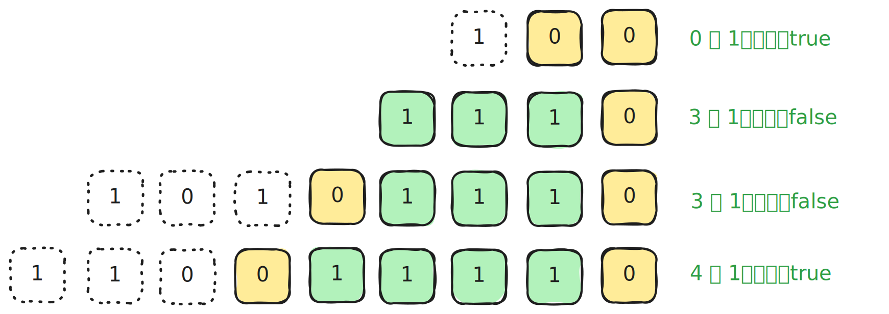

# [0717. 1 比特与 2 比特字符【简单】](https://github.com/tnotesjs/TNotes.leetcode/tree/main/notes/0717.%201%20%E6%AF%94%E7%89%B9%E4%B8%8E%202%20%E6%AF%94%E7%89%B9%E5%AD%97%E7%AC%A6%E3%80%90%E7%AE%80%E5%8D%95%E3%80%91)

<!-- region:toc -->

- [1. 📝 题目描述](#1--题目描述)
- [2. 🎯 s.1 - 暴力解法](#2--s1---暴力解法)
- [3. 🎯 s.2 - 末尾连续 1 计数法](#3--s2---末尾连续-1-计数法)

<!-- endregion:toc -->

## 1. 📝 题目描述

- [leetcode](https://leetcode.cn/problems/1-bit-and-2-bit-characters/)

有两种特殊字符：

- 第一种字符可以用一比特 `0` 表示
- 第二种字符可以用两比特（`10` 或 `11`）表示

给你一个以 `0` 结尾的二进制数组 `bits` ，如果最后一个字符必须是一个一比特字符，则返回 `true`。

示例 1：

- 输入: `bits = [1, 0, 0]`
- 输出: `true`
- 解释: 唯一的解码方式是将其解析为一个两比特字符和一个一比特字符。所以最后一个字符是一比特字符。

示例 2：

- 输入：`bits = [1,1,1,0]`
- 输出：`false`
- 解释：唯一的解码方式是将其解析为两比特字符和两比特字符。所以最后一个字符不是一比特字符。

---

提示：

- `1 <= bits.length <= 1000`
- `bits[i]` 为 `0` 或 `1`

## 2. 🎯 s.1 - 暴力解法

::: code-group

<<< ./solutions/1/1.js [js]

:::

- 时间复杂度：$O(n)$
  - 其中 n 是数组的长度，最坏情况下需要遍历整个数组
- 空间复杂度：$O(1)$
  - 只使用了常数级别的额外空间
- 暴力解法
  - 从头开始逐位消除，消除规则：
  - 如果当前位是 1，表示这是一个 2 比特字符的开始，指针向前移动 2 位 (i += 2)
  - 如果当前位是 0，表示这是一个 1 比特字符，指针向前移动 1 位 (i += 1)
  - 可以统一写成 `i += bits[i] + 1`
  - 终止条件：当指针到达或超过倒数第二个元素时停止

## 3. 🎯 s.2 - 末尾连续 1 计数法

::: swiper

:::

::: code-group

<<< ./solutions/2/1.js [js]

:::

- 时间复杂度：$O(n)$
  - 其中 n 是数组长度，最坏情况下需要遍历整个数组来统计连续的 1。
- 空间复杂度：$O(1)$
  - 只使用了常数级别的额外空间。
- 核心思路：
  - 从右往左数连续的 1，这些 1 可以两两配对组成 11 这样的 2 比特字符消除掉。
    - 如果最后还剩一个 1，它就必须和最后的 0 组成 10 这样的 2 比特字符；
    - 如果最后 1 都消掉了，那么最后一个 0 就是一个 1 比特字符；
  - 0 的消除只有两种情况：
    - 情况 1 - 前边儿是 0：自消
    - 情况 2 - 前边儿是 1：拉上前边儿的 1 垫背一起消
  - 规律：
    - 倒数第二个 0 之前的片段（包括倒数第二个 0）都不需要看，一定是可以消掉的。
    - `有效区间` 是从倒数第二个 0 到最后一个 0 的区域。
    - 最后的 0 是属于【情况 1】返回 true，属于【情况 2】返回 false
      - 情况 1 - 有效区间中 1 的数量是偶数；
      - 情况 2 - 有效区间中 1 的数量是奇数；
