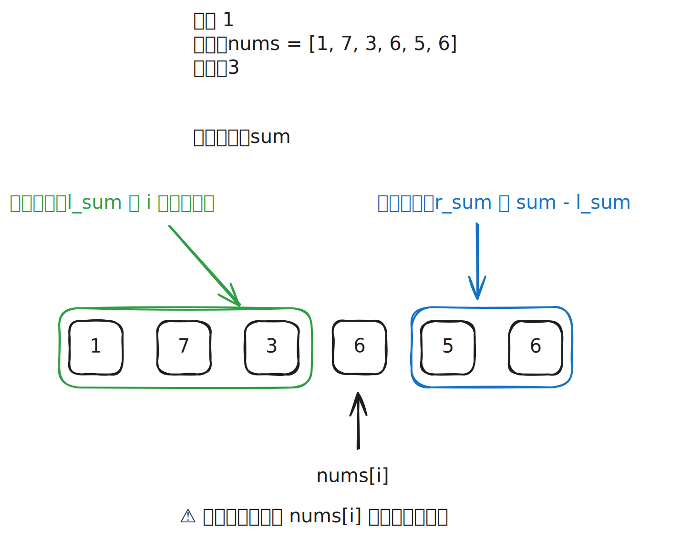

# [0724. 寻找数组的中心下标【简单】](https://github.com/tnotesjs/TNotes.leetcode/tree/main/notes/0724.%20%E5%AF%BB%E6%89%BE%E6%95%B0%E7%BB%84%E7%9A%84%E4%B8%AD%E5%BF%83%E4%B8%8B%E6%A0%87%E3%80%90%E7%AE%80%E5%8D%95%E3%80%91)

<!-- region:toc -->

- [1. 📝 Description](#1--description)
- [2. 🎯 s.1 - 暴力解法](#2--s1---暴力解法)
- [3. 🔗 引用](#3--引用)

<!-- endregion:toc -->

## 1. 📝 Description

::: details [leetcode](https://leetcode.cn/problems/find-pivot-index/)

给你一个整数数组  `nums` ，请计算数组的 **中心下标** 。

数组 **中心下标** 是数组的一个下标，其左侧所有元素相加的和等于右侧所有元素相加的和。

如果中心下标位于数组最左端，那么左侧数之和视为 `0` ，因为在下标的左侧不存在元素。这一点对于中心下标位于数组最右端同样适用。

如果数组有多个中心下标，应该返回 **最靠近左边** 的那一个。如果数组不存在中心下标，返回 `-1` 。

---

- **示例 1：**

```txt
输入：nums = [1, 7, 3, 6, 5, 6]
输出：3
解释：
中心下标是 3 。
左侧数之和 sum = nums[0] + nums[1] + nums[2] = 1 + 7 + 3 = 11 ，
右侧数之和 sum = nums[4] + nums[5] = 5 + 6 = 11 ，二者相等。
```

- **示例 2：**

```txt
输入：nums = [1, 2, 3]
输出：-1
解释：
数组中不存在满足此条件的中心下标。
```

- **示例 3：**

```txt
输入：nums = [2, 1, -1]
输出：0
解释：
中心下标是 0 。
左侧数之和 sum = 0 ，（下标 0 左侧不存在元素），
右侧数之和 sum = nums[1] + nums[2] = 1 + -1 = 0 。
```

---

**提示：**

- `1 <= nums.length <= 10^4`
- `-1000 <= nums[i] <= 1000`

**注意：** 本题与主站 [1991. 找到数组的中间位置][1] 题相同

:::

## 2. 🎯 s.1 - 暴力解法

::: swiper



:::

::: code-group

<<< ./solutions/1/1.js [js]

:::

- 时间复杂度：$O(2n)$
  - 需要遍历数组两次（一次计算总和，一次寻找中心下标）
- 空间复杂度：$O(1)$
  - 只使用了常数级别的额外空间

## 3. 🔗 引用

- [1991. 找到数组的中间位置][1]
  - 相同题目

[1]: https://leetcode-cn.com/problems/find-the-middle-index-in-array/
