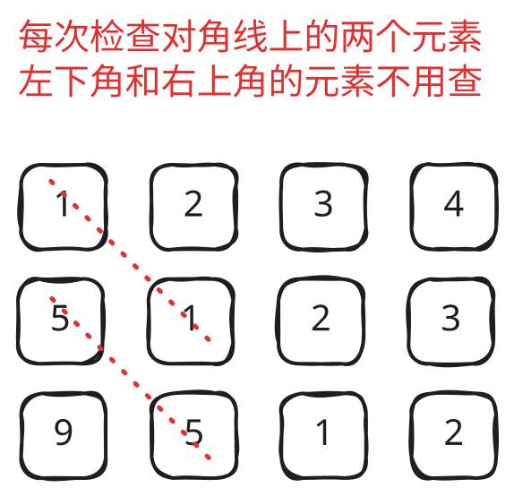
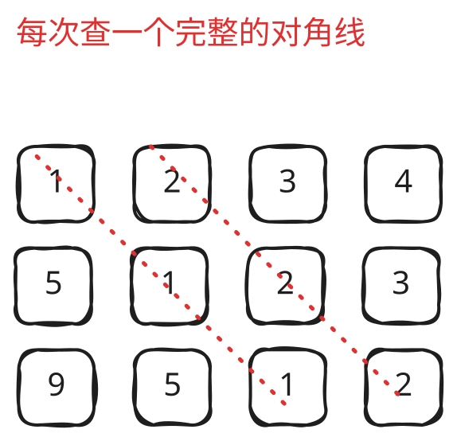

## 1. 📝 题目描述

- [leetcode](https://leetcode.cn/problems/toeplitz-matrix/)

---

- 给你一个 `m x n` 的矩阵 `matrix`。如果这个矩阵是托普利茨矩阵，返回 `true` ；否则，返回 `false`。
- 如果矩阵上每一条由左上到右下的对角线上的元素都相同，那么这个矩阵是 托普利茨矩阵。

---

示例 1：

- 
- 输入：`matrix = [[1,2,3,4],[5,1,2,3],[9,5,1,2]]`
- 输出：`true`
- 解释：
  - 在上述矩阵中, 其对角线为：`"[9]", "[5, 5]", "[1, 1, 1]", "[2, 2, 2]", "[3, 3]", "[4]"`。
  - 各条对角线上的所有元素均相同, 因此答案是 True。

---

示例 2：

- 
- 输入：`matrix = [[1,2],[2,2]]`
- 输出：`false`
- 解释：对角线 `"[1, 2]"` 上的元素不同。

---

提示：

- `m == matrix.length`
- `n == matrix[i].length`
- `1 <= m, n <= 20`
- `0 <= matrix[i][j] <= 99`

---

进阶：

- 如果矩阵存储在磁盘上，并且内存有限，以至于一次最多只能将矩阵的一行加载到内存中，该怎么办？
- 如果矩阵太大，以至于一次只能将不完整的一行加载到内存中，该怎么办？

## 2. 🎯 s.1 - 检查对角线元素



::: code-group

```js [js]
/**
 * @param {number[][]} matrix
 * @return {boolean}
 */
var isToeplitzMatrix = function (matrix) {
  const m = matrix.length
  const n = matrix[0].length

  // 检查除了最后一行和最后一列外的所有元素
  for (let i = 0; i < m - 1; i++) {
    for (let j = 0; j < n - 1; j++) {
      // 检查当前元素是否与其右下角元素相等
      if (matrix[i][j] !== matrix[i + 1][j + 1]) {
        return false
      }
    }
  }

  return true
}
```

:::

- 时间复杂度：$O(m \times n)$，其中 m 是矩阵的行数，n 是矩阵的列数，需要遍历矩阵中的每个元素
- 空间复杂度：$O(1)$，只使用了常数个额外变量

## 3. 🎯 s.2 - 按对角线分组检查



::: code-group

```js [js]
/**
 * @param {number[][]} matrix
 * @return {boolean}
 */
var isToeplitzMatrix = function (matrix) {
  const m = matrix.length
  const n = matrix[0].length

  // 检查从第一行开始的对角线
  for (let j = 0; j < n; j++) {
    const val = matrix[0][j]
    for (let i = 1, k = j + 1; i < m && k < n; i++, k++) {
      if (matrix[i][k] !== val) {
        return false
      }
    }
  }

  // 检查从第一列开始的对角线（跳过(0,0)避免重复检查）
  for (let i = 1; i < m; i++) {
    const val = matrix[i][0]
    for (let j = 1, k = i + 1; j < n && k < m; j++, k++) {
      if (matrix[k][j] !== val) {
        return false
      }
    }
  }

  return true
}
```

:::

- 时间复杂度：$O(m \times n)$，需要遍历矩阵中的每个元素
- 空间复杂度：$O(1)$，只使用了常数个额外变量
