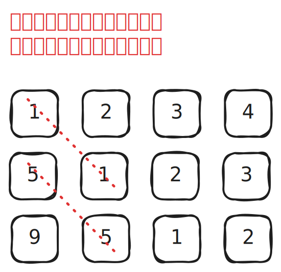
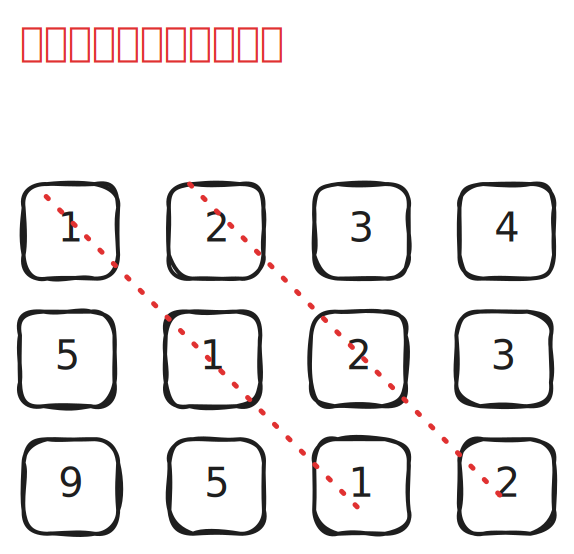

# [0766. 托普利茨矩阵【简单】](https://github.com/tnotesjs/TNotes.leetcode/tree/main/notes/0766.%20%E6%89%98%E6%99%AE%E5%88%A9%E8%8C%A8%E7%9F%A9%E9%98%B5%E3%80%90%E7%AE%80%E5%8D%95%E3%80%91)

<!-- region:toc -->

- [1. 📝 题目描述](#1--题目描述)
- [2. 🎯 s.1 - 检查对角线元素](#2--s1---检查对角线元素)
- [3. 🎯 s.2 - 按对角线分组检查](#3--s2---按对角线分组检查)

<!-- endregion:toc -->

## 1. 📝 题目描述

- [leetcode](https://leetcode.cn/problems/toeplitz-matrix/)

---

- 给你一个 `m x n` 的矩阵 `matrix` 。如果这个矩阵是托普利茨矩阵，返回 `true` ；否则，返回 `false` 。
- 如果矩阵上每一条由左上到右下的对角线上的元素都相同，那么这个矩阵是 **托普利茨矩阵** 。

---

**示例 1：**

- 
- 输入：`matrix = [[1,2,3,4],[5,1,2,3],[9,5,1,2]]`
- 输出：`true`
- 解释：
  - 在上述矩阵中, 其对角线为：`"[9]", "[5, 5]", "[1, 1, 1]", "[2, 2, 2]", "[3, 3]", "[4]"`。
  - 各条对角线上的所有元素均相同, 因此答案是 True 。

---

**示例 2：**

- 
- 输入：`matrix = [[1,2],[2,2]]`
- 输出：`false`
- 解释：对角线 `"[1, 2]"` 上的元素不同。

---

**提示：**

- `m == matrix.length`
- `n == matrix[i].length`
- `1 <= m, n <= 20`
- `0 <= matrix[i][j] <= 99`

---

进阶：

- 如果矩阵存储在磁盘上，并且内存有限，以至于一次最多只能将矩阵的一行加载到内存中，该怎么办？
- 如果矩阵太大，以至于一次只能将不完整的一行加载到内存中，该怎么办？

## 2. 🎯 s.1 - 检查对角线元素

::: code-group

<<< ./solutions/1/1.js [js]

:::

- 时间复杂度：$O(m \times n)$，其中 m 是矩阵的行数，n 是矩阵的列数，需要遍历矩阵中的每个元素
- 空间复杂度：$O(1)$，只使用了常数个额外变量

## 3. 🎯 s.2 - 按对角线分组检查

::: code-group

<<< ./solutions/2/1.js [js]

:::

- 时间复杂度：$O(m \times n)$，需要遍历矩阵中的每个元素
- 空间复杂度：$O(1)$，只使用了常数个额外变量
